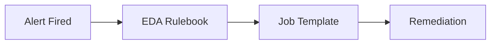
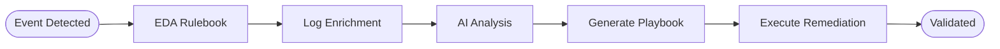
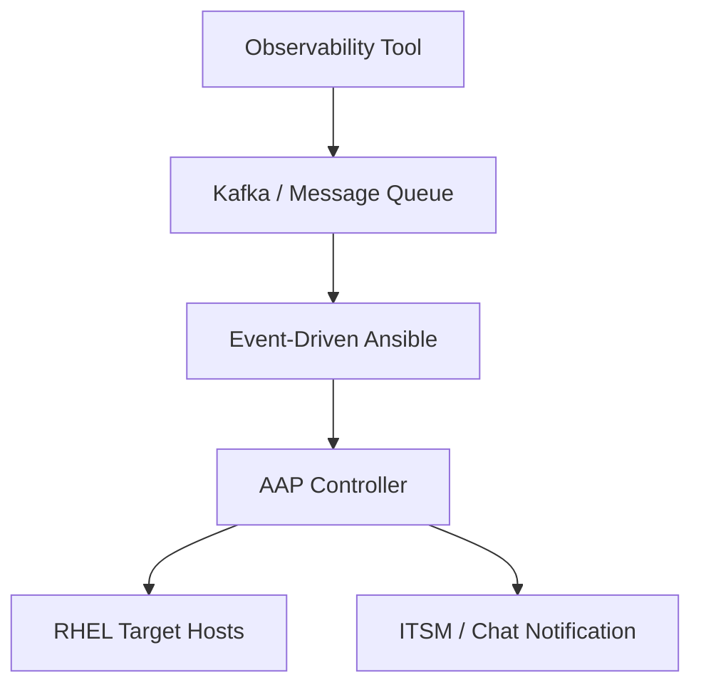
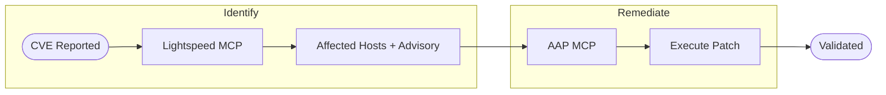

# Mermaid Diagrams in Solution Guides

## How It Works

The site layout (`_layouts/default.html`) loads Mermaid v11 via CDN and runs an
init script that converts fenced `mermaid` code blocks into rendered SVG on page
load. GitHub also renders `mermaid` code blocks natively in markdown previews.

No build step or plugin is needed -- just write a fenced code block with the
`mermaid` language tag.

## Writing a Diagram

Use a standard fenced code block with language `mermaid`:

````markdown

````

### Diagram Type Selection

| Use Case | Mermaid Type | When to Pick |
|----------|-------------|--------------|
| Workflow / pipeline (most solution guides) | `graph LR` | Steps flow left-to-right in sequence |
| Top-down hierarchy or decision tree | `graph TD` | Branching or layered architecture |
| Time-ordered sequence of API calls | `sequenceDiagram` | Show request/response between systems |
| State transitions | `stateDiagram-v2` | Lifecycle of a resource or ticket |

Most solution guides use `graph LR` for workflow diagrams and `graph TD` for
architecture diagrams.

### Style Rules

1. **Direction** -- use `LR` (left-to-right) for workflows, `TD` (top-down) for architecture.
2. **Node count** -- keep diagrams between 3-8 nodes. If you need more, split into multiple diagrams at natural workflow boundaries.
3. **Node shapes** -- use `[text]` for steps, `{text}` for decisions, `([text])` for start/end, `[(text)]` for databases.
4. **Labels** -- keep node text short (2-5 words). Put detail in the narrative below the diagram, not inside nodes.
5. **No inline styles** -- avoid `style` or `classDef` directives. The site CSS and Mermaid's default theme handle colors. Inline styles break when switching between GitHub preview and GitHub Pages.
6. **Edge labels** -- use sparingly. Only add `-->|label|` when the transition condition is not obvious from context.
7. **Subgraphs** -- use `subgraph Title ... end` to group related nodes (e.g., "Enrichment Workflow" vs "Remediation Workflow"). Limit to 2-3 subgraphs per diagram.

### Example: AIOps Workflow (graph LR)



### Example: Architecture (graph TD)



### Example: Patching with MCP (graph LR with subgraphs)



## Common Mistakes

| Mistake | Fix |
|---------|-----|
| Using ASCII art (`→`) instead of mermaid | Replace with a fenced `mermaid` block |
| Diagram has 10+ nodes in a single row | Split into subgraphs or multiple diagrams |
| Inline `style` / `classDef` directives | Remove them; rely on default theme |
| Missing `graph LR` or `graph TD` directive | Every diagram must start with a type declaration |
| Parentheses or special chars in node text | Wrap text in quotes: `A["Node (special)"]` |

## Rendering Environments

| Environment | Renders? | Notes |
|------------|----------|-------|
| GitHub Pages (this site) | Yes | Mermaid v11 loaded in `default.html`, converts `code.language-mermaid` blocks |
| GitHub markdown preview | Yes | GitHub natively renders `mermaid` fenced blocks |
| VS Code / Cursor preview | Yes | With built-in or extension mermaid support |
| Raw markdown (plaintext) | No | Reader sees the mermaid source, which is still readable as pseudocode |
