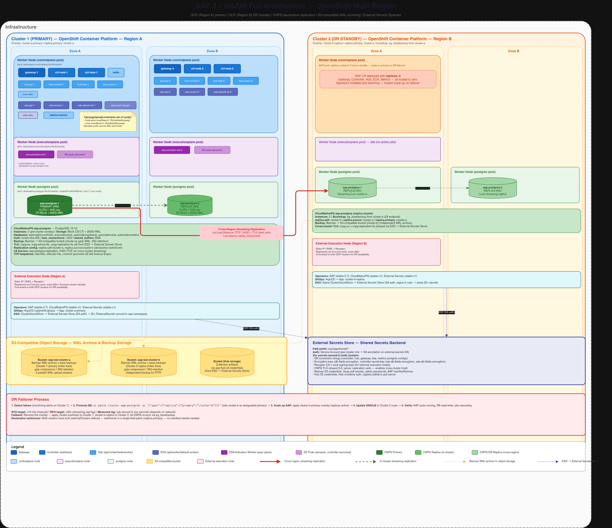
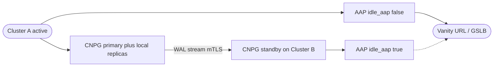

# High Availability and Disaster Recovery for AAP 2.7 on OpenShift - Implementation Guide <!-- omit in toc -->

<style>
  div#toc {
    display: none;
  }
</style>

<a target="_blank" href="assets/images/aap-hadr-full-architecture.png">
  
</a>

## Overview

When Ansible Automation Platform runs on OpenShift as mission-critical infrastructure, a single-cluster outage can halt automation across the enterprise. Recovering AAP after a site loss without a rehearsed active-passive design often means hours of manual database rebuild, secret reconciliation, and DNS cutover -- with unclear RPO.

This implementation guide shows how to deploy **AAP 2.7 (operator-based) on two OpenShift clusters** with **CloudNativePG** cross-cluster streaming replication, replicated S3-compatible storage, shared secrets via External Secrets Operator, and controlled switchover / emergency failover procedures.

**DR model:** Two-site active-passive. The standby cluster runs the AAP CR with `idle_aap: true` so operators stay installed while component replicas remain at zero until promotion.

**Related published guide:** For VM-based Active-Passive DR with EDB Postgres Advanced Server (not OpenShift/CNPG), see [High-Availability AAP with EDB PostgreSQL DR](README-EDB.md).

- [Background](#background)
- [Solution](#solution)
- [Prerequisites](#prerequisites)
- [HA/DR Architecture](#hadr-architecture)
- [Solution Walkthrough](#solution-walkthrough)
  - [Install the Operators](#1-install-the-operators)
  - [Configure External Secrets](#2-configure-external-secrets)
  - [Deploy the CloudNativePG Cluster](#3-deploy-the-cloudnativepg-cluster)
  - [Deploy AAP](#4-deploy-aap)
  - [Failover Procedures](#6-failover-procedures)
- [Validation](#validation)
- [Validated Test Scenarios and Observed SLAs](#validated-test-scenarios-and-observed-slas)
- [Day 2 Operations](#8-day-2-operations)
- [Known Issues](#known-issues)
- [Maturity Path](#maturity-path)
- [Related Guides](#related-guides)
- [Appendix A: ODF RGW Multisite Storage](#appendix-a-odf-rgw-multisite-storage)

---

## Background

Implementing a highly available Ansible Automation Platform begins with proper planning. A system is only as resilient as its weakest dependency, and that weakness is often found in the physical infrastructure, the network connectivity between components, or an external service on which AAP depends.

The sections below outline key considerations for the planning phase of an AAP HA deployment. They provide the conceptual framework needed to decide where systems are placed, how far apart they should be, and what supporting services must themselves be resilient before AAP can be considered highly available.

### Physical Placement of Systems

The goal of high availability is to ensure that no single failure event can take the entire platform offline.  It is not just unplanned failures, but also includes regular data center maintenance.  Achieving high availability requires consideration of all physical elements associated with hosting the platform. Deploying multiple instances of a service is not sufficient if those instances share the same hardware or are located in the same data center.

A single rack-level event, such as a top-of-rack switch failure, a power distribution unit trip, or a physical accident, can cause an outage if primary and secondary controller nodes are running in the same rack. Redundant nodes should be distributed across separate racks at a minimum, though additional separation could be beneficial.

Power should be distributed using multiple paths when possible.  Individual nodes can be purchased with multiple power supplies, or extra capacity can be purchased to support full zones during a power outage.

Nodes chosen for redundant replicas of a service shouldn’t use the same networking path.  A fully active node provides no value if it is incapable of communication.

Environmental factors should also be considered when placing services. Imagine a scenario in which a fire suppression system is activated, impacting an area in the data center.

The key is to review the placement of systems and trace back to supporting systems to identify single points of failure.  Any failure that will impact all replicas of a service needs to be addressed or documented as an acceptable risk.


### Distance Between Redundant Sites

Any highly available implementation needs to consider the distance between redundant sites.  The distance needs to be far enough to avoid significant local events, but close enough to avoid network performance limitations.

This guide focuses on an active / passive implementation of the Ansible Automation Platform.  This reduces the burden of ensuring low-latency connectivity between components but does not eliminate it.

It is critical to have low-latency networking between application nodes and the database.  Poor network connectivity between these two points is a major cause of poor performance.  The database must be collocated in the same physical region as the application frontend.

The database will replicate WAL (write-ahead-logs) to the secondary site to ensure the database system in the passive region will be capable of being promoted.  Storage for Automation Hub and other components will also need to be replicated.


### External Service Dependencies

Ansible Automation Platform depends on a variety of external services.  A failure of these external services can impact platform operations and should be considered when designing a highly available solution.

### Domain Name System (DNS)

DNS is required for Ansible Automation Platform to locate services and find automation targets. This service is critical for clients to locate the new active site.

### Authentication

It is recommended to have a local break-glass account in case your enterprise identity provider is unavailable.  Consider how you would respond if your enterprise identity provider is unavailable.

### Container Registry

Ansible Automation Platform provides its own container registry, but some enterprise customers prefer to use a different product.  Consider how the loss of the container registry would impact automation.

### Network Time Protocol (NTP)

Authentication and encryption are dependent upon clock synchronization.  It is common for enterprises to have local network time clocks.  Plan for how system clocks should be synchronized if these systems go offline

### Load Balancers and Firewalls

Good design guidance already states that network paths should be diverse whenever possible.  Load balancers and firewalls are logical places where the network is designed to flow into a chokepoint.  What is the impact on AAP if these network devices are down?  What is the plan for recovery?

### Observability

Observability answers the question, "What is broken?" and the follow-up question, "How bad is it?"

Awareness of failures is critical to determine when moving AAP to the secondary site is required. It also provides awareness when a failback operation can be executed.

Define clear, concise guidelines for deciding when to fail over to a secondary site and the criteria for recovery back to the primary.

### Failover Practice

High availability mechanisms and failover are only as reliable as the last time they were tested. Organizations often invest heavily in building out redundant infrastructure and disaster recovery plans but never validate them under realistic conditions, leaving critical assumptions untested until an actual outage forces the issue. Enterprises should execute a regular practice drill at least once a year to ensure that a theoretical plan becomes a proven one. Look for configuration drift, undocumented dependencies, and procedural gaps when the stakes are low. The exercises will build institutional muscle memory so that when a real incident occurs, teams can execute with confidence rather than scrambling to understand runbooks.

---

## Solution

**Audience:** Administrators and architects deploying AAP on OpenShift with HA and cross-site DR

**Platform:** AAP 2.7 (operator-based) on Red Hat OpenShift Container Platform

**Database:** CloudNativePG (community or EDB-supported) for PostgreSQL HA

**Storage:** Replicated S3-compatible object storage for WAL archiving, backups, and Hub content (OpenShift Data Foundation with Ceph RGW multisite is documented in Appendix A)

**DR model:** Two-site active-passive with cross-cluster streaming replication

**Secrets:** External Secrets Operator (ESO) syncing from a central secrets store

### Components

- **[Red Hat Ansible Automation Platform 2.7+](https://www.redhat.com/en/technologies/management/ansible)** -- operator-based deployment on OpenShift
- **[CloudNativePG](https://cloudnative-pg.io/)** -- PostgreSQL HA with local quorum and cross-cluster streaming replication
- **[External Secrets Operator](https://external-secrets.io/)** -- shared encryption keys, receptor CA, and DB credentials across clusters
- **S3-compatible object storage** -- WAL archiving, base backups, and Automation Hub content (see Appendix A for ODF RGW)
- **Global load balancer / vanity DNS** -- stable `public_base_url` that follows the active site

### Who Benefits

| Persona | Challenge | What They Gain |
|---------|-----------|----------------|
| IT Ops / SRE | Manual DR for operator-managed AAP is slow and error-prone across secrets, Postgres, and DNS | Documented switchover/failover runbooks with concrete `oc` commands and health checks |
| Automation Architect | Unclear how to combine OpenShift, external Postgres, and idle standby AAP for site DR | Reference architecture with CNPG replica clusters, node pools, and idle_aap warm standby |
| IT Manager / Director | Need credible RTO/RPO and rehearsal guidance for automation platform continuity | Planning criteria, failure-domain design, and annual failover practice expectations |

### Definitions

| Term | Definition |
| :---- | :---- |
| **High Availability (HA)** | Keeping the system running through component-level failures (pod, node, zone) without human intervention |
| **Disaster Recovery (DR)** | Restoring IT systems after a catastrophic event (site loss, widespread outage) -- typically requires planned intervention |
| **Business Continuity (BC)** | The organizational strategy for maintaining essential operations during disruptions -- HA and DR are technical implementations that serve BC goals |
| **Recovery Time Objective (RTO)** | Maximum acceptable downtime from the point of failure to service restoration |
| **Recovery Point Objective (RPO)** | Maximum acceptable data loss, measured in time (e.g., RPO=0 means no data loss; RPO=5min means up to 5 minutes of transactions may be lost) |
| **Failure Domain** | An isolation boundary within which a fault is contained -- hierarchy: pod → node → rack → availability zone → datacenter |
| **Switchover** | A planned, controlled transfer of the primary role from one site to another (zero or near-zero data loss) |
| **Failover** | An unplanned promotion of the standby site when the primary is unreachable (potential data loss up to the last replicated WAL) |
| **Failback** | Returning the primary role to the original site after a failover or switchover |
| **Active-Passive** | A DR topology where one site handles all traffic (active) while the other remains idle but ready (passive/standby) |

### Abbreviations

| Abbreviation | Full Name |
| :---- | :---- |
| AAP | Ansible Automation Platform |
| CNPG | CloudNativePG (Kubernetes operator for PostgreSQL) |
| CR | Custom Resource (Kubernetes API object defined by a CRD) |
| CRD | Custom Resource Definition |
| CSRF | Cross-Site Request Forgery |
| DR | Disaster Recovery |
| EDA | Event-Driven Ansible |
| EE | Execution Environment (container image for running Ansible) |
| ESO | External Secrets Operator |
| GSLB | Global Server Load Balancing |
| HA | High Availability |
| NLB | Network Load Balancer |
| ODF | OpenShift Data Foundation |
| OLM | Operator Lifecycle Manager |
| PDB | Pod Disruption Budget |
| PVC | Persistent Volume Claim |
| RBAC | Role-Based Access Control |
| RPO | Recovery Point Objective |
| RTO | Recovery Time Objective |
| S3 | Simple Storage Service (object storage API) |
| TLS | Transport Layer Security |
| WAL | Write-Ahead Log (PostgreSQL transaction journal) |

### Key Assumptions

* AAP deployed via the AAP Operator on OpenShift (VM-based installs are out of scope)
* Redis is operator-managed (no external Redis deployment)
* PostgreSQL provided by the CloudNativePG operator, not the AAP operator's built-in database
* S3-compatible object storage available for WAL archiving, backups, and Automation Hub content
* Two OpenShift clusters in separate failure domains (regions, datacenters, or zones)
* Global Load Balancer to serve as the public base URL for AAP, able to forward to whichever AAP is active.
* A shared secrets store (AWS Secrets Manager, HashiCorp Vault, etc.) accessible from both clusters

## HA/DR Architecture

<a target="_blank" href="assets/images/aap-hadr-full-architecture.png">
  
</a>



**Key design decisions:**

* **Three node pools per cluster:** controlplane (AAP pods), executionplane (EE and EDA activation workers), postgres (CNPG instances). Each pool uses dedicated taints/tolerations for isolation.
* **Three-node CNPG cluster:** 1 primary + 2 local replicas provides quorum-based failover and read capacity within a single site. Pod anti-affinity ensures one instance per node, and topology spread distributes them across availability zones.
* **Cross-cluster streaming replication:** The CNPG primary on Cluster A streams WAL to replicas on Cluster B via a TCP load balancer (NLB) secured with mutual TLS.
* **Warm standby:** Cluster B runs the AAP CR with idle_aap: true (all component replicas set to 0). Operators are installed and watching. On failover, set idle_aap: false and the platform should start in seconds.
* **Shared secrets:** Encryption keys, receptor CA, and database credentials are identical on both clusters, synced from a central secrets store via the External Secrets Operator.
* **Stable external URL:** Use a vanity URL that follows the active site and include that URL in both public_base_url and CSRF_TRUSTED_ORIGINS. If you expose site-local routes for administration or testing, include those origins too.
* **Replicated S3 storage:** WAL archiving, base backups, and Hub content storage require S3 buckets that are readable from both clusters. Each cluster writes only to its own local S3 endpoint (the standby cluster's AAP is idle and does not write). The S3 layer must replicate data between sites so that during DR failover, the surviving cluster can read the other cluster's WAL archives and Hub content from its local endpoint. We used ODF with Ceph RGW multisite replication -- see Appendix A for details.
* **Controlled switchover vs. emergency failover:** Planned switchovers should use the CNPG demotion/promotion token flow. Promoting a replica without a token is an emergency action only and requires rebuilding the former primary before it can rejoin replication.

## Prerequisites

Before starting, ensure you have:

* \[ \] Two OpenShift clusters (4.14+) in separate failure domains
* \[ \] oc CLI authenticated to both clusters
* \[ \] S3-compatible object storage (two buckets, one per cluster, for WAL archives)
* \[ \] S3-compatible storage for Automation Hub content
* \[ \] A shared secrets store (AWS Secrets Manager, HashiCorp Vault, GCP Secret Manager, etc.)
* \[ \] DNS infrastructure for a stable vanity URL that can be pointed at either cluster
* \[ \] TLS certificates for the AAP route (matching the vanity URL)
* \[ \] An AAP subscription manifest file (manifest.zip)
* \[ \] Container image pull secrets for registry.redhat.io (and quay.io if using pre-release images)

### Node Pool Requirements

Each cluster needs three types of worker nodes. Use MachineSet/MachinePool to create them with the appropriate labels and taints:

| Pool | Label | Taint | Min Nodes | Purpose |
| :---- | :---- | :---- | :---- | :---- |
| controlplane | dedicated=controlplane | dedicated=controlplane:NoSchedule | 2 (spread across AZs) | AAP control plane pods |
| executionplane | dedicated=executionplane | dedicated=executionplane:NoSchedule | 2 (spread across AZs) | EE pods, EDA activation workers |
| postgres | dedicated=postgres | dedicated=postgres:NoSchedule | 3 (spread across AZs) | CNPG PostgreSQL instances |

## Solution Walkthrough

## 1. Install the Operators

Three operators are required on each cluster. Install them via Subscription CRs (or through the OperatorHub UI).

### 1.1 AAP Operator

```yaml
apiVersion: v1
kind: Namespace
metadata:
  name: aap                          # <-- your AAP namespace
---
apiVersion: operators.coreos.com/v1
kind: OperatorGroup
metadata:
  name: aap-operator-group
  namespace: aap
spec:
  targetNamespaces:
    - aap
---
apiVersion: operators.coreos.com/v1alpha1
kind: Subscription
metadata:
  name: ansible-automation-platform-operator
  namespace: aap
spec:
  channel: stable-2.7
  name: ansible-automation-platform-operator
  source: redhat-operators
  sourceNamespace: openshift-marketplace
  installPlanApproval: Automatic
```

**User action:** Change source to match your catalog source. For pre-release testing, point to a custom CatalogSource.

### 1.2 CloudNativePG Operator

```yaml
apiVersion: operators.coreos.com/v1alpha1
kind: Subscription
metadata:
  name: cloudnative-pg
  namespace: aap                        # <-- same namespace as AAP
spec:
  channel: stable-v1
  name: cloudnative-pg
  source: certified-operators
  sourceNamespace: openshift-marketplace
  installPlanApproval: Automatic
```

### 1.3 External Secrets Operator

```yaml
apiVersion: v1
kind: Namespace
metadata:
  name: external-secrets-operator
---
apiVersion: operators.coreos.com/v1
kind: OperatorGroup
metadata:
  name: openshift-external-secrets-operator
  namespace: external-secrets-operator
spec:
  targetNamespaces: []                    # <-- cluster-wide scope
---
apiVersion: operators.coreos.com/v1alpha1
kind: Subscription
metadata:
  name: openshift-external-secrets-operator
  namespace: external-secrets-operator
spec:
  channel: stable-v1
  name: openshift-external-secrets-operator
  source: redhat-operators
  sourceNamespace: openshift-marketplace
  installPlanApproval: Automatic
---
# Operand: deploys controllers into namespace "external-secrets".
# ArgoCD may retry this until the operator CRD is installed from the CSV.
apiVersion: operator.openshift.io/v1alpha1
kind: ExternalSecretsConfig
metadata:
  name: cluster
  namespace: external-secrets-operator
spec:
  controllerConfig:
    networkPolicies:
      - componentName: ExternalSecretsCoreController
        egress:
          - {}
        name: allow-external-secrets-egress
```

**Note:** The `ExternalSecretsConfig` CR triggers the operand install. The egress NetworkPolicy allows the controller to reach external secrets providers (AWS SM, Vault, etc.). Tighten egress rules when you have fixed provider endpoints.

Wait for all three operators to reach Succeeded phase:

```
oc get csv -n aap
oc get csv -n external-secrets-operator
```

## 2. Configure External Secrets

Before deploying any workloads, configure ESO to sync secrets from your central store to both clusters.

### 2.1 ClusterSecretStore

Create a ClusterSecretStore that points to your secrets backend. This example uses AWS Secrets Manager with IRSA authentication:

```yaml
apiVersion: external-secrets.io/v1
kind: ClusterSecretStore
metadata:
  name: cluster-secret-store
spec:
  provider:
    aws:
      region: us-east-1                # <-- your AWS region
      service: SecretsManager
      auth:
        jwt:
          serviceAccountRef:
            name: external-secrets      # <-- ESO service account
            namespace: external-secrets
```

**User action:** Replace the provider section with your secrets backend configuration. ESO supports AWS SM, HashiCorp Vault, GCP SM, Azure Key Vault, and others. See [ESO provider docs](https://external-secrets.io/latest/provider/aws-secrets-manager/).
**User action (IRSA/Workload Identity):** Annotate the ESO service account with the IAM role ARN that has secretsmanager:GetSecretValue permissions:

```
oc annotate sa external-secrets -n external-secrets \
  eks.amazonaws.com/role-arn=arn:aws:iam::ACCOUNT:role/YOUR-ESO-ROLE
```

### 2.2 Required Secrets

The following secrets must exist in your secrets store. All ExternalSecret CRs reference the ClusterSecretStore created above.

#### Encryption Keys (CRITICAL for DR)

These keys encrypt sensitive fields in the AAP database. **Both clusters MUST have identical values.** If keys differ, the DR cluster cannot decrypt the primary's data.

| Secret Store Key | K8s Secret Name | Purpose |
| :---- | :---- | :---- |
| aap/shared/aap-db-fields-encryption-secret | aap-db-fields-encryption-secret | Fernet key for DB field encryption |
| aap/shared/aap-hub-db-fields-encryption | aap-hub-db-fields-encryption | Fernet key for Hub DB fields |
| aap/shared/aap-controller-secret-key | aap-controller-secret-key | Django SECRET_KEY for sessions |
| aap/shared/aap-eda-db-fields-encryption-secret | aap-eda-db-fields-encryption-secret | Fernet key for EDA DB fields |

Generate these once, store in your secrets backend, and sync to all clusters:

```bash
# Generate a Fernet key
python3 -c "from cryptography.fernet import Fernet; print(Fernet.generate_key().decode())"

# Generate a Django secret key
python3 -c "import secrets; print(secrets.token_urlsafe(50))"
```

#### Database Connection Secrets

Each AAP component needs a connection secret pointing to the CNPG service. The secret format:

```yaml
# Example: aap-controller-postgres-configuration
host: aap-postgres-rw.aap.svc.cluster.local   # CNPG read-write service
port: "5432"
database: automationcontroller
username: automationcontroller
password: "<your-password>"                     # <-- must match cnpg-init-sql
type: unmanaged
sslmode: prefer                                 # allowed: prefer, disable, allow, require, verify-ca, verify-full
```

**Note:** The password value must not contain single quotes ('), double quotes ("), or backslashes (\\) -- these cause failures during deployment, backup, or restore.

| K8s Secret Name | Database |
| :---- | :---- |
| aap-controller-postgres-configuration | automationcontroller |
| aap-hub-postgres-configuration | automationhub |
| aap-gateway-postgres-configuration | automationgateway |
| aap-eda-postgres-configuration | automationeda |
| aap-eda-event-stream-postgres-configuration | automationeda (same DB, different user or same) |
| aap-metrics-postgres-configuration | automationmetrics |
| aap-metrics-controller-postgres-configuration | automationcontroller (read-only user) |

#### CNPG Bootstrap SQL

A secret containing the SQL to create database users with passwords. This runs once during CNPG cluster bootstrap (via postInitSQLRefs, executed against the postgres database):

```sql
CREATE USER automationcontroller WITH PASSWORD '<password>';
CREATE USER automationhub WITH PASSWORD '<password>';
CREATE USER automationgateway WITH PASSWORD '<password>';
CREATE USER automationeda WITH PASSWORD '<password>';
CREATE USER automationmetrics WITH PASSWORD '<password>';
CREATE USER automationmetrics_controller WITH PASSWORD '<password>';
CREATE USER monitoring WITH PASSWORD '<password>' CONNECTION LIMIT 10;
CREATE USER streaming_replica WITH REPLICATION PASSWORD '<password>';
```

Store this as a secret with key init.sql.
**CRITICAL:** Passwords in cnpg-init-sql must match the passwords in the corresponding `*-postgres-configuration` secrets.
**CRITICAL:** The hstore PostgreSQL extension is **required** for the Automation Hub database. Without it, Hub database migrations will fail. The CNPG Cluster CR in this guide handles this automatically by creating the extension in template1 before the CREATE DATABASE statements (so all databases inherit it). If you are setting up databases manually, run CREATE EXTENSION IF NOT EXISTS hstore; connected to the automationhub database before deploying AAP.

#### CNPG TLS Certificates (for cross-cluster replication)

Cross-cluster streaming replication requires mutual TLS. Generate a CA and per-cluster server + replication certificates. Both clusters must trust the same CA.

| K8s Secret Name | Type | Contents |
| :---- | :---- | :---- |
| cnpg-ca | Opaque | ca.crt, ca.key |
| cnpg-server-tls | kubernetes.io/tls | tls.crt, tls.key (per-cluster server cert signed by the shared CA) |
| cnpg-replication-tls | kubernetes.io/tls | tls.crt, tls.key (per-cluster replication client cert signed by the shared CA) |

#### Other Required Secrets

| K8s Secret Name | Purpose |
| :---- | :---- |
| aap-admin-password | AAP platform admin password (password key) |
| aap-controller-receptor-ca | Receptor CA for automation mesh (tls.crt, tls.key) |
| aap-controller-receptor-work-signing | Work-signing key for receptor |
| aap-hub-s3-credentials | S3 credentials for Hub content storage |
| barman-s3-credentials | S3 credentials for CNPG WAL archiving (ACCESS_KEY_ID, ACCESS_SECRET_KEY) |
| aap-manifest | AAP subscription manifest (manifest.zip) |
| Image pull secret(s) | Pull secrets for your container registry |

### 2.3 ExternalSecret CRs

Create an ExternalSecret for each secret. Example pattern:

```yaml
apiVersion: external-secrets.io/v1
kind: ExternalSecret
metadata:
  name: aap-admin-password
  namespace: aap
spec:
  refreshInterval: 1h
  secretStoreRef:
    name: cluster-secret-store        # <-- matches your ClusterSecretStore
    kind: ClusterSecretStore
  target:
    name: aap-admin-password
    creationPolicy: Owner
  dataFrom:
    - extract:
        key: aap/shared/aap-admin-password  # <-- path in your secrets store
```

For TLS secrets, use the template field to set the secret type:

```yaml
apiVersion: external-secrets.io/v1
kind: ExternalSecret
metadata:
  name: cnpg-server-tls
  namespace: aap
spec:
  refreshInterval: 24h
  secretStoreRef:
    name: cluster-secret-store
    kind: ClusterSecretStore
  target:
    name: cnpg-server-tls
    creationPolicy: Owner
    template:
      type: kubernetes.io/tls
  data:
    - secretKey: tls.crt
      remoteRef:
        key: aap/shared/cnpg-tls
        property: cluster-a-server.crt    # <-- per-cluster cert
    - secretKey: tls.key
      remoteRef:
        key: aap/shared/cnpg-tls
        property: cluster-a-server.key
```

**User action:** Create ExternalSecret CRs for every secret listed above. Adjust the remoteRef.key paths to match your secrets store layout.

Verify all secrets are synced before proceeding:

```bash
oc get externalsecrets -n aap
# All should show Status: SecretSynced
```

## 3. Deploy the CloudNativePG Cluster

### 3.1 Primary Cluster (Cluster A)

```yaml
apiVersion: postgresql.cnpg.io/v1
kind: Cluster
metadata:
  name: aap-postgres
  namespace: aap
spec:
  instances: 3                          # <-- 1 primary + 2 local replicas (quorum-based HA)

  imageName: ghcr.io/cloudnative-pg/postgresql:15.10  # <-- PostgreSQL 15, AAP 2.7 requires 15+

  storage:
    size: 2Ti                           # <-- size for your workload
    storageClass: ssd-csi               # <-- your block storage class (SSD recommended)

  walStorage:
    size: 200Gi                         # <-- ~10% of data storage
    storageClass: ssd-csi               # <-- same storage class

  postgresql:
    parameters:
      max_connections: "1024"
      shared_buffers: "8GB"             # <-- 25% of pod memory
      work_mem: "128MB"
      maintenance_work_mem: "2GB"
      effective_cache_size: "24GB"      # <-- 75% of pod memory
      random_page_cost: "1.1"           # <-- SSD tuning
      effective_io_concurrency: "200"
      wal_level: "replica"
      wal_buffers: "32MB"
      max_wal_size: "8GB"
      min_wal_size: "2GB"
      checkpoint_completion_target: "0.9"
      autovacuum_vacuum_scale_factor: "0.02"
      autovacuum_analyze_scale_factor: "0.02"
      autovacuum_max_workers: "6"
      autovacuum_vacuum_cost_delay: "2ms"
      log_autovacuum_min_duration: "250"  # log vacuum runs > 250ms for observability
      log_statement: "ddl"
      log_min_duration_statement: "1000"
      pg_stat_statements.max: "5000"
      pg_stat_statements.track: "top"
      # TCP keepalives -- prevents load balancer idle-timeout drops
      tcp_keepalives_idle: "30"
      tcp_keepalives_interval: "10"
      tcp_keepalives_count: "3"
    pg_hba:
      - host all all all scram-sha-256

  resources:
    requests:
      memory: "16Gi"                    # <-- adjust to your node size
      cpu: "8"
    limits:
      memory: "32Gi"
      cpu: "16"
    ephemeralVolumeSource:
      volumeClaimTemplate:
        spec:
          resources:
            requests:
              storage: 20Gi             # <-- for temporary data

  bootstrap:
    initdb:
      database: postgres
      owner: postgres
      dataChecksums: true               # must be set at init, cannot add later
      postInitSQLRefs:
        secretRefs:
          - name: cnpg-init-sql         # <-- your user creation SQL secret
            key: init.sql
      postInitTemplateSQL:              # runs against template1 (outside a transaction, so CREATE DATABASE works)
        # REQUIRED: Enable hstore in template1 BEFORE creating databases.
        # All databases created after this inherit the extension.
        # Hub migrations fail without hstore -- see AAP 2.7 docs:
        # https://docs.redhat.com/en/documentation/red_hat_ansible_automation_platform/2.7/install-configure_an_external_database_for_ansible_automation_platform
        - CREATE EXTENSION IF NOT EXISTS hstore;
        - CREATE DATABASE automationcontroller;
        - CREATE DATABASE automationhub;
        - CREATE DATABASE automationgateway;
        - CREATE DATABASE automationeda;
        - CREATE DATABASE automationmetrics;
        - GRANT ALL PRIVILEGES ON DATABASE automationcontroller TO automationcontroller;
        - GRANT ALL PRIVILEGES ON DATABASE automationhub TO automationhub;
        - GRANT ALL PRIVILEGES ON DATABASE automationgateway TO automationgateway;
        - GRANT ALL PRIVILEGES ON DATABASE automationeda TO automationeda;
        - GRANT ALL PRIVILEGES ON DATABASE automationmetrics TO automationmetrics;
        - ALTER DATABASE automationcontroller OWNER TO automationcontroller;
        - ALTER DATABASE automationhub OWNER TO automationhub;
        - ALTER DATABASE automationgateway OWNER TO automationgateway;
        - ALTER DATABASE automationeda OWNER TO automationeda;
        - ALTER DATABASE automationmetrics OWNER TO automationmetrics;
      postInitApplicationSQL:
        - GRANT CONNECT ON DATABASE automationcontroller TO automationmetrics_controller;
        - GRANT pg_read_all_data TO automationmetrics_controller;
        - ALTER DEFAULT PRIVILEGES IN SCHEMA public GRANT SELECT ON TABLES TO automationmetrics_controller;
        - GRANT pg_monitor TO monitoring;
        - GRANT pg_read_server_files TO monitoring;
        - GRANT CONNECT ON DATABASE automationgateway TO monitoring;
        - GRANT CONNECT ON DATABASE automationcontroller TO monitoring;
        - GRANT CONNECT ON DATABASE automationhub TO monitoring;
        - GRANT CONNECT ON DATABASE automationeda TO monitoring;

  certificates:
    serverCASecret: cnpg-ca
    serverTLSSecret: cnpg-server-tls
    clientCASecret: cnpg-ca
    replicationTLSSecret: cnpg-replication-tls

  backup:
    barmanObjectStore:
      destinationPath: s3://YOUR-WAL-BUCKET-CLUSTER-A/  # <-- your S3 bucket for cluster A
      s3Credentials:
        accessKeyId:
          name: barman-s3-credentials
          key: ACCESS_KEY_ID
        secretAccessKey:
          name: barman-s3-credentials
          key: ACCESS_SECRET_KEY
      wal:
        compression: gzip
        maxParallel: 4
    retentionPolicy: "30d"

  # Cross-cluster replication configuration
  replica:
    self: cluster-a                     # <-- logical name for this cluster
    source: cluster-b                   # <-- logical name for the other cluster
    primary: cluster-a                  # <-- which cluster is currently the primary

  externalClusters:
    - name: cluster-a
      barmanObjectStore:
        destinationPath: s3://YOUR-WAL-BUCKET-CLUSTER-A/
        s3Credentials:
          accessKeyId:
            name: barman-s3-credentials
            key: ACCESS_KEY_ID
          secretAccessKey:
            name: barman-s3-credentials
            key: ACCESS_SECRET_KEY
        wal:
          compression: gzip
          maxParallel: 4
      connectionParameters:
        host: CLUSTER-A-NLB-HOSTNAME    # <-- load balancer hostname for cluster A's postgres
        port: "5432"
        user: streaming_replica
        sslmode: verify-ca
        dbname: postgres
      sslKey:
        name: cnpg-replication-tls
        key: tls.key
      sslCert:
        name: cnpg-replication-tls
        key: tls.crt
      sslRootCert:
        name: cnpg-ca
        key: ca.crt
    - name: cluster-b
      barmanObjectStore:
        destinationPath: s3://YOUR-WAL-BUCKET-CLUSTER-B/
        s3Credentials:
          accessKeyId:
            name: barman-s3-credentials
            key: ACCESS_KEY_ID
          secretAccessKey:
            name: barman-s3-credentials
            key: ACCESS_SECRET_KEY
        wal:
          compression: gzip
          maxParallel: 4
      connectionParameters:
        host: CLUSTER-B-NLB-HOSTNAME    # <-- load balancer hostname for cluster B's postgres
        port: "5432"
        user: streaming_replica
        sslmode: verify-ca
        dbname: postgres
      sslKey:
        name: cnpg-replication-tls
        key: tls.key
      sslCert:
        name: cnpg-replication-tls
        key: tls.crt
      sslRootCert:
        name: cnpg-ca
        key: ca.crt

  monitoring:
    enablePodMonitor: true
    customQueriesConfigMap:
      - name: aap-postgres-monitoring
        key: queries.yaml

  affinity:
    tolerations:
      - key: dedicated
        value: postgres
        effect: NoSchedule
    topologySpreadConstraints:
      - maxSkew: 1
        topologyKey: topology.kubernetes.io/zone
        whenUnsatisfiable: ScheduleAnyway
        labelSelector:
          matchLabels:
            cnpg.io/cluster: aap-postgres

  enablePodAntiAffinity: true           # one CNPG instance per node
```

**User action:** Replace all `<!-- your ... -->` style comments and YOUR-* placeholders with your actual values.
**Important:** The bootstrap section is **immutable** after first creation. To change it, you must delete and recreate the cluster.

### 3.2 Replication Load Balancer Service

Each cluster needs a LoadBalancer Service exposing the CNPG primary on port 5432 so the other cluster can stream from it:

```yaml
apiVersion: v1
kind: Service
metadata:
  name: aap-postgres-replication
  namespace: aap
  annotations:
    # AWS NLB example -- adjust annotations for your cloud/load balancer
    service.beta.kubernetes.io/aws-load-balancer-type: "nlb"
    service.beta.kubernetes.io/aws-load-balancer-connection-idle-timeout: "3600"
spec:
  type: LoadBalancer
  selector:
    cnpg.io/cluster: aap-postgres
    cnpg.io/instanceRole: primary
  ports:
    - name: postgres
      port: 5432
      targetPort: 5432
      protocol: TCP
```

After this Service is created, note the load balancer hostname (`oc get svc aap-postgres-replication -n aap`) and use it as the connectionParameters.host in the externalClusters entries on the *other* cluster.

### 3.3 DR Cluster (Cluster B)

Cluster B's CNPG Cluster CR is nearly identical to Cluster A, with two differences:
Bootstrap from Cluster A (instead of initdb):

```yaml
bootstrap:
  pg_basebackup:
    source: cluster-a    # <-- bootstrap by streaming a base backup from cluster A
```

Replica role set to Cluster A as primary:

```yaml
replica:
  self: cluster-b
  source: cluster-a
  primary: cluster-a                 # <-- cluster A is the designated primary
```

Everything else (storage, resources, certificates, externalClusters, backup, affinity) stays the same, with Cluster B's own S3 bucket and load balancer hostname.

### 3.4 Verify Replication

```bash
# On Cluster A -- check cluster status
oc get cluster aap-postgres -n aap -o yaml | grep -A5 status

# On Cluster B -- verify it's streaming
oc get cluster aap-postgres -n aap
# Should show instances in "Streaming" state

# Check replication lag
oc exec -n aap aap-postgres-1 -- psql -c "SELECT * FROM pg_stat_replication;"
```

## 4. Deploy AAP

### 4.1 The AnsibleAutomationPlatform CR

This is the core CR that defines the entire AAP deployment. Apply this on **both clusters**, with the idle_aap field controlling which one is active.

```yaml
apiVersion: aap.ansible.com/v1alpha1
kind: AnsibleAutomationPlatform
metadata:
  name: aap
  namespace: aap
spec:
  # Set to false on the active cluster, true on the standby cluster
  idle_aap: false                       # <-- true on DR standby cluster

  admin_password_secret: aap-admin-password

  # Stable URL that survives failover (your vanity DNS name)
  public_base_url: "https://aap.example.com"  # <-- your vanity URL
  extra_settings:
    - setting: CSRF_TRUSTED_ORIGINS
      value:
        - "https://aap.example.com"          # <-- stable vanity URL
        - "https://aap-a.apps.cluster-a.example.com"  # <-- optional site-local route
        - "https://aap-b.apps.cluster-b.example.com"  # <-- optional site-local route

  image_pull_policy: IfNotPresent
  image_pull_secrets:
    - your-pull-secret                  # <-- your registry pull secret name
  no_log: false
  redis_mode: standalone

  # ─── API Gateway ───
  api:
    log_level: INFO
    replicas: 2
    resource_requirements:
      requests:
        cpu: 500m
        memory: 4Gi
    node_selector:
      dedicated: controlplane
    tolerations:
      - key: dedicated
        operator: Equal
        value: controlplane
        effect: NoSchedule
    topology_spread_constraints:
      - maxSkew: 1
        topologyKey: kubernetes.io/hostname
        whenUnsatisfiable: ScheduleAnyway
      - maxSkew: 1
        topologyKey: topology.kubernetes.io/zone
        whenUnsatisfiable: ScheduleAnyway

  # ─── Automation Controller ───
  controller:
    disabled: false
    postgres_configuration_secret: aap-controller-postgres-configuration
    create_preload_data: false

    node_selector: |
      dedicated: controlplane
    tolerations: |
      - key: dedicated
        operator: Equal
        value: controlplane
        effect: NoSchedule

    task_replicas: 2
    task_resource_requirements:
      requests:
        cpu: 1000m
        memory: 8Gi

    web_replicas: 2
    web_resource_requirements:
      requests:
        cpu: 500m
        memory: 8Gi

    ee_resource_requirements:
      requests:
        cpu: 100m
        memory: 1Gi
    init_container_resource_requirements:
      requests:
        cpu: 200m
        memory: 256Mi
    rsyslog_resource_requirements:
      requests:
        cpu: 100m
        memory: 512Mi

    uwsgi_processes: 16                 # <-- tune based on expected concurrent API users

    task_topology_spread_constraints: |
      - maxSkew: 1
        topologyKey: kubernetes.io/hostname
        whenUnsatisfiable: ScheduleAnyway
      - maxSkew: 1
        topologyKey: topology.kubernetes.io/zone
        whenUnsatisfiable: ScheduleAnyway

    web_topology_spread_constraints: |
      - maxSkew: 1
        topologyKey: kubernetes.io/hostname
        whenUnsatisfiable: ScheduleAnyway
      - maxSkew: 1
        topologyKey: topology.kubernetes.io/zone
        whenUnsatisfiable: ScheduleAnyway

    extra_settings:
      - setting: MAX_EVENT_RES_DATA
        value: "100000000"
      - setting: SYSTEM_TASK_ABS_MEM
        value: '"6Gi"'
      - setting: DEFAULT_EXECUTION_QUEUE_POD_SPEC_OVERRIDE
        value: >-
          {"spec":{
            "nodeSelector":{"dedicated":"executionplane"},
            "tolerations":[{"key":"dedicated","operator":"Equal","value":"executionplane","effect":"NoSchedule"}],
            "affinity":{"podAntiAffinity":{"preferredDuringSchedulingIgnoredDuringExecution":[
              {"weight":100,"podAffinityTerm":{"labelSelector":{"matchExpressions":[
                {"key":"app.kubernetes.io/name","operator":"In","values":["automation-controller-task","automation-platform"]}
              ]},"topologyKey":"kubernetes.io/hostname"}}
            ]}}
          }}

  # ─── Automation Hub ───
  hub:
    disabled: false
    postgres_configuration_secret: aap-hub-postgres-configuration
    storage_type: s3                    # <-- or "file" with a PVC; set per-cluster overlay
    object_storage_s3_secret: aap-hub-s3-credentials  # <-- S3 credentials for Hub content
    redis_storage_size: 1Gi
    nginx_proxy_connect_timeout: 120s
    nginx_proxy_read_timeout: 120s
    nginx_proxy_send_timeout: 120s
    pulp_settings:
      analytics: false

    node_selector: |
      dedicated: controlplane
    tolerations: |
      - key: dedicated
        operator: Equal
        value: controlplane
        effect: NoSchedule
    topology_spread_constraints: |
      - maxSkew: 1
        topologyKey: kubernetes.io/hostname
        whenUnsatisfiable: ScheduleAnyway
      - maxSkew: 1
        topologyKey: topology.kubernetes.io/zone
        whenUnsatisfiable: ScheduleAnyway

    api:
      replicas: 2
      resource_requirements:
        requests:
          cpu: 500m
          memory: 4Gi
    content:
      replicas: 2
      resource_requirements:
        requests:
          cpu: 250m
          memory: 4Gi
    web:
      replicas: 2
      resource_requirements:
        requests:
          cpu: 250m
          memory: 4Gi
    worker:
      replicas: 2
      resource_requirements:
        requests:
          cpu: 250m
          memory: 8Gi

  # ─── Event-Driven Ansible ───
  eda:
    disabled: false
    ui_disabled: true                   # gateway handles the UI
    redis_storage_size: 1Gi

    database:
      database_secret: aap-eda-postgres-configuration
      externally_managed: true
    event_stream:
      database_secret: aap-eda-event-stream-postgres-configuration
      externally_managed: true
      node_selector:
        dedicated: controlplane
      tolerations:
        - key: dedicated
          operator: Equal
          value: controlplane
          effect: NoSchedule

    api:
      replicas: 2
      resource_requirements:
        requests:
          cpu: 500m
          memory: 4Gi
      node_selector:
        dedicated: controlplane
      tolerations:
        - key: dedicated
          operator: Equal
          value: controlplane
          effect: NoSchedule

    worker:
      replicas: 2
      resource_requirements:
        requests:
          cpu: 500m
          memory: 4Gi
      node_selector:
        dedicated: controlplane
      tolerations:
        - key: dedicated
          operator: Equal
          value: controlplane
          effect: NoSchedule

    default_worker:
      replicas: 2
      resource_requirements:
        requests:
          cpu: 500m
          memory: 4Gi
      node_selector:
        dedicated: controlplane
      tolerations:
        - key: dedicated
          operator: Equal
          value: controlplane
          effect: NoSchedule

    activation_worker:
      replicas: 2
      resource_requirements:
        requests:
          cpu: 500m
          memory: 4Gi
      node_selector:
        dedicated: executionplane       # runs on execution nodes, not control plane
      tolerations:
        - key: dedicated
          operator: Equal
          value: executionplane
          effect: NoSchedule

  # ─── Metrics Service ───
  metrics:
    name: aap-metrics
    disabled: true                  # <-- see Known Issues: Metrics Service with External PostgreSQL
    database:
      database_secret: aap-metrics-postgres-configuration
      externally_managed_database: true
      externally_managed_ms_awx_readonly_user: true
      ms_awx_readonly_user_secret: aap-metrics-controller-postgres-configuration

  # ─── Database (disable operator-managed, using external CNPG) ───
  database:
    disabled: true
    database_secret: aap-gateway-postgres-configuration
    postgres_admin_secret: postgres-admin-credentials  # <-- see Known Issues

  # ─── Lightspeed (disabled) ───
  lightspeed:
    disabled: true

  # ─── Global Settings ───
  redis:
    node_selector:
      dedicated: controlplane
    tolerations:
      - key: dedicated
        operator: Equal
        value: controlplane
        effect: NoSchedule
  route_annotations: |
    haproxy.router.openshift.io/timeout: '300s'
    haproxy.router.openshift.io/set-forwarded-headers: 'never'
  route_tls_termination_mechanism: Edge
```

**User action:** Replace all `<-- ...>` comments with your values. Key items:

* public_base_url -- your stable vanity URL (if using GitOps/Kustomize, set this in per-cluster overlays)
* CSRF_TRUSTED_ORIGINS -- include the stable vanity URL and any site-local routes that users or admins might access directly
* image_pull_secrets -- your pull secret name(s)
* idle_aap -- false on primary, true on DR standby
* All `*_postgres_configuration` secrets must exist before applying
* postgres_admin_secret -- required for the metrics service workaround (see Known Issues)
* Resource requests should be tuned to your workload

### 4.2 DR Standby Cluster

On the DR standby cluster, apply the same CR with these changes:

```yaml
spec:
  idle_aap: true        # all AAP component replicas set to 0
  hub:
    storage_type: s3
    object_storage_s3_secret: aap-hub-s3-credentials
  metrics:
    disabled: true      # no metrics service needed on standby
```

When idle_aap: true, the operator sets all component replicas to 0 but keeps the CR and operator in place, ready for instant activation.

### 4.3 Verify Deployment

```bash
# Check all pods are running
oc get pods -n aap

# Verify AAP status
oc get ansibleautomationplatform aap -n aap -o yaml | grep -A10 status

# Test API access
curl -sk https://aap.example.com/api/gateway/v1/status/
```

## 5. Component Replica and Scheduling Summary

| Component | Replicas | Node Pool | Topology Spread | Anti-Affinity |
| :---- | :---- | :---- | :---- | :---- |
| Gateway | 2 | controlplane | hostname + zone (maxSkew=1) | -- |
| Controller Web | 2 | controlplane | hostname + zone (maxSkew=1) | -- |
| Controller Task | 2 | controlplane | hostname + zone (maxSkew=1) | -- |
| Controller EE pods | dynamic | executionplane | -- | preferred: avoid task/platform pods |
| Hub (API/Content/Web/Worker) | 2 each | controlplane | hostname + zone (maxSkew=1) | -- |
| EDA (API/Worker/Default Worker) | 2 each | controlplane | -- | -- |
| EDA Activation Worker | 2 | executionplane | -- | -- |
| CNPG PostgreSQL | 3 | postgres | zone (maxSkew=1) | enablePodAntiAffinity: true (1/node) |
| Redis (platform + hub + eda) | 1 each | controlplane | -- | -- |

## 6. Failover Procedures

### 6.1 Planned Switchover (Controlled)

Use this procedure for scheduled maintenance or DR testing when **both clusters are healthy and reachable**.
Before you begin:

* Verify that both CNPG clusters are healthy and the standby is actively streaming from the primary.
* Confirm WAL replay is caught up enough for your RPO objective.
* If a GitOps controller or another reconciler manages the Cluster or AnsibleAutomationPlatform resources, pause reconciliation or update the desired state before running imperative oc patch commands. Otherwise your changes can be reverted mid-switchover.

The commands below assume the current primary is identified as cluster-a and the standby is identified as cluster-b. If your logical site identifiers differ, substitute your values consistently.
**Step 1: Idle AAP on the current primary**

```
oc --context=<cluster-a-context> patch ansibleautomationplatform aap -n aap --type=merge \
  -p '{"spec":{"idle_aap":true}}'
```

Wait for the old primary site's AAP pods to scale down:

```
oc --context=<cluster-a-context> get pods -n aap --watch
```

**Step 2: Clear any stale promotion token on the current primary**
If .spec.replica.promotionToken exists from a previous operation, remove it before demotion:

```
oc --context=<cluster-a-context> patch cluster aap-postgres -n aap --type=json \
  -p='[{"op":"remove","path":"/spec/replica/promotionToken"}]'
```

If the field does not exist, the API server can return a 422 error. That error can be ignored.
**Step 3: Demote the current primary CNPG**
Patch the current primary cluster so that it designates the standby as the next primary:

```
oc --context=<cluster-a-context> patch cluster aap-postgres -n aap --type=merge \
  -p '{"spec":{"replica":{"primary":"cluster-b"}}}'
```

**Step 4: Wait for the demotion token**
CNPG generates .status.demotionToken on the demoted cluster after it has safely archived the shutdown checkpoint WAL:

```
oc --context=<cluster-a-context> get cluster aap-postgres -n aap \
  -o jsonpath='{.status.demotionToken}'
```

Save the token:

```
TOKEN=$(oc --context=<cluster-a-context> get cluster aap-postgres -n aap \
  -o jsonpath='{.status.demotionToken}')
```

**Step 5: Promote the standby CNPG using the demotion token**
Patch the standby cluster and set **both** replica.primary and replica.promotionToken in the same request:

```
oc --context=<cluster-b-context> patch cluster aap-postgres -n aap --type=merge \
  -p "{\"spec\":{\"replica\":{\"primary\":\"cluster-b\",\"promotionToken\":\"${TOKEN}\"}}}"
```

**Important:** Do not set replica.primary first and replica.promotionToken later. CNPG requires those changes to be applied together for a controlled switchover.
Wait for Cluster B to report a writable primary:

```
oc --context=<cluster-b-context> get cluster aap-postgres -n aap --watch
```

**Step 6: Activate AAP on the new primary**

```
oc --context=<cluster-b-context> patch ansibleautomationplatform aap -n aap --type=merge \
  -p '{"spec":{"idle_aap":false}}'
```

**Step 7: Update DNS or GSLB**
Point your vanity URL (aap.example.com) to Cluster B's ingress.
**Step 8: Verify the new active site**
Verify CNPG status, AAP health, and application access:

```
oc --context=<cluster-b-context> get cluster aap-postgres -n aap
oc --context=<cluster-b-context> get pods -n aap
curl -sk https://aap.example.com/api/gateway/v1/status/?format=json
```

### 6.2 Disaster Recovery (Emergency Failover)

Use this procedure only when the old primary site is **unreachable or unusable**. This is an uncontrolled failover because no demotion token is available.
Before you begin:

* Confirm that the original primary is truly down, isolated, or otherwise unable to continue serving writes.
* Do **not** use this workflow for transient network or ingress issues.
* Understand that the former primary will need manual rebuild work before it can rejoin as a replica.

The commands below assume the failed site was cluster-a and the surviving site is cluster-b. Substitute your logical site identifiers as needed.
**Step 1: Force-promote the standby CNPG**
Because the old primary is not available to produce a demotion token, force-promotion is done by setting only replica.primary on the surviving cluster:

```
oc --context=<cluster-b-context> patch cluster aap-postgres -n aap --type=merge \
  -p '{"spec":{"replica":{"primary":"cluster-b"}}}'
```

Wait for cluster to be ready

**Step 2: Activate AAP on the new primary**

```
oc --context=<cluster-b-context> patch ansibleautomationplatform aap -n aap --type=merge \
  -p '{"spec":{"idle_aap":false}}'
```

**Step 3: Update DNS or GSLB**
Point your vanity URL to Cluster B.
**Step 4: Verify the platform**

```
oc --context=<cluster-b-context> get cluster aap-postgres -n aap
oc --context=<cluster-b-context> get pods -n aap
curl -sk https://aap.example.com/api/gateway/v1/status/?format=json
```

**RPO:** Limited to the most recent WAL successfully replicated to the standby before the outage.
**RTO:** Typically minutes, depending on operator reconciliation, AAP startup time, and DNS/GSLB propagation.
**Important:** After an emergency failover, do not allow the old primary site to resume replication without rebuilding it from the new primary. The old timeline is no longer authoritative.

### 6.3 Failback

Failback depends on how the active role moved in the first place.
**If the active role moved via a controlled switchover:**
Once both clusters are healthy again, repeat the controlled switchover procedure in reverse.
**If the active role moved via emergency failover:**
Rebuild the recovered site as a replica before attempting failback:

1. Delete the recovered site's stale CNPG cluster.
2. Recreate it with bootstrap.pg_basebackup.source pointing to the current primary.
3. Wait for replication to become healthy and caught up.
4. Keep AAP idle on the recovered site until the database is healthy.
5. After the recovered site is fully synchronized, perform a controlled switchover back if desired.

Example bootstrap on the recovered site:

```yaml
bootstrap:
  pg_basebackup:
    source: cluster-b
```

## 7. What the User Must Provide

This section summarizes everything that must be customized for your environment. Nothing in the CRs above works as-is without filling in these values.

### Infrastructure

| Item | Description |
| :---- | :---- |
| Two OpenShift clusters | With three node pools each (controlplane, executionplane, postgres) |
| S3 buckets (x2) | One per cluster for CNPG WAL archiving and backups |
| S3 bucket for Hub | For Automation Hub collection content storage |
| DNS vanity URL | A stable hostname (aap.example.com) that you can point at either cluster |
| Load balancer for replication | Each cluster needs a TCP load balancer exposing CNPG primary on port 5432 |
| Secrets store | AWS Secrets Manager, HashiCorp Vault, or equivalent |
| Optional reconciler/GitOps controller | If used, it must be coordinated with manual failover operations so it does not revert switchover patches |

### Secrets (must be created before deploying)

| Category | Secrets |
| :---- | :---- |
| **Encryption keys** (shared, identical on both clusters) | aap-db-fields-encryption-secret, aap-hub-db-fields-encryption, aap-controller-secret-key, aap-eda-db-fields-encryption-secret |
| **Database passwords** | cnpg-init-sql, 7x `*-postgres-configuration` secrets |
| **TLS certificates** (shared CA) | cnpg-ca, cnpg-server-tls (per-cluster), cnpg-replication-tls (per-cluster) |
| **Receptor mesh** | aap-controller-receptor-ca, aap-controller-receptor-work-signing |
| **Platform** | aap-admin-password, aap-manifest (subscription), image pull secret(s) |
| **Hub storage** | aap-hub-s3-credentials, barman-s3-credentials |

### Values to Replace in CRs

| Placeholder | Where | What to put |
| :---- | :---- | :---- |
| s3://YOUR-WAL-BUCKET-CLUSTER-A/ | CNPG Cluster CR | Your S3 bucket path for Cluster A WAL archives |
| s3://YOUR-WAL-BUCKET-CLUSTER-B/ | CNPG Cluster CR | Your S3 bucket path for Cluster B WAL archives |
| CLUSTER-A-NLB-HOSTNAME | CNPG externalClusters | Load balancer hostname for Cluster A's replication service |
| CLUSTER-B-NLB-HOSTNAME | CNPG externalClusters | Load balancer hostname for Cluster B's replication service |
| cluster-a / cluster-b | CNPG replica.self, replica.source, replica.primary | Stable logical site identifiers for the two clusters |
| https://aap.example.com | AAP CR public_base_url | Your stable vanity URL |
| CSRF_TRUSTED_ORIGINS entries | AAP CR extra_settings | Every externally reachable HTTPS origin users may access directly |
| your-pull-secret | AAP CR image_pull_secrets | Your container registry pull secret name |
| cluster-secret-store | ExternalSecret CRs | Your ClusterSecretStore name |
| aap/shared/* | ExternalSecret remoteRef.key | Paths in your secrets store |
| Storage class names | CNPG Cluster CR | Your cluster's SSD storage class |
| Resource requests/limits | Both CRs | Tuned to your node sizes and workload |

## 8. Day 2 Operations

### Backup and Restore

CNPG continuously archives WAL to S3 and takes scheduled base backups. To take an on-demand backup:

```yaml
apiVersion: postgresql.cnpg.io/v1
kind: Backup
metadata:
  name: pre-upgrade-backup
  namespace: aap
spec:
  cluster:
    name: aap-postgres
```

AAP itself can be backed up with the AnsibleAutomationPlatformBackup CR:

```yaml
apiVersion: aap.ansible.com/v1alpha1
kind: AnsibleAutomationPlatformBackup
metadata:
  name: aap-backup
  namespace: aap
spec:
  deployment_name: aap
  backup_pvc: aap-backup-pvc           # <-- a PVC for storing the backup
```

**Note:** If you use an external PostgreSQL 16 or 17 deployment, use database-native backup and restore procedures for the database layer in addition to any AAP operator backup objects.

### Database Maintenance

* **Autovacuum** is tuned aggressively in the CNPG CR (2% scale factor, 6 workers). Monitor with log_autovacuum_min_duration.
* **Query performance:** pg_stat_statements is enabled. Query it to find slow queries.
* **PVC expansion:** Increase storage.size in the CNPG Cluster CR; CNPG will expand the PVCs (requires a storage class that supports expansion).

### Certificate Rotation

Rotate CNPG TLS certificates by updating them in your secrets store. ESO will sync the new values. Then restart the CNPG cluster:

```
oc annotate cluster aap-postgres -n aap \
  kubectl.kubernetes.io/restartedAt="$(date -u +%Y-%m-%dT%H:%M:%SZ)"
```

## 9. Monitoring

### Recommended Monitoring Stack

* **OpenShift monitoring** (built-in Prometheus + Alertmanager) with user workload monitoring enabled
* **Grafana** (Grafana Operator) for dashboards
* **CNPG PodMonitor** (enabled in the CR above) for PostgreSQL metrics
* **AAP metrics** via the Controller /api/controller/v2/metrics endpoint

### Key Metrics to Watch

| Metric | Source | Alert Threshold |
| :---- | :---- | :---- |
| Replication lag | pg_stat_replication | > 1s |
| CNPG cluster not healthy | CNPG operator status | Any non-healthy state |
| AAP API response time | Controller metrics | > 5s p99 |
| AAP job failure rate | Controller metrics | > 10% |
| WAL archive lag | Barman metrics | > 100 WAL files behind |
| S3 backup age | Barman last backup timestamp | > 25 hours |

### Health Check Endpoint

AAP exposes /api/gateway/v1/status/?format=json for health monitoring. Use this for GSLB/load balancer health checks and operational dashboards.

## References

* [AAP 2.7 Installation on OpenShift](https://docs.redhat.com/en/documentation/red_hat_ansible_automation_platform/2.7/html/installing_on_openshift_container_platform/index)
* [AAP 2.7 Configure an External Database](https://docs.redhat.com/en/documentation/red_hat_ansible_automation_platform/2.7/install-configure_an_external_database_for_ansible_automation_platform) -- includes hstore requirement for Hub
* [AAP 2.7 External PostgreSQL Setup](https://docs.redhat.com/en/documentation/red_hat_ansible_automation_platform/2.7/install-assembly_setup_postgresql_ext_database)
* [CloudNativePG Documentation](https://cloudnative-pg.io/documentation/current/)
* [CloudNativePG Replica Clusters](https://cloudnative-pg.io/documentation/current/replica_cluster/)
* [CloudNativePG Bootstrap](https://cloudnative-pg.io/documentation/current/bootstrap/) -- postInitSQL vs postInitTemplateSQL vs postInitApplicationSQL
* [External Secrets Operator](https://external-secrets.io/latest/)

## Known Issues

The items in this section reflect current product bugs or temporary workarounds. Remove them from your runbook once the fixes have shipped and remained stable in the operator versions you use.

### Metrics Service with External PostgreSQL

In some AAP 2.7 operator versions, external PostgreSQL settings are not passed correctly from the AnsibleAutomationPlatform CR to the generated MetricsService CR. If this occurs, metrics reconciliation can fail even though the external database secrets are correct.
**Symptoms**

* Metrics service does not reconcile when external PostgreSQL is used.
* Operator logs report that admin credentials are required even though the database is externally managed.

**Workaround**

1. Create a secret named postgres-admin-credentials in the AAP namespace with PostgreSQL superuser credentials:

```
oc create secret generic postgres-admin-credentials -n aap \
  --from-literal=username=postgres \
  --from-literal=password='<postgres-superuser-password>'
```

2. Add the following to the AnsibleAutomationPlatform CR:

```yaml
spec:
  database:
    postgres_admin_secret: postgres-admin-credentials
```

3. Patch the generated MetricsService CR directly:

```
oc patch metricsservice aap-automationmetricsservice -n aap --type=merge \
  -p '{"spec":{"database":{"postgres_admin_secret":"postgres-admin-credentials"}}}'
```

If your AAP deployment name is not aap, the generated resource name follows the pattern `<aap-name>-automationmetricsservice`.
If a later operator reconciliation removes this field and metrics stops working again, re-apply the patch until a fixed operator release is installed.

### Stale Gateway OAuth2 Secret After Switchover

After a switchover or failover, the new primary site can retain a stale gateway OAuth2 token secret that no longer matches the active database state.
**Symptoms**

* Gateway pods are running but login or API authentication fails after failover.
* The platform UI loads partially but authentication redirects or token validation fail.

**Workaround**
Delete the gateway OAuth2 secret on the new primary site and allow the operator to regenerate it:

```
oc --context=<new-primary-context> delete secret aap-gateway-oauth2-token-secret -n aap --ignore-not-found=true
```

After the secret is recreated, re-test the gateway and authentication flows.

## Validation

### Test

On the active cluster, confirm CNPG health, AAP pods, and the gateway status endpoint:

```bash
oc --context=<active-context> get cluster aap-postgres -n aap
oc --context=<active-context> get pods -n aap
curl -sk "https://aap.example.com/api/gateway/v1/status/?format=json"
```

For a controlled switchover rehearsal, follow [6.1 Planned Switchover](#61-planned-switchover-controlled), then re-run the same checks on the new primary.

### Expected Result

- CNPG cluster reports a healthy primary with local replicas streaming.
- AAP pods on the active site are Running; the idle site remains scaled to zero when `idle_aap: true`.
- Gateway status returns HTTP 200 with a healthy JSON payload (component statuses present).

Example status check (shape varies by version):

```json
{
  "status": "healthy"
}
```

### Troubleshooting

| Symptom | Likely Cause | Fix |
|---------|--------------|-----|
| Hub migrations fail on deploy | Missing `hstore` extension | Ensure `postInitTemplateSQL` creates `hstore` in template1 before databases; see AAP 2.7 external DB docs |
| Standby cannot decrypt DB fields | Encryption secrets differ between clusters | Re-sync shared Fernet / SECRET_KEY secrets from the central store; both sites must match |
| Login fails after switchover | Stale gateway OAuth2 secret | Delete `aap-gateway-oauth2-token-secret` on the new primary and let the operator recreate it |
| Metrics service will not reconcile | External Postgres admin secret not passed through | Apply the Known Issues workaround for `postgres-admin-credentials` |
| Replication not Streaming on Cluster B | NLB hostname, mTLS certs, or `streaming_replica` password mismatch | Verify `externalClusters` connectionParameters, shared CA, and replication TLS secrets |

## Validated Test Scenarios and Observed SLAs

The following scenarios were executed against this architecture and **passed** for the outcomes described below. Times are **observed averages rounded to the nearest second** -- use them to set recovery expectations, not as contractual SLAs. Environment sizing, node `tolerationSeconds`, DNS/GSLB behavior, and workload mix will change results.

| Test type | Scenario | Failure and recovery expectation | Observed SLA |
|-----------|----------|----------------------------------|--------------|
| Pod recovery | Hub API pod failure during active sessions / collection sync | Surviving Hub replicas continue serving; failed pod restarts; sessions re-auth as needed; no Hub DB data loss | **59 seconds** average recovery |
| Pod recovery | Hub Worker pod failure during content operations | Worker restarts; collection sync continues after restart | **8 seconds** average recovery |
| Pod recovery | Gateway pod failure under active API traffic | Surviving gateway replicas absorb traffic; brief 503s during the fault window; automatic recovery | **38 seconds** average recovery |
| Pod recovery | EDA activation-worker pod failure while processing events | Worker restarts; event processing resumes on the restarted pod | **6 seconds** average recovery; events not captured during failure |
| Cache recovery | Gateway or Hub Redis pod failure | Gateway falls back to non-cached auth without permanent auth failures; Hub continues serving on cache miss; no split-brain after Redis returns | Degraded latency during outage |
| DB failover | CNPG primary pod failure under load | Local replica promoted; Controller reconnects; queued jobs retained; no duplicate dispatch; short jobs see transient impact, long jobs largely unaffected | **33 seconds** average until CNPG Ready; **44 seconds** average Controller reconnect |
| Node failure | Single worker node failure ( control / execution planes) | Pods reschedule to surviving nodes/AZs; gateway continues via surviving replicas; zero data loss for control-plane sessions | **~7 minutes** average controller-task Ready (dominated by node `tolerationSeconds`, often 300s minimum) |
| Node failure | Full availability-zone outage | Workloads reschedule to the surviving AZ; platform remains usable when anti-affinity spreads replicas across AZs | **~5 minutes** average until pods ready with minimal user disruption |
| Network failure | Partition between AAP pods and the database | No split-brain; platform recovers when connectivity returns; job dispatch resumes | **~4 minutes** recovery after a ~90 second full partition (job launcher / SLO recovery often longer than DB reconnect alone) |
| Network failure | Partition on the Receptor / execution-node path | In-flight ansible-runner jobs continue locally; new dispatch pauses; on reconnect, orphaned jobs are marked failed and can be re-run; Receptor backs off and reconnects | Automatic reconnect (backoff up to ~5 minutes); **no duplicate dispatch** observed |
| Network failure | Gateway network isolation | Cached JWT allows brief continued auth; after cache expiry downstream auth fails; restore of network recovers auth without manual intervention for core platform | Automatic recovery after network restore |
| Full region DR | Cross-region failover, in-flight job handling, and failback | Force-promote standby DB; activate idle AAP; users login and dispatch; surviving exec-node jobs complete; failback re-establishes replication and re-idles the former DR site | **11 seconds** average DB force-promote; **79 seconds** average until DR control plane responds |

> **Tip:** Treat node and AZ times as infrastructure-bound.
>
> OpenShift eviction and `tolerationSeconds` often set a floor (commonly ~5 minutes) before pods reschedule. Tune those values if your RTO target for node/AZ loss is tighter than the averages above.

## Maturity Path

| Maturity | Description |
|----------|-------------|
| **Crawl** | Single-site AAP on OpenShift with operator-managed or external Postgres; document RTO/RPO assumptions and break-glass auth |
| **Walk** | Two-cluster active-passive with CNPG streaming replication, shared secrets, idle standby AAP, and annual controlled switchover drills |
| **Run** | Automated health-based GSLB cutover, monitored replication lag SLOs, GitOps-coordinated failover, and routine emergency-failover rehearsals |

## Related Guides

- [High-Availability AAP with EDB PostgreSQL DR](README-EDB.md) -- VM-based Active-Passive DR with EDB Postgres Advanced Server and EFM
- [Consuming OpenShift API Resources with EDA and Kafka](README-OpenShift-EDA-Kafka.md) -- OpenShift event capture patterns complementary to platform HA

## Appendix A: ODF RGW Multisite Storage

This section describes the S3 storage implementation we used: OpenShift Data Foundation (ODF) with Ceph RGW (RADOS Gateway) multisite replication. Any S3-compatible storage with cross-site replication can substitute for this.

### What ODF RGW Provides

ODF deploys a full Ceph cluster on each OpenShift cluster. The Ceph RGW component provides an S3-compatible API. RGW multisite replication synchronizes objects between the two clusters asynchronously, so each cluster reads and writes to its local RGW endpoint with no cross-cluster network dependency for S3 operations.

We use RGW for two purposes:

* **CNPG WAL archiving and backups** -- the active cluster archives WAL segments and base backups to a local `cnpg-wal` bucket. RGW replicates this bucket to the other cluster so that during DR failover, the surviving cluster can restore from the failed cluster's backups via its own local RGW endpoint.
* **Automation Hub content** -- the active cluster stores Hub collection artifacts in an `automation-hub-content` bucket. RGW replicates this so the DR standby has all Hub content available from its local RGW on failover.

### ODF Components Deployed

| Component | Purpose |
| :---- | :---- |
| ODF Operator (`odf-operator`) | Deploys Ceph (MON, OSD, MGR) + NooBaa |
| `StorageCluster` | Defines the Ceph cluster (3x OSD on block storage) |
| `CephObjectRealm` | Top-level RGW multisite realm (`hub-realm`) |
| `CephObjectZoneGroup` | Groups zones under the realm (`hub-zonegroup`) |
| `CephObjectZone` | Per-cluster zone (e.g., `cluster-a`, `cluster-b`) |
| `CephObjectStore` | Deploys RGW gateway pods for the S3 API |
| `CephObjectStoreUser` | S3 credentials for Hub content access |
| `ObjectBucketClaim` | Declares buckets (`automation-hub-content`, `cnpg-wal`) |

### Multisite Topology

```
Realm: hub-realm
  └─ ZoneGroup: hub-zonegroup
       ├─ Zone: cluster-a  (Cluster A)
       └─ Zone: cluster-b  (Cluster B)
```

Both zones are active-active: they accept writes simultaneously, and data replicates asynchronously via Ceph's built-in sync. The `ObjectBucketClaim` for Hub content is created only on the master zone -- the bucket replicates to the replica zone via RGW sync policy.

### Multisite Bootstrap

After ODF is deployed and the `CephObjectZone` CRs are reconciled, the RGW multisite topology must be configured via `radosgw-admin` commands inside the Rook Ceph toolbox pod. All commands below run inside the toolbox pod on the master cluster unless noted otherwise.

**Step 1: Fix `.rgw.root` pool placement groups** (see Known Issues below):

```bash
ceph osd pool set .rgw.root pg_num 8
```

Then restart the rook-ceph-operator to retry zone reconciliation:

```bash
oc rollout restart deploy/rook-ceph-operator -n openshift-storage
```

**Step 2: Create a system user** with realm admin capabilities and the same access/secret keys used in the `hub-realm-keys` secret:

```bash
radosgw-admin user create \
  --uid=hub-realm-system \
  --display-name='hub-realm system user' \
  --system \
  --access-key='<ACCESS_KEY>' \
  --secret='<SECRET_KEY>' \
  '--caps=buckets=*;users=*;metadata=*;usage=*;zone=*'
```

**Step 3: Set realm, zonegroup, and zone defaults** on the master:

```bash
radosgw-admin realm default --rgw-realm=hub-realm --default
radosgw-admin zonegroup default --rgw-zonegroup=hub-zonegroup
radosgw-admin zone default --rgw-zone=<master-zone>
radosgw-admin zone modify --rgw-zone=<master-zone> \
  --access-key='<ACCESS_KEY>' \
  --secret='<SECRET_KEY>' \
  --endpoints=https://<master-rgw-route>
```

**Step 4: Clean stale default zones** created by Rook:

```bash
radosgw-admin zonegroup remove --rgw-zonegroup=default --rgw-zone=default || true
radosgw-admin zone delete --rgw-zone=default || true
radosgw-admin zonegroup delete --rgw-zonegroup=default || true
```

**Step 5: Register the replica zone** in the master zonegroup:

```bash
radosgw-admin --rgw-realm=hub-realm zone create \
  --rgw-zone=<replica-zone> \
  --rgw-zonegroup=hub-zonegroup \
  --endpoints=https://<replica-rgw-route> \
  --read-only=0
```

**Step 6: Create bidirectional sync policy** (symmetrical flow + pipe):

```bash
radosgw-admin sync group create --group-id=bidir-sync --status=enabled
radosgw-admin sync group flow create \
  --group-id=bidir-sync --flow-id=bidir-flow --flow-type=symmetrical \
  --zones=<master-zone>,<replica-zone>
radosgw-admin sync group pipe create \
  --group-id=bidir-sync --pipe-id=all-buckets \
  --source-zones='*' --dest-zones='*'
```

**Step 7: Commit the period on master and pull on replica:**

On the master:

```bash
radosgw-admin --rgw-realm=hub-realm period update --commit
```

On the replica toolbox pod:

```bash
radosgw-admin --rgw-realm=hub-realm period pull \
  --url=https://<master-rgw-route> \
  --access-key='<ACCESS_KEY>' \
  --secret='<SECRET_KEY>'
```

**Step 8: Restart RGW pods** on both clusters to pick up the new period:

```bash
oc rollout restart deploy/rook-ceph-rgw-hub-objectstore-a -n openshift-storage
```

**Step 9: Fix bucket creation_time** on synced buckets (see Known Issues below). For each bucket that replicated via sync, check if `creation_time` is zero and patch it:

```bash
radosgw-admin --rgw-realm=hub-realm metadata get bucket:<bucket-name> > /tmp/bm.json
# If creation_time is "0.000000", patch it to current UTC and write back:
radosgw-admin --rgw-realm=hub-realm metadata put bucket:<bucket-name> < /tmp/bm.json
```

**Step 10: Verify sync status:**

```bash
radosgw-admin --rgw-realm=hub-realm sync status
```

### Known Issues and Workarounds

Two upstream Rook/Ceph bugs require permanent workarounds during RGW bootstrap. Neither has an upstream fix.

#### `.rgw.root` pool created with pg_num=1 (needs 8)

**Upstream:** [rook#16103](https://github.com/rook/rook/issues/16103) -- closed as wontfix.

When Rook creates the `.rgw.root` pool via `CephObjectRealm`/`CephObjectZoneGroup` CRDs, it sets `pg_num=1`. Ceph RGW requires at least 8 placement groups on metadata pools. With only 1 PG, `radosgw-admin period commit` fails with an opaque `exit status 22` and the `CephObjectZone` CR never reconciles.

**Workaround:** After ODF finishes deploying, exec into a Ceph toolbox pod and run `ceph osd pool set .rgw.root pg_num 8`, then restart the rook-ceph-operator so it retries zone reconciliation. This must happen before multisite configuration.

#### `creation_time=0` on synced buckets breaks OBC binding

**Upstream:** [Ceph #16597](https://tracker.ceph.com/issues/16597) -- fixed for direct bucket creation, but not for buckets arriving via multisite sync.

When a bucket replicates from the master zone to the replica via RGW multisite sync, the replica's bucket metadata has `creation_time=0.000000` (Unix epoch). Rook's OBC provisioner cannot parse this zero timestamp, so the `ObjectBucketClaim` on the replica never transitions to Bound.

**Workaround:** Read the bucket metadata with `radosgw-admin metadata get bucket:<name>`, patch `creation_time` from `0.000000` to the current UTC timestamp, and write it back with `radosgw-admin metadata put`. This runs on both clusters during multisite bootstrap and is automated in the `rgw_multisite_setup` role.

Both workarounds are idempotent and safe to re-run. They must be applied on every fresh cluster bootstrap.
