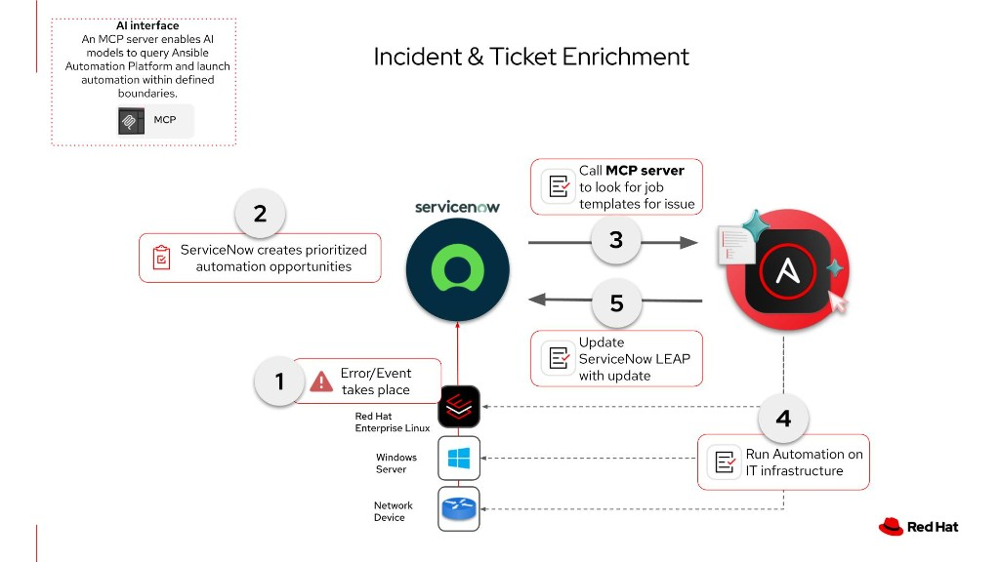


# Unlock AIOps with ServiceNow LEAP and Ansible MCP server - Solution Guide <!-- omit in toc -->

<style>
  div#toc {
    display: none;
  }
</style>

## Overview

Service management and automation teams often solve the same operational problems from two different “systems of work”: **ServiceNow** captures incidents and workflows, while **Ansible Automation Platform (AAP)** executes the remediation automation. The friction shows up as slow handoffs, duplicate investigations, and inconsistent execution -- all of which inflate **MTTR** and toil.

This guide describes a practical AIOps pattern that bridges those teams using **ServiceNow Learning-Enhanced Automation Platform (LEAP)** and the **Ansible Automation Platform MCP server**. In the flow, LEAP helps identify and prioritize automation opportunities tied to real operational pain, connects to AAP through MCP, **surfaces the right Ansible playbook**, and **runs it with enterprise governance** (RBAC, auditability, and repeatable outcomes).

> **Where this fits in AIOps maturity**
>
> This pattern is closest to **Walk/Run** depending on how you gate execution: LEAP can recommend and launch governed automation from an ITSM context, rather than stopping at ticket commentary alone. For a broader Crawl → Walk → Run framing, see [AIOps automation with Ansible](README-AIOps.md).

**Interactive walkthrough (source narrative for this guide):** [Unlock AIOps with ServiceNow LEAP and Ansible MCP server](https://app.arcade.software/share/UAt0jBV2NHwrV3rgaTQr?ref=share-link)

- [Overview](#overview)
- [Background](#background)
- [Solution](#solution)
  - [Who Benefits](#who-benefits)
- [End-to-End Architecture](#end-to-end-architecture)
- [Prerequisites](#prerequisites)
  - [Ansible Automation Platform](#ansible-automation-platform)
  - [ServiceNow](#servicenow)
  - [Featured Ansible Content Collections (common additions)](#featured-ansible-content-collections-common-additions)
- [Solution Walkthrough](#solution-walkthrough)
  - [1. Create an AAP API token for the MCP integration](#1-create-an-aap-api-token-for-the-mcp-integration)
  - [2. Connect ServiceNow to the Ansible Automation Platform MCP server](#2-connect-servicenow-to-the-ansible-automation-platform-mcp-server)
  - [3. Map a LEAP opportunity to an AAP remediation playbook](#3-map-a-leap-opportunity-to-an-aap-remediation-playbook)
  - [4. Remediate an incident via LEAP (“Execute Ansible playbooks”)](#4-remediate-an-incident-via-leap-execute-ansible-playbooks)
- [Validation](#validation)
  - [Troubleshooting](#troubleshooting)
- [Security, Governance, and Operational Risk](#security-governance-and-operational-risk)
- [Maturity Path](#maturity-path)
- [Related Guides](#related-guides)
- [Summary](#summary)

<h2 id="background"></h2>

## Background

**ServiceNow** remains the enterprise standard for ITSM and service operations workflows. **LEAP** extends that operational context by helping teams identify recurring issues and automation opportunities, then connecting those opportunities to executable remediation.

**Ansible Automation Platform** is the execution plane for infrastructure and application automation -- with the controls enterprises expect: RBAC, credential management, execution environments, job templates/workflows, and audit trails.

**MCP (Model Context Protocol) integration** matters here because it gives ServiceNow/LEAP a structured, supported way to call into AAP capabilities (discover and run the right automation) without bespoke glue code for every new playbook.

 <a target="_blank" href="https://www.redhat.com/en/technologies/management/ansible">Ansible Automation Platform -- redhat.com</a>

 <a target="_blank" href="https://www.redhat.com/en/topics/ai/what-is-aiops">What is AIOps? -- redhat.com</a>

<h2 id="solution"></h2>

## Solution

What makes up the solution?

-  **ServiceNow + LEAP** to prioritize automation opportunities and drive incident remediation from the service operations experience
-  **Ansible Automation Platform MCP server** as the integration surface between LEAP and AAP
-  **Ansible Automation Platform** to execute the matched remediation playbook with enterprise controls

### Who Benefits

| Persona | Challenge | What They Gain |
|---------|-----------|---------------|
|  **IT Ops / Service Operations** | Swivel-chairing between ITSM and automation tools; inconsistent remediation steps across teams | A guided path from incident → governed Ansible execution, with fewer manual handoffs |
|  **Automation Architect / Platform** | Fragile one-off integrations; hard-to-audit execution; unclear RBAC boundaries | A standard connector model (MCP) and AAP-native audit/RBAC for what actually runs |
|  **IT Leader** | High MTTR and repeat incidents; automation exists but isn’t operationalized | Faster resolution, reuse of trusted playbooks, and measurable governance |

<h2 id="end-to-end-architecture"></h2>

## End-to-End Architecture

The Arcade walkthrough summarizes the story as:

- **Incident in ServiceNow**
- **LEAP prioritizes automation opportunities**
- **LEAP calls MCP server for AAP** and **surfaces an AAP playbook**
- **AAP runs the playbook** (governed: RBAC + audit)
- **ServiceNow LEAP updates** as the remediation proceeds/completes



**End-to-end flow (logical):**

```
ServiceNow Incident/Operations context
  → LEAP identifies/matches an automation opportunity
    → LEAP uses Ansible AAP MCP integration
      → AAP executes approved remediation (Job Template / Workflow Job Template)
        → Results propagate back into the ServiceNow/LEAP experience
```

<h2 id="prerequisites"></h2>

## Prerequisites

### Ansible Automation Platform

- **Ansible Automation Platform 2.6+** with MCP server for Ansible Automation Platform
- A **service account** model for integration (prefer short-lived tokens + narrowly scoped permissions)
- The **Ansible Automation Platform MCP server endpoint** deployed and reachable from ServiceNow (org-standard: reverse proxy, mTLS, IP allow lists, etc.)

### ServiceNow

- ServiceNow instance with **LEAP** available (workspace navigation in the demo begins at **Workspaces → Learning-Enhanced Automation Platform**)
- Permissions to configure **Connectors** and complete LEAP workflows that launch remediation actions (demo path: settings → **Connectors** → **+ Connect**)

### Featured Ansible Content Collections (common additions)

These aren’t mandatory for the LEAP/MCP integration itself, but they’re commonly used adjacent to ITSM execution patterns:

| Collection | Type | Purpose |
|-----------|------|---------|
| <a target="_blank" href="https://console.redhat.com/ansible/automation-hub/repo/published/servicenow/itsm/">servicenow.itsm</a> | Certified | Update incidents/problems/changes from Ansible jobs when you want bi-directional ITSM updates beyond LEAP UI |
| <a target="_blank" href="https://console.redhat.com/ansible/automation-hub/repo/published/ansible/controller/">ansible.controller</a> | Certified | Controller configuration as code (job templates, workflows, surveys) |

<h2 id="solution-walkthrough"></h2>

## Solution Walkthrough

> **Note:** UI labels mirror the Arcade guidance.
>
> Adapt naming to your organization’s ServiceNow profiles, workspaces, and connector menus.

### 1. Create an AAP API token for the MCP integration

**Goal:** Create an Automation Platform credential that ServiceNow can use when calling the Ansible MCP server.

In Ansible Automation Platform:

- Go to **Access Management**
- Open **API Tokens**
- Select **Create API token**
- Fill in an optional description, set the token **scope** appropriately, then **Create token**
- **Copy the token immediately** (it may not be shown again)

### 2. Connect ServiceNow to the Ansible Automation Platform MCP server

**Goal:** Register the MCP integration inside ServiceNow so LEAP can call into AAP.

Starting from the **ServiceNow dashboard home page**:

- Open **Workspaces → Learning-Enhanced Automation Platform** (LEAP)
- Open **settings** (the demo calls out the settings control on the LEAP home page)
- Go to **Connectors**
- Click **+ Connect**
- Enter the **Ansible Automation Platform MCP server URL** and **API key** (the API token from the previous step), then **save**

**Success criteria:** ServiceNow confirms the connector is saved and LEAP can reach the MCP endpoint (see [Validation](#validation)).

### 3. Map a LEAP opportunity to an AAP remediation playbook

**Goal:** Associate a LEAP “opportunity” with a validated Ansible remediation artifact so the right automation is available when an incident matches.

In LEAP:

- Find a LEAP opportunity and select **Review**
- Open **Review details**
- Confirm a **valid remediation playbook** is identified for the scenario (demo example: restoring a broken web application)
- **Save and close** the mapping workflow

**Success criteria:** The opportunity shows a matched AAP playbook and is ready for operational use.

### 4. Remediate an incident via LEAP (“Execute Ansible playbooks”)

**Goal:** Use the Service Operations experience to drive governed playbook execution through LEAP + MCP + AAP.

- Go to the **Service Operations** workspace
- Select an incident to remediate
- Choose **Execute Ansible playbooks**
- Use the **LEAP assistant connected to AAP** to request a resolution for the incident
- LEAP should **confirm the service issue**, **match the incident to the correct AAP playbook**, and **run the playbook**
- Verify the incident reaches the expected resolved state in ServiceNow after AAP completes successfully

<h2 id="validation"></h2>

## Validation

| Checkpoint | What to verify | Success indicator |
|-----------|----------------|-------------------|
| **AAP token** | Token scopes and user/team permissions | Token can launch the intended job template(s) manually from Controller (smoke test) |
| **ServiceNow connector** | MCP URL + credential | Connector saves cleanly; LEAP can query AAP capabilities (playbook surfaced in LEAP) |
| **Opportunity mapping** | Playbook binding | Opportunity review shows the expected AAP remediation object |
| **Execution** | Incident-driven run | AAP job run is created/visible in Controller; ServiceNow reflects completion criteria you expect |

### Troubleshooting

| Symptom | Likely cause | Fix |
|---------|--------------|-----|
| Connector save fails | Wrong MCP base URL, TLS trust chain, or network path | Validate URL, certificates, egress/proxy allow lists, and MCP health outside ServiceNow |
| LEAP can’t list/playbooks | Token scope too narrow or wrong AAP user | Recreate token with correct RBAC; confirm the user can see the job template in Controller |
| Playbook runs but wrong target | Inventory/limit mismatch or survey vars missing | Standardize surveys/extra vars; enforce limits via approved job templates |
| “Success” in UI but service still broken | Playbook is incomplete or verification step is insufficient | Add post-check tasks; gate “resolved” updates on objective health checks |

<h2 id="security-governance-and-operational-risk"></h2>

## Security, Governance, and Operational Risk

Unlike “ticket-only enrichment” patterns, **executing Ansible changes infrastructure and application state**. Treat this integration as production automation:

- **Prefer least privilege** on the AAP token and integration user; scope to only the job templates/workflows required
- **Use approved job templates/workflows** (don’t expose arbitrary playbook execution)
- **Enforce change controls**: approvals, maintenance windows, and/or human gates where required
- **Treat MCP like any integration endpoint**: protect with TLS, monitoring, and rotation for API keys/tokens
- **Audit everything**: Controller job output + ServiceNow history should tell the same story

<h2 id="maturity-path"></h2>

## Maturity Path

| Maturity | What LEAP + AAP MCP enables | Typical gating |
|----------|----------------------------|----------------|
|  **Crawl** | Standardize the connector + map a small set of “golden path” playbooks | Manual selection; narrow incident categories |
|  **Walk** | Expand opportunity mapping catalog; add surveys/limits; integrate approvals | Change management + playbook reviews |
|  **Run** | Higher-confidence matching + broader coverage + policy guardrails | Automated guardrails, SLO-driven execution, continuous verification |

<h2 id="related-guides"></h2>

## Related Guides

-  **AIOps reference architecture:** [AIOps automation with Ansible](README-AIOps.md)
-  **Splunk-triggered remediation:** [Triggering Automated Remediation from Splunk Alerts](README-AIOps-Splunk.md)
-  **EDA (alternate trigger pattern):** [Get started with EDA (Ansible Rulebook)](https://access.redhat.com/articles/7136720)
-  **Legacy ServiceNow enrichment KB:** [ServiceNow ITSM Ticket Enrichment Automation](https://access.redhat.com/articles/7127603)

---

## Summary

ServiceNow LEAP helps operations teams move from “we have incidents” to “we have **repeatable, governed remediation**.” By connecting LEAP to Ansible Automation Platform through an **MCP server**, teams can **surface the right playbook**, **run it with AAP controls**, and **close the loop back in ServiceNow** -- reducing MTTR, removing silos, and making automation operational rather than theoretical.

---



