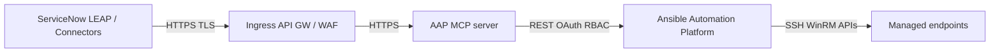


# Unlock AIOps with ServiceNow LEAP and Ansible MCP server - Solution Guide <!-- omit in toc -->


<style>
  div#toc {
    display: none;
  }
</style>

## Overview

Service management and automation teams often solve the same operational problems from two different “systems of work”: **ServiceNow** captures incidents and workflows, while **Ansible Automation Platform (AAP)** executes the remediation automation. The friction shows up as slow handoffs, duplicate investigations, and inconsistent execution -- all of which inflate **MTTR** and toil.

This guide describes a practical AIOps pattern that bridges those teams using **ServiceNow Learning-Enhanced Automation Platform (LEAP)** and the **Ansible Automation Platform MCP server**. In the flow, LEAP helps identify and prioritize automation opportunities tied to real operational pain, connects to AAP through MCP, **surfaces the right Ansible playbook**, and **runs it with enterprise governance** (RBAC, auditability, and repeatable outcomes).

**Business value:** Fewer handoffs and faster MTTR when remediation already exists as Ansible content -- operators launch **approved** job templates from the ITSM context they already use. Repeat incidents shrink when LEAP systematically maps opportunities to trusted playbooks; stakeholders get an **audit trail** from ServiceNow through AAP to the hosts that changed.

**Technical value:** A **standard MCP integration surface** instead of one-off REST scripts per team; **RBAC-scoped** execution in AAP whether a human or LEAP starts the job; **credential isolation** (vaulted in AAP, injected at runtime); optional **`servicenow.itsm`** follow-up for correlation IDs in work notes.

> **Where this fits in AIOps maturity**
>
> This pattern is closest to **Walk/Run** depending on how you gate execution: LEAP can recommend and launch governed automation from an ITSM context, rather than stopping at ticket commentary alone. For a broader Crawl → Walk → Run framing, see [AIOps automation with Ansible](README-AIOps.md).

**Interactive walkthrough (source narrative for this guide):** [Unlock AIOps with ServiceNow LEAP and Ansible MCP server](https://app.arcade.software/share/UAt0jBV2NHwrV3rgaTQr?ref=share-link)

- [Overview](#overview)
- [Background](#background)
- [Solution](#solution)
  - [Who Benefits](#who-benefits)
- [Workflow](#workflow)
  - [Architecture diagram (reference)](#architecture-diagram-reference)
  - [Operational impact by stage](#operational-impact-by-stage)
  - [MCP deployment topology and trust boundaries](#mcp-deployment-topology-and-trust-boundaries)
- [Prerequisites](#prerequisites)
  - [Ansible Automation Platform](#ansible-automation-platform)
  - [ServiceNow](#servicenow)
  - [Featured Ansible Content Collections](#featured-ansible-content-collections)
- [Solution Walkthrough](#solution-walkthrough)
  - [1. Create an AAP API token for the MCP integration](#1-create-an-aap-api-token-for-the-mcp-integration)
  - [2. Connect ServiceNow to the Ansible Automation Platform MCP server](#2-connect-servicenow-to-the-ansible-automation-platform-mcp-server)
  - [3. Map a LEAP opportunity to an AAP remediation playbook](#3-map-a-leap-opportunity-to-an-aap-remediation-playbook)
  - [4. Remediate an incident via LEAP (“Execute Ansible playbooks”)](#4-remediate-an-incident-via-leap-execute-ansible-playbooks)
- [Executable artifacts (YAML examples)](#executable-artifacts-yaml-examples)
- [Validation](#validation)
  - [Sample verification artifacts](#sample-verification-artifacts)
  - [Troubleshooting](#troubleshooting)
- [Security, Governance, and Operational Risk](#security-governance-and-operational-risk)
- [Maturity Path](#maturity-path)
- [Measuring success](#measuring-success)
- [Related Guides](#related-guides)
- [Summary](#summary)

<h2 id="background"></h2>

## Background

**ServiceNow** remains the enterprise standard for ITSM and service operations workflows. **LEAP** extends that operational context by helping teams identify recurring issues and automation opportunities, then connecting those opportunities to executable remediation.

**Ansible Automation Platform** is the execution plane for infrastructure and application automation -- with the controls enterprises expect: RBAC, credential management, execution environments, job templates/workflows, and audit trails.

**MCP (Model Context Protocol) integration** matters here because it gives ServiceNow/LEAP a structured, supported way to call into AAP capabilities (discover and run the right automation) without bespoke glue code for every new playbook.

 <a target="_blank" href="https://www.redhat.com/en/blog/aiops-and-ansible-automation-platform-where-ai-intelligence-meets-trusted-execution">AIOps and Ansible Automation Platform: Where AI intelligence meets trusted execution</a>

 <a target="_blank" href="https://www.redhat.com/en/topics/ai/what-is-aiops">What is AIOps? -- redhat.com</a>

<h2 id="solution"></h2>

## Solution

What makes up the solution?

-  **ServiceNow + LEAP** to prioritize automation opportunities and drive incident remediation from the service operations experience
-  **Ansible Automation Platform MCP server** as the integration surface between LEAP and AAP
-  **Ansible Automation Platform** to execute the matched remediation playbook with enterprise controls

### Who Benefits

| Persona | Challenge | What They Gain |
|---------|-----------|---------------|
|  **IT Ops / Service Operations** | Swivel-chairing between ITSM and automation tools; inconsistent remediation steps across teams | A guided path from incident → governed Ansible execution, with fewer manual handoffs |
|  **Automation Architect / Platform** | Fragile one-off integrations; hard-to-audit execution; unclear RBAC boundaries | A standard connector model (MCP) and AAP-native audit/RBAC for what actually runs |
|  **IT Leader** | High MTTR and repeat incidents; automation exists but isn’t operationalized | Faster resolution, reuse of trusted playbooks, and measurable governance |

<h2 id="workflow"></h2>

## Workflow

The Arcade walkthrough summarizes the story as:

- **Incident in ServiceNow**
- **LEAP prioritizes automation opportunities**
- **LEAP calls MCP server for AAP** and **surfaces an AAP playbook**
- **AAP runs the playbook** (governed: RBAC + audit)
- **ServiceNow LEAP updates** as the remediation proceeds/completes


**Logical flow:**

```
ServiceNow Incident / Service Operations context
  → LEAP identifies or matches an automation opportunity
    → LEAP uses the Ansible Automation Platform MCP integration
      → AAP runs an approved Job Template or Workflow Job Template
        → Outcomes and status feed back into the ServiceNow / LEAP experience
```

### Operational impact by stage

| Stage | Operational impact | Why it matters |
|-------|-------------------|----------------|
| **LEAP opportunity mapping** | **Low** (metadata and bindings in ITSM) | Associates approved AAP artifacts with recurring operational patterns |
| **Connector + MCP** | **Low** (integration configuration) | Defines trust path and credentials between ServiceNow and AAP |
| **Playbook execution** | **Medium to High** (infrastructure / application change) | This is real remediation -- scope, limits, and approvals must match production policy |

### MCP deployment topology and trust boundaries

Place the **Ansible Automation Platform MCP server** where your organization routes all third-party SaaS integrations: typically **behind an HTTPS ingress** (reverse proxy, API gateway, or load balancer) with **TLS termination**, **allow lists**, and optional **mTLS** between proxy and MCP. ServiceNow holds the **integration identity** (API token or OAuth secret); the MCP server never stores broad admin passwords in clear text -- align with your vault and rotation policy.



**Trust boundaries to document in your runbook:** who can create API tokens, which job templates the integration user may launch, whether **survey** or **limit** is mandatory, and where job output is allowed to be copied back into ServiceNow (work notes vs system fields).

<h2 id="prerequisites"></h2>

## Prerequisites

### Ansible Automation Platform

- **Ansible Automation Platform 2.6+** with the **MCP server for Ansible Automation Platform** (confirm supported versions in your AAP release notes; older supported trains may allow **2.5+**)
- A **dedicated integration user** or **team-scoped service account** with permission only for the job templates LEAP is allowed to run; prefer **short-lived tokens** and narrowly scoped permissions
- The **Ansible Automation Platform MCP server endpoint** deployed and reachable from ServiceNow (reverse proxy, mTLS, IP allow lists, health checks)

### ServiceNow

- ServiceNow instance with **LEAP** available (demo navigation: **Workspaces → Learning-Enhanced Automation Platform**)
- Permissions to configure **Connectors** and run LEAP remediation flows (demo path: settings → **Connectors** → **+ Connect**)

### Featured Ansible Content Collections

| Collection | Type | Purpose |
|-----------|------|---------|
| <a target="_blank" href="https://console.redhat.com/ansible/automation-hub/repo/published/ansible/controller/">ansible.controller</a> | Certified | Define job templates and AAP objects as code (pairs with [Executable artifacts](#executable-artifacts-yaml-examples)) |
| <a target="_blank" href="https://console.redhat.com/ansible/automation-hub/repo/published/servicenow/itsm/">servicenow.itsm</a> | Certified | Optional: update incidents from an Ansible follow-up job after AAP completes (correlation IDs, work notes) |

<h2 id="solution-walkthrough"></h2>

## Solution Walkthrough

> **Note:** UI labels may vary.
>
> The screenshots and step names below match a reference ServiceNow instance. Adapt naming to your organization's profiles, workspaces, and connector menus.

### 1. Create an AAP API token for the MCP integration

**Goal:** Create an Automation Platform credential that ServiceNow can use when calling the Ansible MCP server.

In Ansible Automation Platform:

- Go to **Access Management**
- Open **API Tokens**
- Select **Create API token**
- Fill in an optional description, set the token **scope** appropriately, then **Create token**
- **Copy the token immediately** (it may not be shown again)

### 2. Connect ServiceNow to the Ansible Automation Platform MCP server

**Goal:** Register the MCP integration inside ServiceNow so LEAP can call into AAP.

Starting from the **ServiceNow dashboard home page**:

- Open **Workspaces → Learning-Enhanced Automation Platform** (LEAP)
- Open **settings** (the demo calls out the settings control on the LEAP home page)
- Go to **Connectors**
- Click **+ Connect**
- Enter the **Ansible Automation Platform MCP server URL** and **API key** (the API token from the previous step), then **save**

**Success criteria:** ServiceNow confirms the connector is saved and LEAP can reach the MCP endpoint (see [Validation](#validation)).

### 3. Map a LEAP opportunity to an AAP remediation playbook

**Goal:** Associate a LEAP “opportunity” with a validated Ansible remediation artifact so the right automation is available when an incident matches.

In LEAP:

- Find a LEAP opportunity and select **Review**
- Open **Review details**
- Confirm a **valid remediation playbook** is identified for the scenario (demo example: restoring a broken web application)
- **Save and close** the mapping workflow

**Success criteria:** The opportunity shows a matched AAP playbook and is ready for operational use.

### 4. Remediate an incident via LEAP (“Execute Ansible playbooks”)

**Goal:** Use the Service Operations experience to drive governed playbook execution through LEAP + MCP + AAP.

- Go to the **Service Operations** workspace
- Select an incident to remediate
- Choose **Execute Ansible playbooks**
- Use the **LEAP assistant connected to AAP** to request a resolution for the incident
- LEAP should **confirm the service issue**, **match the incident to the correct AAP playbook**, and **run the playbook**
- Verify the incident reaches the expected resolved state in ServiceNow after AAP completes successfully

<h2 id="executable-artifacts-yaml-examples"></h2>

## Executable artifacts (YAML examples)

These excerpts mirror patterns used in higher-scoring guides: **AAP-as-code** for approved catalogs, plus an optional **`servicenow.itsm`** follow-up when you want Ansible (not only LEAP UI) to write correlation data back to the incident.

### 1. Governed job template (AAP as code)

Use `ansible.controller.job_template` (or `awx.awx.job_template` on community Galaxy if your standards allow) so remediation artifacts are **reviewable in Git** and promoted like any other automation.

```yaml
---
- name: Example - ensure LEAP-facing remediation template exists
  hosts: localhost
  gather_facts: false
  vars:
    aap_host: "https://controller.example.com"
    aap_token: "{{ vault_aap_oauth_token }}"
  tasks:
    - name: Create or update governed job template
      ansible.controller.job_template:
        controller_host: "{{ aap_host }}"
        controller_oauth_token: "{{ aap_token }}"
        name: "LEAP - Restore web application"
        description: "Approved remediation for LEAP / MCP; restrict via RBAC and inventory limits."
        job_type: "run"
        playbook: "playbooks/remediate_webapp.yml"
        project: "Org - Trusted playbooks"
        inventory: "Production - Linux"
        execution_environment: "Supported EE - RHEL"
        credential:
          - "Prod - SSH automation"
          - "Prod - Vault lookup"
        ask_limit_on_launch: true
        ask_variables_on_launch: true
        state: present
```

Tune **`ask_limit_on_launch`** and surveys so operators (and LEAP-driven runs) cannot bypass blast-radius controls.

### 2. Optional ITSM follow-up with servicenow.itsm

After AAP finishes, a small **follow-up playbook** can append **work notes** with the **AAP job ID** and status for auditors linking ITSM and AAP.

```yaml
---
- name: Optional - correlate AAP job to ServiceNow incident
  hosts: localhost
  gather_facts: false
  vars:
    snow_instance: "yourcompany.service-now.com"
  tasks:
    - name: Append work note with remediation correlation
      servicenow.itsm.incident:
        instance:
          host: "{{ snow_instance }}"
          username: "{{ snow_api_user }}"
          password: "{{ snow_api_password }}"
        number: "{{ incident_number }}"
        state: present
        other:
          work_notes: |
            Ansible Automation Platform remediation completed.
            Job ID: {{ tower_job_id | default('unknown') }}
            Job template: {{ job_template_name | default('unknown') }}
            Status: {{ job_status | default('unknown') }}
      when: incident_number is defined
```

Use a **dedicated** ServiceNow integration user with least privilege (often **read/update incident work notes** only).

<h2 id="validation"></h2>

## Validation

| Checkpoint | What to verify | Success indicator |
|-----------|----------------|-------------------|
| **AAP token** | Token scopes and user/team permissions | User can see only approved job templates in the UI; smoke-launch succeeds (see below) |
| **ServiceNow connector** | MCP URL + credential | Connector saves; LEAP surfaces playbooks tied to opportunities |
| **Opportunity mapping** | Playbook binding | Opportunity review shows the expected AAP job template or workflow |
| **Execution** | Incident-driven run | AAP shows a new job with expected template name; exit status matches policy |

### Sample verification artifacts

Sanitize hostnames, tokens, and IDs before sharing. Below shapes are what you should expect when debugging.

**1. AAP API -- job template visible to integration user**

```bash
curl -sS -H "Authorization: Bearer <AAP_TOKEN>" \
  "https://controller.example.com/api/v2/job_templates/?name__icontains=LEAP"
```

Example (truncated) response shape:

```json
{
  "count": 1,
  "results": [
    {
      "id": 42,
      "name": "LEAP - Restore web application",
      "type": "job_template"
    }
  ]
}
```

**2. AAP API -- launch job (smoke test)**

```bash
curl -sS -X POST \
  -H "Authorization: Bearer <AAP_TOKEN>" \
  -H "Content-Type: application/json" \
  "https://controller.example.com/api/v2/job_templates/42/launch/" \
  -d '{"limit":"web-prod-01.example.com"}'
```

Example (truncated) response:

```json
{
  "job": 9876
}
```

**3. Job completed successfully**

```bash
curl -sS -H "Authorization: Bearer <AAP_TOKEN>" \
  "https://controller.example.com/api/v2/jobs/9876/"
```

Look for `"status":"successful"` and capture **`job_template`** / **`id`** for your incident correlation note.

**4. Optional -- ServiceNow incident API sanity check**

```bash
curl -sS -u "integration_user:<PASSWORD>" \
  "https://yourcompany.service-now.com/api/now/table/incident?sysparm_query=number=INC0010001&sysparm_fields=number,state,work_notes"
```

Confirm **`work_notes`** contains your correlation block after the optional `servicenow.itsm` task runs.

### Troubleshooting

| Symptom | Likely cause | Fix |
|---------|--------------|-----|
| Connector save fails | Wrong MCP base URL, TLS trust chain, or network path | Validate URL, certificates, egress/proxy allow lists, and MCP health outside ServiceNow |
| LEAP can’t list/playbooks | Token scope too narrow or wrong AAP user | Recreate token with correct RBAC; confirm the user can see the job template in AAP |
| Playbook runs but wrong target | Inventory/limit mismatch or survey vars missing | Standardize surveys/extra vars; enforce limits via approved job templates |
| “Success” in UI but service still broken | Playbook is incomplete or verification step is insufficient | Add post-check tasks; gate “resolved” updates on objective health checks |
| 401/403 from AAP API | Expired token or wrong OAuth scope | Rotate token; verify user belongs to team that owns the template |

<h2 id="security-governance-and-operational-risk"></h2>

## Security, Governance, and Operational Risk

Unlike “ticket-only enrichment” patterns, **executing Ansible changes infrastructure and application state**. Treat this integration as production automation:

- **Prefer least privilege** on the AAP token and integration user; scope to only the job templates/workflows required
- **Use approved job templates/workflows** (don’t expose arbitrary playbook execution)
- **Enforce change controls**: approvals, maintenance windows, and/or human gates where required
- **Treat MCP like any integration endpoint**: protect with TLS, monitoring, and rotation for API keys/tokens
- **Audit everything**: AAP job output + ServiceNow history should tell the same story

<h2 id="maturity-path"></h2>

## Maturity Path

| Maturity | What LEAP + AAP MCP enables | Typical gating |
|----------|----------------------------|----------------|
|  **Crawl** | Standardize the connector + map a small set of “golden path” playbooks | Manual selection; narrow incident categories |
|  **Walk** | Expand opportunity mapping catalog; add surveys/limits; integrate approvals | Change management + playbook reviews |
|  **Run** | Higher-confidence matching + broader coverage + policy guardrails | Automated guardrails, SLO-driven execution, continuous verification |

<h2 id="measuring-success"></h2>

## Measuring success

Quantify adoption the same way top guides anchor business outcomes to observable signals:

| Metric | What good looks like | How to measure |
|--------|---------------------|----------------|
| **MTTR for mapped scenarios** | Down vs baseline after LEAP + MCP go-live | ITSM timestamps (open → resolved) for incidents tagged to LEAP-mapped categories |
| **Repeat incident rate** | Fewer reopen tickets for the same root cause | Problem/incident correlation IDs in ServiceNow over 30/90 days |
| **Automation reuse** | Same certified job template used across many incidents | AAP job runs per template ID; LEAP opportunity linkage |
| **Governance coverage** | No unauthorized templates executed via integration | AAP RBAC audits; token scoped user cannot launch non-approved templates |
| **Audit completeness** | Every remediation ties ITSM ↔ job ID ↔ host change | Work notes or CMDB update optional task; AAP job `id` in notes |

<h2 id="related-guides"></h2>

## Related Guides

-  **AIOps reference architecture:** [AIOps automation with Ansible](README-AIOps.md)
-  **EDA (alternate trigger pattern):** [Get started with EDA (Ansible Rulebook)](https://access.redhat.com/articles/7136720)
-  **ServiceNow enrichment:** [ServiceNow ITSM Ticket Enrichment Automation](README-ServiceNow-ITSM.md)

---

## Summary

ServiceNow LEAP helps operations teams move from “we have incidents” to “we have **repeatable, governed remediation**.” By connecting LEAP to Ansible Automation Platform through an **MCP server**, teams can **surface the right playbook**, **run it with AAP controls**, and **close the loop back in ServiceNow** -- reducing MTTR, removing silos, and making automation operational rather than theoretical.

---



