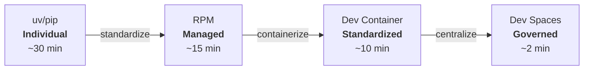
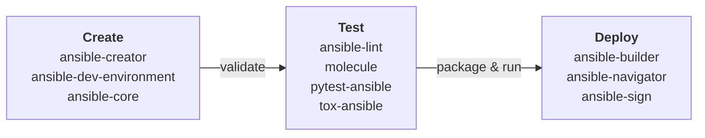
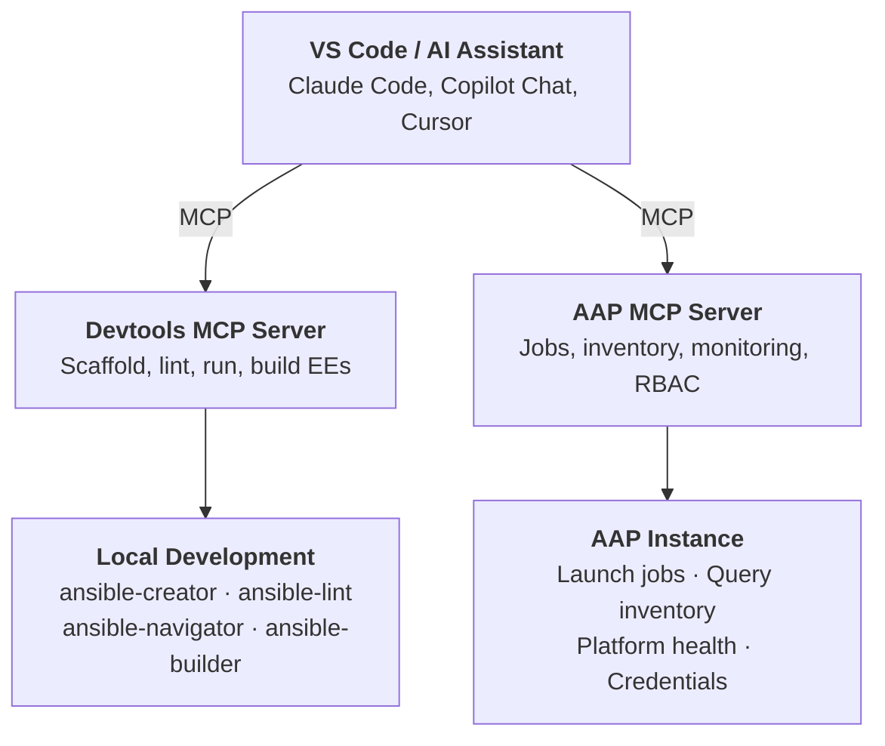
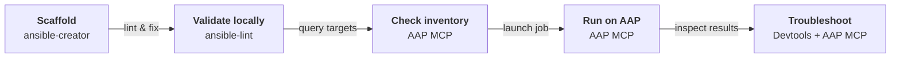

# AI-Assisted Ansible Developer Experience - Solution Guide

## Overview

Onboarding a new automation developer takes anywhere from 1 to 3 months when done manually: waiting for laptop provisioning, requesting access permissions, installing the right Python version, resolving dependency conflicts, configuring linting rules to match the team's standards, and debugging why molecule tests pass on a colleague's machine but fail on theirs. Multiply that across a team of 10 or 15 engineers, and the cost of inconsistent development environments becomes significant: delayed projects, "works on my machine" bugs, and quality standards that exist on paper but not in practice.

**Ansible Development Tools (ADT)** solves this by bundling essential CLI tools into a single, versioned package -- no Ansible Automation Platform installation required. ADT is available through four delivery methods that represent an evolution from individual setup to enterprise-governed environments:



| Method | Onboarding | Consistency | Who manages it |
|--------|-----------|-------------|---------------|
| **uv/pip** | ~30 min, but developers must manually coordinate versions with their team and troubleshoot conflicts on their own | Low: each developer manages their own environment, drift is inevitable | Developer |
| **RPM** | ~15 min if Satellite is available, but requires IT to include it in laptop provisioning workflows | Medium: same package version across RHEL systems, but no IDE or linting config | IT / Platform team |
| **Dev Container** | ~10 min (first image pull), then instant for subsequent projects. Requires permissions to run containers on the workstation. Available as community (free) or supported (AAP subscription) image | High: same image, same tools, same config. Adding `.devcontainer/` to a repo is all it takes | Team lead / repo owner |
| **Dev Spaces** | ~2 min. Open a browser, click create, start coding | Highest: centrally managed, browser-only, zero local dependencies | Platform team / IT |

The goal is to move every automation developer in your organization onto the same toolchain, with the same versions, the same linting rules, and the same testing frameworks. Dev containers and Dev Spaces are the recommended enterprise options: they require an initial investment in image management to account for different project scenarios, but once that setup is done, the environment is completely transparent to developers.

> **Example:** A network automation team of 12 engineers across three offices adopts Dev Spaces. A new engineer joins on Monday, opens a browser, navigates to the Dev Spaces URL, and clicks "Create Workspace" on the team's Git repository. Two minutes later they have a full VS Code environment with ansible-lint, molecule, ansible-navigator, and the team's linting profile, identical to every other engineer on the team. No local installs, no "which Python version do I need," no VPN issues with package mirrors.

---

- [AI-Assisted Ansible Developer Experience - Solution Guide](#ai-assisted-ansible-developer-experience---solution-guide)
  - [Overview](#overview)
  - [Background](#background)
  - [Solution](#solution)
    - [What's in the Bundle](#whats-in-the-bundle)
    - [Who Benefits](#who-benefits)
    - [Recommended Resources](#recommended-resources)
  - [Prerequisites](#prerequisites)
    - [Ansible Automation Platform](#ansible-automation-platform)
    - [System Requirements](#system-requirements)
  - [Installation Methods](#installation-methods)
    - [Method A: Python Package (uv)](#method-a-python-package-uv)
    - [Method B: RPM (Red Hat Subscription)](#method-b-rpm-red-hat-subscription)
    - [Method C: Dev Container (VS Code)](#method-c-dev-container-vs-code)
    - [Method D: Red Hat OpenShift Dev Spaces](#method-d-red-hat-openshift-dev-spaces)
  - [Comparison](#comparison)
  - [AI-Assisted Ansible Development](#ai-assisted-ansible-development)
    - [Ansible Devtools MCP Server](#ansible-devtools-mcp-server)
    - [Connecting to Ansible Automation Platform](#connecting-to-ansible-automation-platform)
    - [End-to-End Development Workflow](#end-to-end-development-workflow)
  - [Validation](#validation)
    - [Verify the Installation](#verify-the-installation)
    - [Quick Smoke Test](#quick-smoke-test)
    - [Troubleshooting](#troubleshooting)
  - [Maturity Path](#maturity-path)
  - [Related Guides](#related-guides)
  - [Sources](#sources)

---

## Background

The Ansible content lifecycle -- **Create, Test, Deploy** -- requires a set of specialized tools at each stage. When each developer installs and maintains these tools individually, environment drift is inevitable: one developer runs ansible-lint 24.x while another has 25.x, molecule tests pass on Linux but fail on macOS because of a missing dependency, and the new hire spends their first week troubleshooting Python conflicts instead of writing automation.

This drift compounds across teams. A role that passes CI on one developer's machine may fail on another's. Linting rules that are enforced locally may not match the CI pipeline. When something breaks in production, the first question is always "which version were you running?" instead of "what changed?"

ADT addresses this by providing a single installable package (or container image) that bundles known-good versions of all essential tools. Whether you install via uv/pip, RPM, or use a containerized environment, you get the same toolchain with the same integration guarantees. The container-based methods (dev containers and Dev Spaces) go further: they guarantee not just the same tool versions but the same OS, the same Python, the same VS Code extensions, and the same linting configuration for every developer.

> **Why a bundle instead of individual installs?**
>
> The tools in ADT are tightly integrated -- `ansible-lint` feeds into the VS Code extension, `molecule` uses `ansible-navigator` and `podman` under the hood, and `ansible-creator` scaffolds projects pre-configured for all of them. Installing them separately risks version conflicts and broken integrations.

---

## Solution

### What's in the Bundle

ADT includes ten tools covering the full content lifecycle:



| Stage | Tool | Purpose |
|-------|------|---------|
| **Create** | `ansible-creator` | Scaffold collections, roles, playbooks, and plugins |
| **Create** | `ansible-dev-environment` | pip-like install for Ansible collections in virtual environments |
| **Create** | `ansible-core` | Core automation engine |
| **Test** | `ansible-lint` | Static analysis for playbooks, roles, and collections |
| **Test** | `molecule` | Integration testing with ephemeral infrastructure |
| **Test** | `pytest-ansible` | pytest plugin for testing module and plugin Python code |
| **Test** | `tox-ansible` | Test matrix across Python and ansible-core versions |
| **Deploy** | `ansible-builder` | Build execution environments (container images) |
| **Deploy** | `ansible-galaxy` | Install collections and roles from Galaxy or Automation Hub (included with `ansible-core`) |
| **Deploy** | `ansible-navigator` | TUI for running and troubleshooting automation with EEs |
| **Deploy** | `ansible-sign` | Sign and verify Ansible project contents |

### Who Benefits

**Business Value Drivers:**

- **Faster onboarding** -- new automation developers go from zero to productive in minutes instead of weeks, directly reducing time-to-value for automation initiatives.
- **Reduced support burden** -- eliminating "works on my machine" failures frees senior engineers from troubleshooting environment issues and lets them focus on building automation.
- **Lower risk of inconsistent deployments** -- when every developer uses the same toolchain, the gap between what passes locally and what runs in production shrinks to zero.

**Technical Value Drivers:**

- **Deterministic environments** -- containerized workspaces guarantee identical OS, Python, tool versions, linting rules, and VS Code extensions across every developer.
- **Governed toolchain updates** -- platform teams control image versions centrally, rolling out upgrades and security patches without requiring action from individual developers.
- **Integrated content lifecycle** -- Create, Test, and Deploy tools are pre-integrated and version-locked, eliminating dependency conflicts and broken tool interactions.

| Persona | Challenge | What They Gain |
|---------|-----------|----------------|
| **Automation Developer** | Spending days or weeks assembling tools, resolving conflicts, and matching versions with the rest of the team instead of writing automation | A single install (or a container they never have to configure) that provides all tools in known-good, compatible versions |
| **Platform Engineer / SRE** | Inconsistent environments across developers causing "works on my machine" failures that waste CI cycles and delay releases | Containerized workspaces that guarantee identical toolchains for every developer, eliminating environment as a variable |
| **Automation Architect** | Enforcing development standards and testing practices across multiple teams when each team manages tools differently | Standardized tooling embedded in the project repo (`.devcontainer/`) or the platform (Dev Spaces), so standards are inherited, not documented |
| **Engineering Manager** | New developers take 1 to 3 months to become productive, with most of that time spent on environment setup and troubleshooting | Onboarding drops to minutes with dev containers or Dev Spaces. New hires open a browser or VS Code and start contributing on day one |

### Recommended Resources

- **Source code:** [ansible/ansible-dev-tools](https://github.com/ansible/ansible-dev-tools) on GitHub
- **Documentation (upstream):** [Ansible Development Tools](https://docs.ansible.com/projects/dev-tools/) official docs
- **Documentation (downstream):** [Developing automation content (AAP 2.6)](https://docs.redhat.com/en/documentation/red_hat_ansible_automation_platform/2.6/html/developing_automation_content/devtools-intro) on Red Hat docs
- **Community container image:** [community-ansible-dev-tools](https://github.com/ansible/community-ansible-dev-tools/pkgs/container/community-ansible-dev-tools) on GHCR
- **Supported container image:** [ansible-dev-tools-rhel9](https://catalog.redhat.com/software/containers/ansible-automation-platform-26/ansible-dev-tools-rhel9/) on Red Hat Ecosystem Catalog (requires AAP or Ansible Developer subscription)
- **VS Code extension:** [Ansible extension for VS Code](https://marketplace.visualstudio.com/items?itemName=redhat.ansible)
- **Community:** [Ansible Forum (devtools)](https://forum.ansible.com/tags/devtools)

---

## Prerequisites

### Ansible Automation Platform

- **uv/pip methods:** No AAP subscription required -- these use the upstream community packages.
- **Dev container method:** Available in two variants -- a free upstream community image (no subscription required) and a supported downstream image from `registry.redhat.io` (requires an AAP or Ansible Developer subscription).
- **RPM method:** Requires an AAP or Ansible Developer subscription and RHEL 9 registered with Red Hat Subscription Manager.
- **Dev Spaces method:** Requires an OpenShift cluster with Red Hat OpenShift Dev Spaces operator installed.

### System Requirements

| Requirement | uv/pip | RPM | Dev Container | Dev Spaces |
|-------------|-----|-----|---------------|------------|
| **Python** | 3.10+ | 3.10+ (included in RHEL 9+) | N/A (in container) | N/A (in container) |
| **OS** | Linux, macOS, WSL | RHEL 9 | Any (VS Code + container runtime) | Browser only |
| **Container runtime** | Optional (for molecule, builder) | Optional (for molecule, builder) | Docker or Podman | Managed by OpenShift |
| **Disk space** | ~500 MB | ~500 MB | ~2 GB (image) | Managed by cluster |
| **Subscription** | None | Red Hat AAP or Ansible Developer | None (community) or AAP/Ansible Developer (supported) | OpenShift + Dev Spaces |

---

## Installation Methods

### Method A: Python Package (uv)

**Operational Impact:** None -- local workstation only

**Best for:** Individual developers, quick setup on Linux/macOS/WSL, CI pipelines.

**Step 1:** Install [uv](https://docs.astral.sh/uv/) if you don't have it:

```bash
curl -LsSf https://astral.sh/uv/install.sh | sh
```

**Step 2:** Create a virtual environment and install ADT:

```bash
uv venv ~/ansible-dev-venv
source ~/ansible-dev-venv/bin/activate
uv add ansible-dev-tools
```

**Step 3:** Verify the installation:

```bash
adt --version
```

> **Tip:** Always use a virtual environment.
>
> Installing ADT system-wide can conflict with OS-packaged Python modules. On macOS 14+ and newer Linux distributions, the system Python is externally managed (PEP 668) and direct installs will fail. Using `uv` with a venv avoids this entirely.

> **Tip:** `pip` works too.
>
> If you prefer `pip`, replace `uv venv` with `python3 -m venv` and `uv add` with `pip install`. The rest of the workflow is identical.

**Upgrading:**

```bash
uv add --upgrade ansible-dev-tools
```

**Pinning a specific version:**

```bash
uv add ansible-dev-tools==26.4.6
```

---

### Method B: RPM (Red Hat Subscription)

**Operational Impact:** None -- local workstation only

**Best for:** Enterprise environments running RHEL with Red Hat subscriptions, air-gapped networks with Satellite.

**Step 1:** Register your system and enable a repository that includes ADT. Two subscription options are available:

```bash
# Option 1: Ansible Automation Platform subscription (AAP 2.6, RHEL 9)
sudo subscription-manager repos \
  --enable ansible-automation-platform-2.6-for-rhel-9-x86_64-rpms

# Option 2: Ansible Developer subscription (Developer 1.3, RHEL 9)
sudo subscription-manager repos \
  --enable ansible-developer-1.3-for-rhel-9-x86_64-rpms
```

> **Tip:** Choose the right subscription for your use case.
>
> The **Ansible Developer** subscription provides the development tools without bundling the full AAP platform -- this is often more appropriate for developer workstations. The **AAP** subscription includes the dev tools alongside the full platform components.

**Step 2:** Install ADT:

```bash
sudo dnf install ansible-dev-tools
```

**Step 3:** Verify the installation:

```bash
adt --version
```

> **Why RPM over uv/pip?**
>
> The RPM packages are built and tested by Red Hat, receive security errata through the standard RHEL advisory process, and are supported under a Red Hat subscription. This is the recommended method for enterprises that need vendor-backed support and predictable update cycles.

**Available repositories:**

Both subscriptions provide repos for RHEL 9 across four architectures: `x86_64`, `aarch64`, `ppc64le`, and `s390x`. Replace the architecture in the repo name to match your system:

- **Ansible Automation Platform:** `ansible-automation-platform-{version}-for-rhel-9-{arch}-rpms` (versions: 2.6, 2.5)
- **Ansible Developer:** `ansible-developer-{version}-for-rhel-9-{arch}-rpms` (versions: 1.3, 1.2)

---

### Method C: Dev Container (VS Code)

**Operational Impact:** None -- local workstation only

**Best for:** Teams wanting a consistent, reproducible development environment without managing Python installations. Works on any OS that runs VS Code and a container runtime.

Pre-built container images with all ADT tools, the Ansible VS Code extension, and nested Podman support are available in two variants:

- **Upstream (community):** `ghcr.io/ansible/community-ansible-dev-tools:latest`
- **Downstream (Red Hat supported):** `registry.redhat.io/ansible-automation-platform-26/ansible-dev-tools-rhel9` (requires [Red Hat registry authentication](https://access.redhat.com/RegistryAuthentication))

**Step 1:** Install prerequisites:

- [VS Code](https://code.visualstudio.com/)
- [Ansible extension for VS Code](https://marketplace.visualstudio.com/items?itemName=redhat.ansible) (`redhat.ansible`)
- [Dev Containers extension](https://marketplace.visualstudio.com/items?itemName=ms-vscode-remote.remote-containers) (`ms-vscode-remote.remote-containers`)
- A container runtime: [Docker Desktop](https://www.docker.com/products/docker-desktop/) or [Podman Desktop](https://podman-desktop.io/)

**Step 2:** Add a devcontainer to your project using one of these methods:

**Option A: CLI.** Run `ansible-creator` to scaffold devcontainer files into an existing project:

```bash
ansible-creator add resource devcontainer /path/to/your/project
```

This generates a `.devcontainer/` directory with both Docker and Podman configurations.

**Option B: VS Code UI.** Open the command palette (`Ctrl+Shift+P` / `Cmd+Shift+P`) and run **Ansible: Add devcontainer configuration**. The Ansible extension generates the same `.devcontainer/` directory.

**Option C: Manual.** Create `.devcontainer/devcontainer.json` in your project. This example matches the output of `ansible-creator` for a Podman-based setup:

```json
{
  "name": "ansible-dev-container-podman",
  "image": "ghcr.io/ansible/community-ansible-dev-tools:latest",
  "containerUser": "root",
  "runArgs": [
    "--cap-add=SYS_ADMIN",
    "--cap-add=SYS_RESOURCE",
    "--device", "/dev/fuse",
    "--security-opt", "seccomp=unconfined",
    "--security-opt", "label=disable",
    "--security-opt", "apparmor=unconfined",
    "--userns=host",
    "--hostname=ansible-dev-container"
  ],
  "customizations": {
    "vscode": {
      "extensions": [
        "redhat.ansible",
        "redhat.vscode-redhat-account"
      ]
    }
  }
}
```

> **Tip:** Using the supported downstream image.
>
> To use the Red Hat supported image instead of the community one, replace the `image` value in your `devcontainer.json` with `registry.redhat.io/ansible-automation-platform-26/ansible-dev-tools-rhel9:latest`. You must authenticate to `registry.redhat.io` first -- run `podman login registry.redhat.io` (or `docker login`) with your Red Hat account credentials. See [Red Hat Registry Authentication](https://access.redhat.com/RegistryAuthentication) for details.

**Step 3:** Open your project in VS Code, and when prompted, click **Reopen in Container** (or run the command `Dev Containers: Reopen in Container` from the command palette).

**Step 4:** Open a terminal in VS Code and verify:

```bash
adt --version
```

> **Tip:** Nested Podman is supported.
>
> The container image supports nested Podman, so you can run `molecule test` and `ansible-builder build` inside the dev container without additional configuration.

**Running the container image directly (without VS Code):**

```bash
podman run -it --rm \
  --cap-add=SYS_ADMIN \
  --cap-add=SYS_RESOURCE \
  --device "/dev/fuse" \
  --hostname=ansible-dev-container \
  --name=ansible-dev-container \
  --security-opt "apparmor=unconfined" \
  --security-opt "label=disable" \
  --security-opt "seccomp=unconfined" \
  --user=root \
  --userns=host \
  -v $PWD:/workdir \
  ghcr.io/ansible/community-ansible-dev-tools:latest
```

---

### Method D: Red Hat OpenShift Dev Spaces

**Operational Impact:** Medium -- requires an OpenShift cluster with Dev Spaces operator

**Best for:** Enterprise teams wanting centralized, browser-based development environments with zero local setup. Ideal for onboarding, workshops, and environments where developers cannot install software on their workstations.

Dev Spaces provides a full VS Code environment running in the browser, backed by an OpenShift cluster. All tools, extensions, and project sources are defined in a `devfile.yaml` -- a declarative workspace specification.

**Step 1:** Ensure your OpenShift cluster has the Dev Spaces operator installed and configured.

**Step 2:** Log into the Dev Spaces dashboard:

```
https://devspaces.<your-openshift-ingress-domain>
```

**Step 3:** Import a workspace from a Git repository. Paste the URL of a repository containing a `devfile.yaml`, for example:

```
https://github.com/rhpds/ansible-dev-tools-workspace.git
```

Click **Create & Open**. The workspace provisions automatically with all ADT tools pre-installed.

**Step 4:** Once the VS Code interface loads in your browser, open a terminal and verify:

```bash
adt --version
```

**Example devfile.yaml:**

```yaml
schemaVersion: 2.2.2
metadata:
  name: ansible-dev-tools-workspace
components:
  - name: tooling-container
    container:
      image: ghcr.io/ansible/community-ansible-dev-tools:latest
      memoryRequest: 2Gi
      memoryLimit: 4Gi
      cpuRequest: 500m
      cpuLimit: 1000m
      env:
        - name: SHELL
          value: /bin/bash
        - name: ADT_CONTAINER_ENGINE
          value: podman
```

> **Why Dev Spaces?**
>
> Unlike local dev containers, Dev Spaces runs entirely in the cloud. Developers only need a browser. The platform administrator controls the image, resource limits, and access -- ensuring every developer gets an identical, governed environment. This also enables features like rootless nested containers via OpenShift user namespaces, which are difficult to configure on local workstations.

**Key capabilities in Dev Spaces:**

| Feature | Details |
|---------|---------|
| **Browser-based VS Code** | Full IDE experience with no local install |
| **Nested containers** | Rootless Podman for molecule tests and EE builds |
| **Workspace-as-code** | `devfile.yaml` defines tools, repos, and resources declaratively |
| **Multi-user** | Each developer gets an isolated workspace on shared infrastructure |
| **Preloaded extensions** | Ansible VS Code extension with lint, navigator, and creator integration |
| **Git integration** | OAuth2 for GitHub/GitLab, SSH key forwarding |

---

## Comparison

| Dimension | uv/pip | RPM | Dev Container | Dev Spaces |
|-----------|--------|-----|---------------|------------|
| **New developer onboarding** | ~30 min (manual coordination) | ~15 min (if Satellite provisioned) | ~10 min (first image pull) | ~2 min (browser, click, code) |
| **Team consistency** | Low (each dev manages their own) | Medium (same RPM, no IDE config) | High (same image, tools, config) | Highest (centrally managed) |
| **Local install required** | Python 3.10+ | RHEL + subscription | VS Code + container runtime | Browser only |
| **Who manages it** | Developer | IT / Platform team | Team lead / repo owner | Platform team / IT |
| **Image management needed** | No | No | Yes (initial investment) | Yes (initial investment) |
| **Nested containers** | N/A (use host runtime) | N/A (use host runtime) | Yes (with capabilities) | Yes (OCP user namespaces) |
| **Offline / air-gapped** | PyPI mirror | Satellite | Registry mirror | Internal registry |
| **Vendor support** | Community | Red Hat (AAP sub) | Community or Red Hat (AAP sub) | Red Hat (OCP + Dev Spaces) |
| **Cost** | Free | AAP subscription | Free (community) or AAP subscription (supported) | OCP + Dev Spaces subscription |

> **Start here:** Think about your team, not just yourself.
>
> For individual exploration, start with **uv/pip**. For RHEL shops that need supported packages and managed updates, add **RPM** via Satellite. For team-wide consistency with minimal effort, adopt **dev containers** in your project repos. For enterprise governance with zero local dependencies, deploy **Dev Spaces**. The container-based methods are the long-term target.

---

## AI-Assisted Ansible Development

The Model Context Protocol (MCP) is an open standard that enables AI coding assistants to interact with external tools through a unified interface. The Ansible ecosystem provides two MCP servers that enhance the developer experience when used with AI assistants like Claude Code, VS Code Copilot Chat, or Cursor:

- **Ansible Devtools MCP Server** -- gives AI assistants direct access to ADT tools (lint, scaffold, navigate, build) so they can create, validate, and fix Ansible content on your behalf.
- **Ansible Automation Platform MCP Server** -- gives AI assistants access to your AAP instance (inventory, job templates, workflows) so they can query platform state and launch automation during development and testing.

Together, these turn your AI assistant into an Ansible-aware pair programmer that can scaffold a collection, lint it, run it against a development AAP instance, and troubleshoot the results -- all within a single conversation.



> **Tip:** Both MCP servers are currently available as a technology preview.

### Ansible Devtools MCP Server

The <a href="https://docs.ansible.com/projects/vscode-ansible/mcp/" target="_blank">Ansible Devtools MCP Server</a> (`@ansible/ansible-mcp-server`) exposes ADT tools to any MCP-compatible AI client. It provides capabilities for playbook and collection scaffolding, automated linting with fix suggestions, execution environment building, and playbook execution via ansible-navigator.

**Installation options:**

| Method | Command | Requirements |
|--------|---------|-------------|
| **npm** | `npx -y @ansible/ansible-mcp-server --stdio` | Node.js 24+ |
| **Container** | `ghcr.io/ansible/devtools-mcp-server:latest` | Docker or Podman |
| **VS Code extension** | Enable `ansible.mcpServer.enabled` in settings | Ansible VS Code extension |

**Adding to Claude Code:**

```bash
claude mcp add ansible -- npx -y @ansible/ansible-mcp-server --stdio
```

**Adding to Claude Code (container):**

```bash
claude mcp add ansible -- podman run --rm -i \
  -v /path/to/your/ansible/project:/workspace \
  -e WORKSPACE_ROOT=/workspace \
  ghcr.io/ansible/devtools-mcp-server:latest --stdio
```

**Adding to VS Code Copilot Chat** (in `.vscode/settings.json`):

```json
{
  "mcp": {
    "servers": {
      "ansible": {
        "command": "npx",
        "args": ["-y", "@ansible/ansible-mcp-server", "--stdio"],
        "env": {
          "WORKSPACE_ROOT": "${workspaceFolder}"
        }
      }
    }
  }
}
```

When using the Ansible VS Code extension, the MCP server can be started automatically -- no manual configuration is required. Set `ansible.mcpServer.enabled` to `true` in your extension settings.

### Connecting to Ansible Automation Platform

When developing against a development or staging AAP instance, the <a href="https://www.redhat.com/en/blog/it-automation-agentic-ai-introducing-mcp-server-red-hat-ansible-automation-platform" target="_blank">AAP MCP server</a> allows your AI assistant to query inventories, inspect job templates, launch jobs, and monitor results -- all without leaving your editor. This is particularly useful for iterating on automation content: write a playbook, push it to your dev AAP instance, run it, and troubleshoot failures in a single workflow.

The AAP gateway (starting with AAP 2.6.4) exposes MCP endpoints for six service areas:

| Service | Endpoint | What It Provides |
|---------|----------|------------------|
| **Job Management** | `/job_management/mcp` | Launch, monitor, and inspect job runs |
| **Inventory Management** | `/inventory_management/mcp` | Query hosts, groups, and inventory sources |
| **System Monitoring** | `/system_monitoring/mcp` | Check platform health and capacity |
| **User Management** | `/user_management/mcp` | Inspect users, teams, and organizations |
| **Security & Compliance** | `/security_compliance/mcp` | Review RBAC policies and credentials |
| **Platform Configuration** | `/platform_configuration/mcp` | Inspect settings and configuration |

**Adding AAP MCP to Claude Code** (using a `.mcp.json` file in your project root):

```json
{
  "mcpServers": {
    "aap-mcp-job-management": {
      "type": "http",
      "url": "https://aap-gateway.example.com:8448/job_management/mcp",
      "headersHelper": "echo '{\"Authorization\": \"Bearer '\"$MCP_AAP_TOKEN\"'\"}'"
    },
    "aap-mcp-inventory-management": {
      "type": "http",
      "url": "https://aap-gateway.example.com:8448/inventory_management/mcp",
      "headersHelper": "echo '{\"Authorization\": \"Bearer '\"$MCP_AAP_TOKEN\"'\"}'"
    }
  }
}
```

> **Tip:** Start with just the services you need.
>
> You don't have to configure all six AAP MCP services at once. For content development, `job_management` and `inventory_management` are typically the most useful -- they let your AI assistant launch test runs and inspect target hosts.

Authentication uses an AAP personal access token passed via `MCP_AAP_TOKEN`. The MCP server inherits the user's RBAC permissions, so the AI assistant can only access what the token owner is authorized to see. Tokens can be scoped as read-only or read-write, providing an additional layer of control -- a read-only token lets the AI assistant query inventories, inspect job results, and review platform configuration without being able to launch jobs or modify state. Note that job execution requires a write-scoped token.

> **Warning:** Use development or staging AAP instances for AI-assisted workflows.
>
> AI assistants can launch jobs and modify platform state through the AAP MCP server. Always point MCP configurations at non-production instances during development, and use a read-only token unless you specifically need the AI assistant to launch jobs.

### End-to-End Development Workflow

When both MCP servers are configured together, your AI assistant has access to the full content lifecycle -- from scaffolding automation content locally to validating it against a real AAP instance. Instead of switching between your editor, terminal, and AAP UI, the entire develop-test-validate loop happens in a single conversation:



1. **Scaffold** -- the AI assistant uses the Devtools MCP server to create a new role or playbook with `ansible-creator`, pre-configured with the correct structure and metadata.
2. **Validate locally** -- the assistant runs `ansible-lint` through the Devtools MCP server, identifies issues, and applies fixes automatically before the code ever reaches AAP.
3. **Check inventory** -- the assistant queries the AAP inventory through the AAP MCP server to verify target hosts, groups, and variables match what the playbook expects.
4. **Run on AAP** -- the assistant launches the playbook as a job on a development AAP instance, using the correct job template, credentials, and survey variables.
5. **Troubleshoot** -- if the job fails, the assistant inspects the job output through AAP MCP, correlates it with the playbook logic it can read locally through Devtools MCP, and proposes a fix. The cycle repeats from step 2 until the job succeeds.

This workflow is particularly valuable for teams onboarding new automation developers. A developer who is still learning Ansible conventions can ask the AI assistant to scaffold a role, explain why the linter flagged a particular rule, fix it, and then run the corrected playbook against a real environment -- building understanding of both the toolchain and the platform in context rather than in isolation.

> **Example:** A developer asks the AI assistant to create a role that configures NTP on RHEL hosts. The assistant scaffolds the role with `ansible-creator`, lints it, queries the AAP development instance to confirm the RHEL inventory group exists and has the expected hosts, launches a test job, and discovers that the `chrony` package is already installed but the configuration file differs. The assistant updates the template, re-runs the job, and confirms idempotency -- all within the same conversation, without the developer opening the AAP UI once.

---

## Validation

### Verify the Installation

Regardless of the installation method, run:

```bash
adt --version
```

**Expected output** (versions may vary):

```
ansible-builder                 3.1.1
ansible-core                    2.20.5
ansible-creator                 26.4.3
ansible-dev-environment         26.4.0
ansible-dev-tools               26.4.6
ansible-lint                    26.4.0
ansible-navigator               26.4.0
ansible-sign                    0.1.5
molecule                        26.4.0
pytest-ansible                  26.4.0
tox-ansible                     26.3.0
```

### Quick Smoke Test

Scaffold a collection and run lint to confirm the full toolchain works:

```bash
ansible-creator init collection testns.testcol --init-path /tmp/testcol
cd /tmp/testcol
ansible-lint
```

**Expected output:**

```
Passed with production profile: 0 failure(s), 0 warning(s) on 5 files.
```

### Troubleshooting

| Symptom | Likely Cause | Fix |
|---------|-------------|-----|
| `command not found: adt` | Virtual environment not activated | Run `source ~/ansible-dev-venv/bin/activate` |
| `uv add` or `pip install` fails with dependency conflicts | System Python has conflicting packages or is externally managed (PEP 668) | Use `uv venv` to create a clean virtual environment. On macOS 14+, `uv` handles PEP 668 automatically |
| `dnf install` says package not found | AAP repo not enabled or subscription not attached | Run `subscription-manager repos --list \| grep ansible` to verify repo availability |
| Dev container fails to start | Container runtime not running | Start Docker Desktop or Podman Desktop, then retry |
| Molecule tests fail with "permission denied" | Missing container capabilities for nested Podman | Add `--cap-add=SYS_ADMIN --cap-add=SYS_RESOURCE --device /dev/fuse` flags |
| Dev Spaces workspace stuck starting | Resource limits exceeded or image pull failure | Check OpenShift events with `oc get events -n <workspace-ns>` |
| `ansible-lint` shows different results across team | Different ADT versions installed | Pin the version (`uv add ansible-dev-tools==26.4.6`) or use container-based methods |

---

## Maturity Path

| Maturity | Method | What You Do | Environment Consistency |
|----------|--------|-------------|------------------------|
| **Crawl** | uv/pip | Individual developers install ADT on their own workstations. Each developer manages their own Python version, venv, and tool upgrades. Teams coordinate versions manually via chat or documentation. | Low. Works for individual contributors and early exploration, but drift across the team is inevitable. |
| **Walk** | RPM | IT includes ADT in the standard RHEL laptop provisioning via Satellite. All developers on RHEL get the same RPM version. Add `ansible-lint` and `molecule` to CI pipelines for a second layer of consistency. | Medium. Same tool versions across RHEL systems, but no guarantee of IDE config, linting profiles, or Python library alignment. |
| **Run** | Dev Container | Add a `.devcontainer/` directory to every Ansible project repo. Developers open the repo in VS Code and get the full environment automatically. The platform team manages a base container image; teams can extend it for project-specific needs. | High. Same OS, same Python, same tools, same VS Code extensions, same linting config. Requires container runtime permissions on the workstation. |
| **Fly** | Dev Spaces | Deploy Dev Spaces on OpenShift for the entire organization. Developers open a browser, click create, and start coding. The platform team manages workspace images, resource limits, and access centrally. | Highest. Zero local dependencies, zero configuration, fully governed. Developers only need a browser and credentials. |

> **Tip:** Dev containers and Dev Spaces are the target.
>
> The uv/pip and RPM methods are stepping stones. They get individual developers productive quickly, but they don't solve the consistency problem at scale. Invest in a base container image early. Once that image exists, both dev containers and Dev Spaces use it, and every developer gets an identical environment from day one.

By standardizing on ADT, your organization eliminates environment drift as a source of CI failures, reduces developer onboarding from weeks to minutes, and ensures that every automation artifact is created, tested, and deployed with the same governed toolchain. The investment shifts from individual troubleshooting to platform management -- a one-time image setup that scales across every team and project without requiring action from individual developers.

---

## Related Guides

**Solution guides in this collection:**

- **Database automation:** The [EDB Postgres automation guide](README-EDB.md) demonstrates a multi-role deployment that benefits from consistent dev environments -- teams working on complex database automation can use ADT dev containers to ensure every contributor has the same linting rules and molecule test setup.
- **ITSM integration:** The [ServiceNow ITSM guide](README-ServiceNow-ITSM.md) and [RHEL patching guide](README-Patching-RHEL.md) show production automation workflows where environment consistency directly reduces "works on my machine" failures in CI/CD pipelines.
- **AI-assisted operations:** The [Intelligent Assistant with RHAIIS guide](README-Intelligent-Assistant-RHAIIS.md) extends the AI-assisted development theme -- once your dev environment includes the Ansible MCP server, the same AI assistant that helps you write automation can also interact with your AAP instance.
- **Network automation:** The [NetBox + AAP guide](README-NetBox-AAP-Solution-Guide.md) and [NetBox + EDA guide](README-NetBox-EDA-Config-Solution-Guide.md) are examples of multi-tool integrations where standardized dev environments prevent version conflicts across collections.

**External documentation:**

- **Execution Environments:** See the [Ansible Builder documentation](https://docs.ansible.com/projects/dev-tools/container/) for building custom EEs on top of the ADT container image.
- **Content Testing:** See [Molecule documentation](https://ansible.readthedocs.io/projects/molecule/) for comprehensive testing strategies with ADT.
- **Content Signing:** See [ansible-sign documentation](https://docs.ansible.com/projects/sign/) for signing and verifying Ansible content in CI/CD.
- **Dev Spaces Administration:** See the [Red Hat OpenShift Dev Spaces docs](https://access.redhat.com/documentation/en-us/red_hat_openshift_dev_spaces/) for cluster setup and operator configuration.

---

## Sources

**Upstream (community)**

- [Ansible Development Tools documentation](https://docs.ansible.com/projects/dev-tools/)
- [ansible-dev-tools on GitHub](https://github.com/ansible/ansible-dev-tools)
- [community-ansible-dev-tools container](https://docs.ansible.com/projects/dev-tools/container/)
- [OpenShift Dev Spaces with ADT](https://docs.ansible.com/projects/dev-tools/devspaces/)
- [ansible-dev-tools on PyPI](https://pypi.org/project/ansible-dev-tools/)

**Downstream (Red Hat product documentation)**

- [Ansible development tools overview (AAP 2.6)](https://docs.redhat.com/en/documentation/red_hat_ansible_automation_platform/2.6/html/developing_automation_content/devtools-intro)
- [Installing Ansible development tools (AAP 2.6)](https://docs.redhat.com/en/documentation/red_hat_ansible_automation_platform/2.6/html/developing_automation_content/installing-devtools)
- [Using Ansible development workspaces (AAP 2.6)](https://docs.redhat.com/en/documentation/red_hat_ansible_automation_platform/2.6/html-single/using_ansible_development_workspaces_for_automation_content_development/index)

**Other**

- [Solution Guides Best Practices](https://ansible-tmm.github.io/solution-guides/README-best-practices)

---

*Copyright 2026 Red Hat, Inc.*
