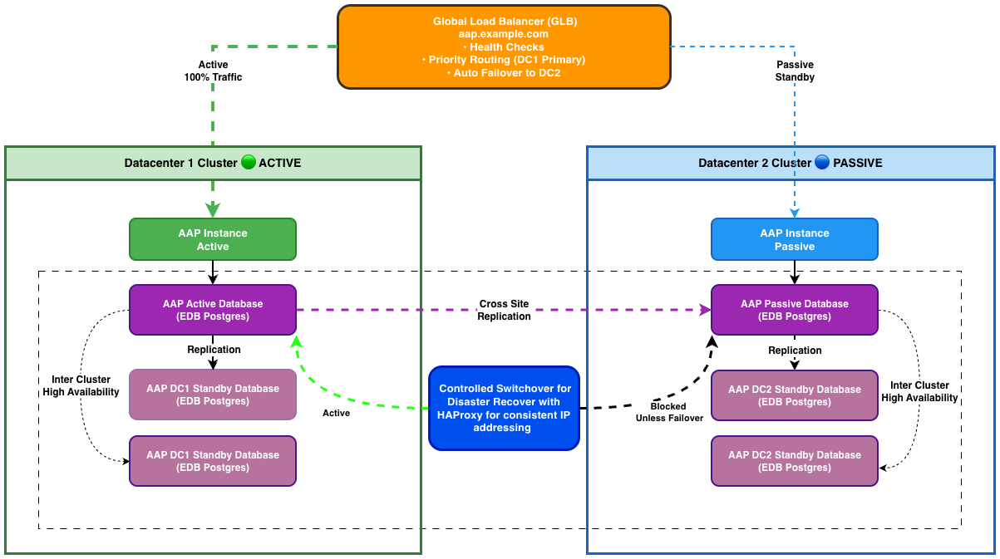
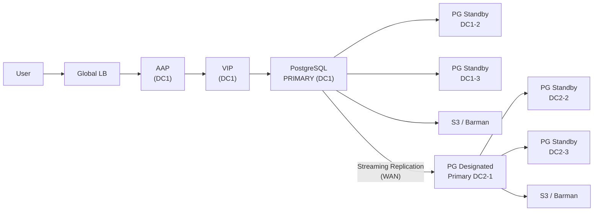
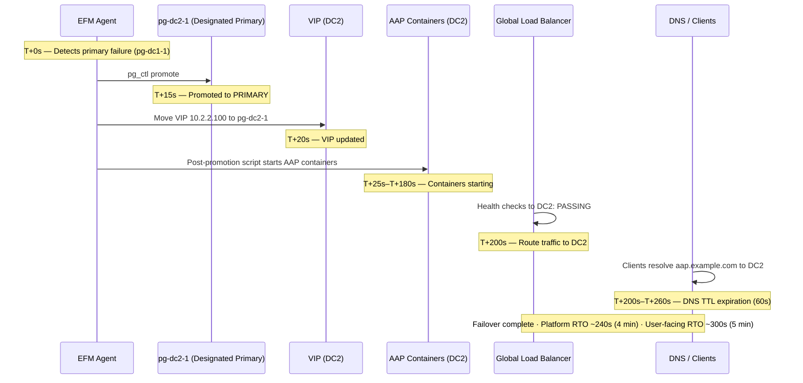


# High-Availability Ansible Automation Platform with EDB PostgreSQL Active-Passive DR - Solution Guide <!-- omit in toc -->

<style>
  div#toc {
    display: none;
  }
</style>


## Overview

When Ansible Automation Platform becomes mission-critical infrastructure -- orchestrating network changes, managing security compliance, or coordinating multi-cloud deployments -- downtime is not an option. A database failure, datacenter outage, or unplanned maintenance window can halt automation across the enterprise, blocking change tickets, delaying deployments, and leaving teams unable to respond to incidents.

This guide demonstrates how to deploy Red Hat Ansible Automation Platform 2.6 with a **multi-datacenter Active-Passive disaster recovery architecture** using EDB Postgres Advanced Server and EDB Failover Manager (EFM). The result is a resilient automation platform capable of surviving datacenter failures with **Recovery Time Objective (RTO) under 5 minutes** and **Recovery Point Objective (RPO) under 5 seconds** -- ensuring automation continuity for mission-critical operations.

**Implementation approach:** This solution leverages Red Hat's AAP 2.6 Container Enterprise Topology deployed via a **single unified installation** across both datacenters, with DC2 AAP services intentionally stopped post-installation to maintain the Active-Passive configuration. The database layer is **fully supported by EDB**, while the AAP platform follows Red Hat's tested enterprise topology.

**Business value:** Guaranteed automation availability for mission-critical workflows. Reduced risk of extended outages blocking change management, compliance enforcement, or incident response. Automated failover eliminates manual intervention during datacenter failures, reducing downtime from hours (manual DR procedures) to minutes (automated database promotion and AAP activation).

**Technical value:** Proven enterprise topology for production AAP deployments. Streaming replication with sub-5-second RPO protects against data loss. EFM-managed automated failover orchestrates database promotion and AAP service activation without operator intervention. Full implementation roadmap from infrastructure provisioning through testing and production cutover.

- [Background](#background)
- [Solution](#solution)
- [Prerequisites](#prerequisites)
- [Multi-Datacenter DR Architecture](#multi-datacenter-dr-architecture)
- [Solution Walkthrough](#solution-walkthrough)
  - [Phase 1: Infrastructure Preparation](#phase-1-infrastructure-preparation)
  - [Phase 2: Database Cluster Setup](#phase-2-database-cluster-setup)
  - [Phase 3: AAP Installation](#phase-3-aap-installation)
  - [Phase 4: Integration and Automation](#phase-4-integration-and-automation)
  - [Phase 5: Testing and Validation](#phase-5-testing-and-validation)
  - [Phase 6: Production Cutover](#phase-6-production-cutover)
- [Validation](#validation)
- [Operational Runbook](#operational-runbook)
- [Maturity Path](#maturity-path)
- [Related Guides](#related-guides)

---

## Background

### Why Disaster Recovery Matters for Automation Platforms

Ansible Automation Platform has evolved from a convenient automation tool to mission-critical enterprise infrastructure. Organizations use AAP to orchestrate network changes across thousands of devices, enforce compliance policies on production servers, coordinate multi-cloud deployments, and automate incident response. When AAP is unavailable, these critical workflows stop.

A database failure in a single-datacenter AAP deployment creates cascading impact:

- **Change management blocked** -- teams cannot execute approved automation, delaying deployments and configuration changes
- **Compliance drift** -- scheduled enforcement playbooks do not run, allowing systems to drift out of policy
- **Incident response delayed** -- on-call engineers cannot trigger remediation playbooks during outages
- **Audit trail interrupted** -- automation activity logs are incomplete, creating compliance gaps

Traditional backup-and-restore approaches offer Recovery Time Objectives measured in hours, not minutes. Restoring a multi-database AAP deployment from backup requires coordinating database recovery, verifying data consistency across four separate databases (controller, hub, EDA, gateway), and validating service health before resuming automation. This is unacceptable for platforms supporting mission-critical workflows.

### Active-Passive Multi-Datacenter DR Architecture

Active-Passive disaster recovery deploys a complete AAP stack in two datacenters:

- **Active site (DC1)** -- production AAP services handle all automation traffic; PostgreSQL primary database serves all read-write operations
- **Passive site (DC2)** -- AAP services remain stopped; PostgreSQL designated primary receives streaming replication from DC1 but does not accept connections

When DC1 fails, EDB Failover Manager (EFM) automatically promotes the DC2 database to primary and triggers a post-promotion script that starts AAP services in DC2. The global load balancer detects DC2 health checks passing and redirects traffic. Total failover time: under 5 minutes.

This architecture extends Red Hat's tested Container Enterprise Topology -- an 8-VM, multi-component design for high-scale AAP deployments -- into a multi-datacenter configuration. Each datacenter follows Red Hat's validated single-datacenter model, with cross-datacenter database replication and automated failover orchestration providing disaster recovery capability.

### EDB Postgres: Enterprise-Grade Database Platform

[EDB Postgres Advanced Server](https://www.enterprisedb.com/products/edb-postgres-advanced-server) extends PostgreSQL with enterprise features required for mission-critical AAP deployments:

- **Streaming replication** with synchronous local standbys and asynchronous cross-datacenter standbys delivers sub-5-second RPO
- **EDB Failover Manager (EFM)** provides automated database promotion, virtual IP failover, and post-promotion script execution for application service activation
- **Barman backup integration** supports point-in-time recovery and WAL archiving to S3/NFS for disaster scenarios requiring historical data restoration
- **Performance optimizations** including connection pooling compatibility, query tuning extensions, and workload profiling tools
- **Oracle compatibility** (optional) for organizations migrating from Oracle-based automation platforms

EDB is a trusted PostgreSQL partner with deep integration into Red Hat's ecosystem. EFM's post-promotion script capability enables coordinated database-and-application failover, ensuring AAP services start only after the database is ready to accept connections.

---

## Solution

### Components

**Ansible Automation Platform -- the automation layer:**

- **[Red Hat Ansible Automation Platform 2.6+](https://www.redhat.com/en/technologies/management/ansible)** -- containerized deployment on RHEL 9.4+ using Podman
- **AAP Container Enterprise Topology** -- 8-VM component architecture per datacenter (2 gateway, 2 controller, 2 hub, 2 EDA)
- **Redis cluster** -- colocated on gateway, hub, and EDA nodes (`redis_mode='cluster'`) for session storage and job queue management

**EDB PostgreSQL -- the database layer:**

- **[EDB Postgres Advanced Server 16](https://www.enterprisedb.com/products/edb-postgres-advanced-server)** -- 3-node cluster per datacenter with streaming replication
- **[EDB Failover Manager (EFM)](https://www.enterprisedb.com/docs/efm/latest/)** -- automated database promotion, VIP management, and post-promotion script execution
- **[Barman](https://pgbarman.org/)** -- continuous WAL archiving and point-in-time recovery to S3/NFS

**Infrastructure:**

- **Global Load Balancer** -- F5, AWS Route53, or Azure Traffic Manager with health-check-based routing to active datacenter
- **Site-to-site VPN or Direct Connect** -- low-latency WAN connectivity between datacenters (< 100ms latency required)

### Who Benefits

| Persona | Challenge | What They Gain |
|---------|-----------|---------------|
| **IT Ops Engineer / SRE** | AAP downtime blocks critical automation; manual DR procedures require coordinating database restore, service startup, and health validation across 16+ VMs | Automated failover orchestration via EFM; tested recovery procedures with concrete validation commands; complete operational runbook for daily health checks and emergency failover |
| **Automation Architect** | Uncertainty about how to design production-ready AAP for mission-critical use cases; existing single-datacenter deployments lack disaster recovery capability | Production-validated reference architecture based on Red Hat's Container Enterprise Topology; detailed component specifications, network topology, and firewall rules; complete implementation guidance for this 26-VM enterprise design |
| **IT Manager / Director** | Business justification required for DR investment; inability to commit to SLA targets without proven recovery procedures | Measurable RTO/RPO targets (5 minutes / 5 seconds); infrastructure scale and resource planning guidance; implementation roadmap with clear phase gates from planning through production cutover |

### Recommended Demos and Self-Paced Labs

- [Red Hat Ansible Automation Platform Documentation](https://docs.redhat.com/en/documentation/red_hat_ansible_automation_platform/)
- [EDB Failover Manager Documentation](https://www.enterprisedb.com/docs/efm/latest/)

---

## Prerequisites

### Red Hat Ansible Automation Platform

**Ansible Automation Platform 2.6+** -- required for Container Enterprise Topology support and unified containerized installer.

### Operating System and Runtime

- **RHEL 9.4+** on all AAP component VMs and PostgreSQL database nodes
- **Podman** (bundled with RHEL) for AAP container runtime
- **Python >= 3.9** for Ansible Core

### External Systems

| System | Required | Examples |
|--------|----------|----------|
| EDB Postgres Advanced Server | Yes | EDB subscription or trial license |
| EDB Failover Manager (EFM) | Yes | Bundled with EDB Postgres Advanced Server |
| Global Load Balancer | Yes | F5 BIG-IP, AWS Route53, Azure Traffic Manager |
| WAL Archive Storage | Yes | S3, Azure Blob, NFS |
| Site-to-site connectivity | Yes | VPN or Direct Connect with < 100ms latency |

**Operational Impact:** High during implementation phases; Medium for ongoing operations; High during failover/failback procedures.

### Infrastructure Requirements

**Total Resource Footprint:**

- **24 VMs** total (12 per datacenter)
  - 8 AAP component VMs per DC (2 gateway, 2 controller, 2 hub, 2 EDA)
  - 3 PostgreSQL VMs per DC
  - 1 Barman per DC
- **66 vCPU, 264GB RAM per datacenter**
- **500GB SSD per PostgreSQL node** (3000 IOPS minimum)
- **WAN bandwidth:** 100 Mbps minimum, 1 Gbps recommended for replication

### Cost and Resource Notes

- **EDB licensing:** Contact EDB for Advanced Server and EFM pricing
- **AAP subscription:** Standard AAP pricing applies; no additional cost for multi-datacenter deployment
- **Infrastructure:** VM costs scale linearly -- this is a 2x infrastructure investment compared to single-datacenter deployment
- **Storage:** S3/Azure Blob for WAL archiving incurs storage and transfer costs

---

## Multi-Datacenter DR Architecture

### High-Level Architecture



```
┌────────────────────────────────────────────────────────────────────────┐
│                        GLOBAL LOAD BALANCER                            │
│                      (F5 / Route53 / Azure TM)                         │
│                    https://aap.example.com                             │
│                                                                        │
│  Health Checks: /api/v2/ping/ every 10s                                │
│  Active-Passive Routing: DC1 (Priority 100) → DC2 (Priority 50)        │
└──────────────┬────────────────────────────────┬────────────────────────┘
               │ (Active - 100% traffic)        │ (Passive - 0% traffic)
               │                                │
┌──────────────▼─────────────────┐   ┌──────────▼──────────────────────┐
│      DATACENTER 1 (Active)     │   │    DATACENTER 2 (Standby)       │
│                                │   │                                 │
│  ┌──────────────────────────┐  │   │  ┌──────────────────────────┐   │
│  │  AAP Component Layer     │  │   │  │  AAP Component Layer     │   │
│  │  (8 VMs - Active)        │  │   │  │  (8 VMs - STOPPED)       │   │
│  │                          │  │   │  │                          │   │
│  │  gateway1-dc1            │  │   │  │  gateway1-dc2            │   │
│  │  gateway2-dc1            │  │   │  │  gateway2-dc2            │   │
│  │    + Redis colocated     │  │   │  │    + Redis (stopped)     │   │
│  │                          │  │   │  │                          │   │
│  │  controller1-dc1         │  │   │  │  controller1-dc2         │   │
│  │  controller2-dc1         │  │   │  │  controller2-dc2         │   │
│  │    (dedicated VMs)       │  │   │  │    (stopped)             │   │
│  │                          │  │   │  │                          │   │
│  │  hub1-dc1                │  │   │  │  hub1-dc2                │   │
│  │  hub2-dc1                │  │   │  │  hub2-dc2                │   │
│  │    + Redis colocated     │  │   │  │    + Redis (stopped)     │   │
│  │                          │  │   │  │                          │   │
│  │  eda1-dc1                │  │   │  │  eda1-dc2                │   │
│  │  eda2-dc1                │  │   │  │  eda2-dc2                │   │
│  │    + Redis colocated     │  │   │  │    + Redis (stopped)     │   │
│  └──────────┬───────────────┘  │   │  └──────────┬───────────────┘   │
│             │                  │   │             │                   │         
│  ┌──────────▼─────────────────┐│   │  ┌──────────▼─────────────────┐ │
│  │ PostgreSQL Cluster (3)     ││   │  │ PostgreSQL Cluster (3)     │ │
│  │ (EDB Postgres Advanced 16) ││   │  │ (EDB Postgres Advanced 16) │ │
│  │                            ││   │  │                            │ │
│  │ pg-dc1-1 (PRIMARY)         ││   │  │ pg-dc2-1 (STANDBY/DP)      │ │
│  │   - awx                    ││   │  │   - awx (replica)          │ │
│  │   - automationhub          ││   │  │   - automationhub          │ │
│  │   - automationedacontroller││   │  │   - automationedacontroller│ │
│  │   - automationgateway      ││   │  │   - automationgateway      │ │
│  │                            ││   │  │                            │ │
│  │ pg-dc1-2 (STANDBY)         ││   │  │ pg-dc2-2 (STANDBY)         │ │
│  │ pg-dc1-3 (STANDBY)         ││   │  │ pg-dc2-3 (STANDBY)         │ │
│  │                            ││   │  │                            │ │
│  │ VIP: 10.1.2.100 (EFM)      ││   │  │ VIP: 10.2.2.100 (EFM)      │ │
│  └────────┬───────────────────┘│   │  └────────┬───────────────────┘ │
│           │                    │   │           │                     │
│  ┌────────▼──────────────────┐ │   │  ┌────────▼───────────────────┐ │
│  │ Barman Backup Server      │ │   │  │ Barman Backup Server       │ │
│  │ + WAL Archive (NFS/S3)    │ │   │  │ + WAL Archive (NFS/S3)     │ │
│  └───────────────────────────┘ │   │  └────────────────────────────┘ │
└───────────┬────────────────────┘   └────────────┬────────────────────┘
            │                                     │
            │      Streaming Replication (SSL)    │
            │      5432 (direct or VPN tunnel)    │
            └─────────────────────────────────────┘
                     (Asynchronous)
```

### Data Flow During Normal Operations (DC1 Active)



### Automated Failover Sequence (DC1 Failure)



**Important operational impacts:**

- **User sessions lost** -- all users must re-authenticate after failover; browser sessions tied to DC1 will be invalidated
- **In-flight jobs lost** -- any jobs running at failover time will be marked as failed and must be manually resubmitted
- **EDA activations require manual restart** -- rulebook activations must be manually restarted in DC2 after failover (not automated by post-promotion script)
- **DNS propagation affects user experience** -- actual user-facing downtime = platform failover time + DNS TTL (recommend 30-60s TTL for GLB)

### Component Specifications

**Quick reference:** 24 VMs total (12 per datacenter), 66 vCPU / 264GB RAM per datacenter

<details markdown="1">
<summary><strong>View detailed component specifications →</strong></summary>

#### AAP Component VMs (Per Datacenter)

| Component | Specification | Count | Resource per VM | Total Resources |
|-----------|--------------|-------|-----------------|-----------------|
| **Platform Gateway** | RHEL 9.4+, Podman + Redis | 2 | 4 vCPU, 16GB RAM, 60GB disk | 8 vCPU, 32GB RAM |
| **Automation Controller** | RHEL 9.4+, Podman | 2 | 4 vCPU, 16GB RAM, 60GB disk | 8 vCPU, 32GB RAM |
| **Automation Hub** | RHEL 9.4+, Podman + Redis | 2 | 4 vCPU, 16GB RAM, 60GB disk | 8 vCPU, 32GB RAM |
| **Event-Driven Ansible** | RHEL 9.4+, Podman + Redis | 2 | 4 vCPU, 16GB RAM, 60GB disk | 8 vCPU, 32GB RAM |
| **Total AAP Infrastructure** | - | **8 VMs** | - | **32 vCPU, 128GB RAM** |

#### PostgreSQL Database Cluster (Per Datacenter)

| Role | Count | Specification |
|------|-------|---------------|
| **Primary + 2 Standby (DC1)** | 3 | 8 vCPU, 32GB RAM, 500GB SSD |
| **Designated Primary + 2 Standby (DC2)** | 3 | 8 vCPU, 32GB RAM, 500GB SSD |

**EFM Quorum Requirements:**

- **Minimum cluster size:** 3 nodes (1 primary + 2 standbys) to achieve quorum for automated failover
- **Witness node:** Optional dedicated witness node recommended for production deployments to prevent split-brain scenarios during network partitions
- **Quorum calculation:** Majority of configured nodes must be reachable for failover to proceed (e.g., 2 of 3 nodes, or 3 of 5 with witness)
- **Split-brain prevention:** EFM requires majority consensus before promoting a standby to prevent multiple primaries

> **Production recommendation:** Use a witness node outside a failed DC for quorum.
>
> Deploy a lightweight witness node (2 vCPU, 4GB RAM) in a third location or availability zone to maintain quorum during single-datacenter failures. This guide uses 3-node clusters per DC for simplicity; add witness nodes for production deployments requiring maximum availability.

#### AAP Databases (4 databases per PostgreSQL instance)

```sql
-- Database Layout (AAP 2.6 official database names)
CREATE DATABASE awx OWNER aap;                          -- 50GB (main controller database)
CREATE DATABASE automationhub OWNER aap;                -- 20GB (content/collections)
CREATE DATABASE automationedacontroller OWNER aap;      -- 10GB (event-driven automation)
CREATE DATABASE automationgateway OWNER aap;            -- 5GB (platform gateway)
```

#### Network Topology

```
DC1 Network:
  - AAP Subnet:       10.1.1.0/24
    - gateway1-dc1:     10.1.1.11    gateway2-dc1:     10.1.1.12
    - controller1-dc1:  10.1.1.13    controller2-dc1:  10.1.1.14
    - hub1-dc1:         10.1.1.15    hub2-dc1:         10.1.1.16
    - eda1-dc1:         10.1.1.17    eda2-dc1:         10.1.1.18

  - Database Subnet:  10.1.2.0/24
    - pg-dc1-1:         10.1.2.21    pg-dc1-2:         10.1.2.22
    - pg-dc1-3:         10.1.2.23
    - Database VIP:     10.1.2.100 (EFM managed)

DC2 Network:
  - AAP Subnet:       10.2.1.0/24
    - gateway1-dc2:     10.2.1.11    gateway2-dc2:     10.2.1.12
    - controller1-dc2:  10.2.1.13    controller2-dc2:  10.2.1.14
    - hub1-dc2:         10.2.1.15    hub2-dc2:         10.2.1.16
    - eda1-dc2:         10.2.1.17    eda2-dc2:         10.2.1.18

  - Database Subnet:  10.2.2.0/24
    - pg-dc2-1:         10.2.2.21    pg-dc2-2:         10.2.2.22
    - pg-dc2-3:         10.2.2.23
    - Database VIP:     10.2.2.100 (EFM managed)

WAN Connectivity:
  - Type: Site-to-Site VPN or Direct Connect
  - Bandwidth: 100 Mbps minimum, 1 Gbps recommended
  - Latency: < 100ms required for streaming replication
  - Encryption: IPsec or TLS
```

**Important notes on hostname conventions:**

- **DC-specific hostnames are intentional:** Hostnames like `gateway1-dc1` and `pg-dc2-1` explicitly identify which datacenter hosts each VM
- **User-facing endpoint is datacenter-agnostic:** Users access `https://aap.example.com` (GLB manages routing)
- **During failover, DC2 hostnames remain unchanged:** When DC2 becomes active, nodes retain their `-dc2` suffix -- this is expected and correct
- **Internal references use VIPs:** AAP components connect directly to the datacenter-local PostgreSQL VIP (`10.1.2.100` or `10.2.2.100`)
- **Why not use datacenter-agnostic names?** Explicit DC identifiers in hostnames aid troubleshooting, capacity planning, and operational awareness of which datacenter is serving traffic

> **Production consideration:** Hostname style is an operational tradeoff.
>
> Some organizations prefer datacenter-agnostic hostnames (e.g., `gateway1-a`, `gateway1-b`) to avoid confusion. This guide uses explicit DC identifiers for operational clarity, but either approach works as long as the GLB provides the user-facing abstraction.

> **Why not pgBouncer for connection pooling?**
>
> AAP 2.6 has specific connection pooling requirements that make direct connections to the PostgreSQL VIP the recommended approach. pgBouncer's transaction-level pooling can interfere with AAP's connection state management, particularly for long-running automation jobs and EDA rulebook activations. Direct connections to the EFM-managed VIP ensure full connection lifecycle control while maintaining automatic failover capability.

</details>

---

## Solution Walkthrough

### Phase 1: Infrastructure Preparation

**Operational Impact:** None -- provisioning and configuration only

**Duration:** Week 1-2

**Tasks:**

1. Provision VMs (24 total)
   - DC1: 8 AAP VMs + 3 PostgreSQL + 1 Barman
   - DC2: 8 AAP VMs + 3 PostgreSQL + 1 Barman
2. Install RHEL 9.4+ on all nodes
3. Configure network (VLANs, firewall rules, VPN between DCs)
4. Install Podman on AAP component VMs
5. Configure storage (SSD for databases, ensure 3000 IOPS minimum)

**Network firewall rules required:**

```bash
# User Access (GLB → Platform Gateway)
Source: 0.0.0.0/0
Dest: 10.1.1.11-12, 10.2.1.11-12
Port: 443/tcp

# Platform Gateway → AAP Components
Source: 10.1.1.11-12, 10.2.1.11-12
Dest: 10.1.1.13-18, 10.2.1.13-18
Port: 8080/8443 (Controller), 8081/8444 (Hub), 8082/8445 (EDA)

# AAP Components → PostgreSQL VIP
Source: 10.1.1.0/24, 10.2.1.0/24
Dest: 10.1.2.100, 10.2.2.100
Port: 5432/tcp

# PostgreSQL Replication (DC1 ↔ DC2)
Source: 10.1.2.21-23
Dest: 10.2.2.21-23
Port: 5432/tcp

# EFM Cluster Communication
Source: 10.1.2.0/24, 10.2.2.0/24
Dest: 10.1.2.0/24, 10.2.2.0/24
Port: 7800-7810/tcp
```

---

### Phase 2: Database Cluster Setup

**Operational Impact:** Low -- database installation and replication setup, no production traffic

**Duration:** Week 3-4

**Key tasks:** Install EDB Postgres Advanced Server, configure primary database with streaming replication, initialize AAP databases, set up local and cross-datacenter standbys, install and configure EDB Failover Manager

<details markdown="1">
<summary><strong>View detailed database setup steps →</strong></summary>

#### Step 1: Install EDB Postgres Advanced Server

```bash
# On all PostgreSQL nodes (pg-dc1-1, pg-dc1-2, pg-dc1-3, pg-dc2-1, pg-dc2-2, pg-dc2-3)

# Add EDB repository
sudo dnf -y install https://dl.enterprisedb.com/default/release/get/16/rpm

# Install EDB Postgres Advanced Server
sudo dnf -y install edb-as16-server edb-as16-contrib

# Initialize database cluster
sudo /usr/edb/as16/bin/edb-as-16-setup initdb

# Start and enable service
sudo systemctl start edb-as-16
sudo systemctl enable edb-as-16
```

#### Step 2: Configure primary database (DC1)

**postgresql.conf (pg-dc1-1):**

```ini
listen_addresses = '*'
port = 5432
max_connections = 1500
shared_buffers = 8GB
effective_cache_size = 24GB
work_mem = 64MB
maintenance_work_mem = 2GB

# Replication Settings
wal_level = replica
max_wal_senders = 10
max_replication_slots = 10
wal_keep_size = 1GB
hot_standby = on
hot_standby_feedback = on
synchronous_standby_names = 'pg-dc1-2'  # Local sync standby
synchronous_commit = on

# Archive Settings
archive_mode = on
archive_command = 'barman-cloud-wal-archive --cloud-provider aws-s3 --endpoint-url https://s3.us-east-1.amazonaws.com s3://aap-wal-dc1 edb-cluster %p'
archive_timeout = 60

# Performance Tuning
checkpoint_timeout = 15min
checkpoint_completion_target = 0.9
random_page_cost = 1.1  # For SSD
effective_io_concurrency = 200
```

**pg_hba.conf additions (pg-dc1-1):**

```
# TYPE  DATABASE        USER            ADDRESS                 METHOD
host    replication     replicator      10.1.2.22/32            scram-sha-256  # pg-dc1-2
host    replication     replicator      10.1.2.23/32            scram-sha-256  # pg-dc1-3
host    replication     replicator      10.2.2.21/32            scram-sha-256  # pg-dc2-1 (cross-DC)

# AAP database access
host    awx                     aap     10.1.1.0/24             scram-sha-256
host    automationhub           aap     10.1.1.0/24             scram-sha-256
host    automationedacontroller aap     10.1.1.0/24             scram-sha-256
host    automationgateway       aap     10.1.1.0/24             scram-sha-256
```

#### Step 3: Initialize AAP databases

```sql
-- On pg-dc1-1
CREATE ROLE aap LOGIN PASSWORD 'SCRAM-SHA-256$...' ENCRYPTED;
CREATE ROLE replicator REPLICATION LOGIN PASSWORD 'SCRAM-SHA-256$...' ENCRYPTED;

CREATE DATABASE awx OWNER aap;
CREATE DATABASE automationhub OWNER aap;
CREATE DATABASE automationedacontroller OWNER aap;
CREATE DATABASE automationgateway OWNER aap;

-- automation_hub requires hstore extension
\c automationhub
CREATE EXTENSION IF NOT EXISTS hstore;
```

#### Step 4: Set up local standbys (DC1-2, DC1-3)

```bash
# On pg-dc1-2
sudo systemctl stop edb-as-16
sudo -u enterprisedb rm -rf /var/lib/edb/as16/data/*
sudo -u enterprisedb pg_basebackup -h pg-dc1-1 -U replicator \
  -D /var/lib/edb/as16/data -P -Xs -R --slot=pg_dc1_2_slot -C

# Start standby
sudo systemctl start edb-as-16

# Verify replication
psql -h pg-dc1-1 -U postgres -c "SELECT * FROM pg_stat_replication;"
```

Repeat for pg-dc1-3 with slot `pg_dc1_3_slot`.

#### Step 5: Set up cross-datacenter standby (DC2-1)

```bash
# On pg-dc2-1
sudo systemctl stop edb-as-16
sudo -u enterprisedb rm -rf /var/lib/edb/as16/data/*
sudo -u enterprisedb pg_basebackup -h pg-dc1-1 -U replicator \
  -D /var/lib/edb/as16/data -P -Xs -R --slot=pg_dc2_1_slot -C

# Start designated primary (currently in standby role)
sudo systemctl start edb-as-16

# Verify cross-DC replication
psql -h pg-dc1-1 -U postgres -c "SELECT application_name, state, sync_state FROM pg_stat_replication WHERE application_name='pg-dc2-1';"
```

Set up pg-dc2-2 and pg-dc2-3 as standbys of pg-dc2-1.

#### Step 6: Install and configure EDB Failover Manager (EFM)

```bash
# On all PostgreSQL nodes
sudo dnf -y install edb-efm47

# Configure EFM properties
sudo vi /etc/edb/efm-4.7/efm.properties
```

**/etc/edb/efm-4.7/efm.properties (pg-dc1-1):**

```ini
# Database Configuration
db.user=efm
db.password.encrypted=<encrypted_password>
db.port=5432
db.database=postgres

# Node Configuration
bind.address=10.1.2.21:7800
is.witness=false
db.service.owner=enterprisedb
db.service.name=edb-as-16
db.bin=/usr/edb/as16/bin

# Membership (all nodes in DC1 cluster)
nodes=10.1.2.21:7800 10.1.2.22:7800 10.1.2.23:7800

# Auto-failover Settings
auto.failover=true
auto.reconfigure=true
failover.timeout=60
node.timeout=60

# Virtual IP (for AAP connection)
virtual.ip=10.1.2.100
virtual.ip.interface=eth0
virtual.ip.prefix=24
virtual.ip.single=true

# Post-promotion Script (AAP integration)
script.post.promotion=/usr/edb/efm-4.7/bin/efm-orchestrated-failover.sh %h %s %a %v
enable.custom.scripts=true
script.timeout=600

# Notification
notification.level=WARNING
user.email=ops@example.com
```

Start EFM:

```bash
sudo systemctl start edb-efm-4.7
sudo systemctl enable edb-efm-4.7

# Verify cluster status
/usr/edb/efm-4.7/bin/efm cluster-status efm
```

#### Step 7: Configure WAL archiving to S3

```bash
# Install barman-cli on all PostgreSQL nodes
sudo dnf -y install barman-cli

# Configure S3 credentials
cat > ~/.aws/credentials <<EOF
[default]
aws_access_key_id = YOUR_ACCESS_KEY
aws_secret_access_key = YOUR_SECRET_KEY
EOF

# Test WAL archiving
barman-cloud-wal-archive --cloud-provider aws-s3 \
  --endpoint-url https://s3.us-east-1.amazonaws.com \
  s3://aap-wal-dc1 edb-cluster /tmp/test.wal
```

</details>

---

### Phase 3: AAP Installation

**Operational Impact:** Medium -- installs AAP services, requires database connectivity

**Duration:** Week 5-6

**Key tasks:** Download AAP containerized installer, configure inventory for 16 AAP VMs across both datacenters, run installer, verify installation, stop DC2 services for standby mode

<details markdown="1">
<summary><strong>View detailed AAP installation steps →</strong></summary>

#### Step 8: Download AAP containerized installer

```bash
# On a controller node in DC1
cd /opt
tar -xzf ansible-automation-platform-containerized-setup-2.6-1.tar.gz
cd ansible-automation-platform-containerized-setup-2.6-1
```

#### Step 9: Create unified inventory file

**/opt/aap/inventory:**

```ini
# Red Hat Ansible Automation Platform 2.6 - Container Enterprise Topology
# Multi-Datacenter Active/Passive Configuration

# Platform Gateway (4 VMs - 2 per DC with colocated Redis)
[automationgateway]
gateway1-dc1.example.com
gateway2-dc1.example.com
gateway1-dc2.example.com
gateway2-dc2.example.com

# Automation Controller (4 VMs - 2 per DC, dedicated)
[automationcontroller]
controller1-dc1.example.com
controller2-dc1.example.com
controller1-dc2.example.com
controller2-dc2.example.com

# Automation Hub (4 VMs - 2 per DC with colocated Redis)
[automationhub]
hub1-dc1.example.com
hub2-dc1.example.com
hub1-dc2.example.com
hub2-dc2.example.com

# Event-Driven Ansible (4 VMs - 2 per DC with colocated Redis)
[automationeda]
eda1-dc1.example.com
eda2-dc1.example.com
eda1-dc2.example.com
eda2-dc2.example.com

# Redis (colocated on gateway, hub, and EDA nodes)
[redis]
gateway1-dc1.example.com
gateway2-dc1.example.com
hub1-dc1.example.com
hub2-dc1.example.com
eda1-dc1.example.com
eda2-dc1.example.com
gateway1-dc2.example.com
gateway2-dc2.example.com
hub1-dc2.example.com
hub2-dc2.example.com
eda1-dc2.example.com
eda2-dc2.example.com

[all:vars]
# Common variables
postgresql_admin_username=postgres
postgresql_admin_password='<set your own>'

# Red Hat Registry Credentials
registry_username='<your RHN username>'
registry_password='<your RHN password>'

# Redis Configuration (cluster across all [redis] hosts)
redis_mode='cluster'

# Platform Gateway Configuration
gateway_admin_password='<set your own>'
gateway_pg_database='automationgateway'
gateway_pg_username='aap'
gateway_pg_password='<set your own>'
gateway_main_url='https://aap.example.com'

# Automation Controller Configuration
controller_admin_password='<set your own>'
controller_pg_database='awx'
controller_pg_username='aap'
controller_pg_password='<set your own>'

# Automation Hub Configuration
hub_admin_password='<set your own>'
hub_pg_database='automationhub'
hub_pg_username='aap'
hub_pg_password='<set your own>'

# Event-Driven Ansible Configuration
eda_admin_password='<set your own>'
eda_pg_database='automationedacontroller'
eda_pg_username='aap'
eda_pg_password='<set your own>'

# DC1-specific host variables (pointing to DC1 PostgreSQL VIP)
[automationgateway:vars]
gateway1-dc1.example.com gateway_pg_host='10.1.2.100' gateway_pg_port='5432'
gateway2-dc1.example.com gateway_pg_host='10.1.2.100' gateway_pg_port='5432'

[automationcontroller:vars]
controller1-dc1.example.com controller_pg_host='10.1.2.100' controller_pg_port='5432'
controller2-dc1.example.com controller_pg_host='10.1.2.100' controller_pg_port='5432'

[automationhub:vars]
hub1-dc1.example.com hub_pg_host='10.1.2.100' hub_pg_port='5432'
hub2-dc1.example.com hub_pg_host='10.1.2.100' hub_pg_port='5432'

[automationeda:vars]
eda1-dc1.example.com eda_pg_host='10.1.2.100' eda_pg_port='5432'
eda2-dc1.example.com eda_pg_host='10.1.2.100' eda_pg_port='5432'

# DC2-specific host variables (pointing to DC2 PostgreSQL VIP)
gateway1-dc2.example.com gateway_pg_host='10.2.2.100' gateway_pg_port='5432'
gateway2-dc2.example.com gateway_pg_host='10.2.2.100' gateway_pg_port='5432'
controller1-dc2.example.com controller_pg_host='10.2.2.100' controller_pg_port='5432'
controller2-dc2.example.com controller_pg_host='10.2.2.100' controller_pg_port='5432'
hub1-dc2.example.com hub_pg_host='10.2.2.100' hub_pg_port='5432'
hub2-dc2.example.com hub_pg_host='10.2.2.100' hub_pg_port='5432'
eda1-dc2.example.com eda_pg_host='10.2.2.100' eda_pg_port='5432'
eda2-dc2.example.com eda_pg_host='10.2.2.100' eda_pg_port='5432'
```

> **Critical:** DC2 nodes will be STOPPED after installation.
>
> All admin passwords and database credentials must match between DC1 and DC2 for seamless failover.

#### Step 10: Install AAP on DC1 (active)

```bash
cd /opt/ansible-automation-platform-containerized-setup-2.6-1

# Run installer
./setup.sh

# Verify installation
podman ps --format "table {{.Names}}\t{{.Status}}\t{{.Ports}}"

# Enable systemd services
systemctl enable --now automation-controller-web
systemctl enable --now automation-controller-task
systemctl enable --now automation-gateway
systemctl enable --now automation-hub
systemctl enable --now eda-activation-worker
systemctl enable --now redis
```

#### Step 11: Install AAP on DC2 (standby) and stop services

```bash
# On DC2 nodes

# IMMEDIATELY STOP all AAP containers (standby mode)
systemctl stop automation-controller-web automation-controller-task
systemctl stop automation-gateway automation-hub eda-activation-worker redis

# Disable auto-start
systemctl disable automation-controller-web automation-controller-task
systemctl disable automation-gateway automation-hub eda-activation-worker redis
```

#### Step 12: Verify AAP database connectivity to PostgreSQL VIP

```bash
# From each AAP node, verify connectivity to local datacenter VIP
# DC1 nodes:
psql -h 10.1.2.100 -U aap -d awx -c "SELECT version();"

# DC2 nodes:
psql -h 10.2.2.100 -U aap -d awx -c "SELECT version();"

# Verify VIP points to primary node
psql -h 10.1.2.100 -U postgres -c "SELECT pg_is_in_recovery();"
# Expected: f (false - this is the primary)
```

</details>

---

### Phase 4: Integration and Automation

**Operational Impact:** Medium -- failover automation configuration

**Duration:** Week 7-8

**Key tasks:** Create EFM post-promotion script for AAP activation, configure global load balancer, set up monitoring and alerting, create operational runbooks

<details markdown="1">
<summary><strong>View detailed integration and automation steps →</strong></summary>

#### Step 13: Create EFM post-promotion script for AAP activation

**/usr/edb/efm-4.7/bin/efm-orchestrated-failover.sh:**

```bash
#!/bin/bash
# EFM Post-Promotion Script: Start AAP containers in failover datacenter

set -e

CLUSTER_NAME="$1"
NODE_TYPE="$2"
NODE_ADDRESS="$3"
VIP_ADDRESS="$4"

# Determine datacenter
if [[ "$NODE_ADDRESS" == *"dc2"* ]] || [[ "$NODE_ADDRESS" == "10.2"* ]]; then
    DATACENTER="DC2"
    GATEWAY_NODES=("gateway1-dc2" "gateway2-dc2")
    CONTROLLER_NODES=("controller1-dc2" "controller2-dc2")
    HUB_NODES=("hub1-dc2" "hub2-dc2")
    EDA_NODES=("eda1-dc2" "eda2-dc2")
else
    echo "ERROR: Failover to DC1 not expected"
    exit 1
fi

# Start AAP containers by component type
echo "Starting Platform Gateway nodes in $DATACENTER..."
for node in "${GATEWAY_NODES[@]}"; do
    ssh "$node" "systemctl start automation-gateway redis"
done

echo "Starting Automation Controller nodes in $DATACENTER..."
for node in "${CONTROLLER_NODES[@]}"; do
    ssh "$node" "systemctl start automation-controller-web automation-controller-task"
done

echo "Starting Automation Hub nodes in $DATACENTER..."
for node in "${HUB_NODES[@]}"; do
    ssh "$node" "systemctl start automation-hub redis"
done

echo "Starting Event-Driven Ansible nodes in $DATACENTER..."
for node in "${EDA_NODES[@]}"; do
    ssh "$node" "systemctl start eda-activation-worker redis"
done

# Wait for AAP API
MAX_WAIT=300
ELAPSED=0
while [ $ELAPSED -lt $MAX_WAIT ]; do
    if curl -k -s https://10.2.1.11/api/v2/ping/ | grep -q "200"; then
        echo "AAP is ready in $DATACENTER"
        break
    fi
    sleep 10
    ELAPSED=$((ELAPSED + 10))
done

# Send notifications
logger -t efm-failover "AAP activated in $DATACENTER"
echo "WARNING: EDA rulebook activations require MANUAL restart via AAP UI or API" | logger -t efm-failover
```

Make executable and configure SSH keys:

```bash
chmod +x /usr/edb/efm-4.7/bin/efm-orchestrated-failover.sh

# Configure passwordless SSH from all PostgreSQL nodes to all AAP nodes
# (Required for post-promotion script to start services)
```

#### Step 14: Configure Global Load Balancer

**Critical DNS Configuration:**

- **TTL recommendation:** 30-60 seconds for the GLB record
  - Lower TTL (30s) = faster client failover, higher DNS query load
  - Higher TTL (60s) = reduced DNS queries, slower client convergence after failover
- **User-facing RTO calculation:** Platform failover time (4 min) + DNS TTL (30-60s) = ~5 minutes total
- **Health check interval:** 10 seconds with 2 consecutive failures before marking unhealthy
- **Health check timeout:** 5 seconds

Example Route53 configuration:

```json
{
  "HostedZoneId": "Z1234567890ABC",
  "ChangeBatch": {
    "Changes": [
      {
        "Action": "CREATE",
        "ResourceRecordSet": {
          "Name": "aap.example.com",
          "Type": "A",
          "TTL": 60,
          "SetIdentifier": "DC1-Primary",
          "Failover": "PRIMARY",
          "HealthCheckId": "health-check-dc1",
          "ResourceRecords": [{"Value": "10.1.1.100"}]
        }
      },
      {
        "Action": "CREATE",
        "ResourceRecordSet": {
          "Name": "aap.example.com",
          "Type": "A",
          "TTL": 60,
          "SetIdentifier": "DC2-Secondary",
          "Failover": "SECONDARY",
          "HealthCheckId": "health-check-dc2",
          "ResourceRecords": [{"Value": "10.2.1.100"}]
        }
      }
    ]
  }
}
```

**Health check configuration:**

```json
{
  "Type": "HTTPS",
  "ResourcePath": "/api/v2/ping/",
  "FullyQualifiedDomainName": "aap-dc1.example.com",
  "Port": 443,
  "RequestInterval": 10,
  "FailureThreshold": 2,
  "MeasureLatency": true
}
```

> **Important:** DNS TTL directly affects client failover timing.
>
> A 60-second TTL means clients may continue attempting to reach DC1 for up to 60 seconds after GLB has switched to DC2. For mission-critical deployments, consider 30-second TTL or client-side connection retry logic.

#### Step 15: Set up monitoring and alerting

**Prometheus alert rules:**

```yaml
# /etc/prometheus/alert-rules.yml

groups:
  - name: aap_alerts
    interval: 30s
    rules:
      - alert: AAPAPIDown
        expr: probe_success{job="aap-api"} == 0
        for: 3m
        labels:
          severity: critical
        annotations:
          summary: "AAP API is down on {{ $labels.instance }}"

      - alert: PostgreSQLReplicationLagHigh
        expr: pg_replication_lag_seconds > 30
        for: 2m
        labels:
          severity: warning
        annotations:
          summary: "High replication lag on {{ $labels.instance }}"

      - alert: PostgreSQLReplicationStopped
        expr: pg_replication_is_replica == 1 and pg_replication_lag_seconds == -1
        for: 1m
        labels:
          severity: critical
        annotations:
          summary: "Replication stopped on {{ $labels.instance }}"
```

</details>

---

### Phase 5: Testing and Validation

**Operational Impact:** High during failover tests -- production traffic should be drained before testing

**Duration:** Week 9-10

**Key tasks:** Test local database failover, test cross-datacenter failover, test AAP failover activation, test failback procedure, measure and validate RTO/RPO targets

<details markdown="1">
<summary><strong>View detailed testing and validation steps →</strong></summary>

#### Step 16: Test local database failover (within DC1)

```bash
# Simulate primary failure
ssh pg-dc1-1 "sudo systemctl stop edb-as-16"

# EFM should automatically promote pg-dc1-2
# Monitor with:
/usr/edb/efm-4.7/bin/efm cluster-status efm

# Verify VIP moved
ping 10.1.2.100

# Verify new primary
psql -h 10.1.2.100 -U postgres -c "SELECT pg_is_in_recovery();"
# Expected: f (false)
```

#### Step 17: Test cross-datacenter failover (DC1 → DC2)

```bash
# Stop AAP in DC1
for node in gateway1-dc1 gateway2-dc1; do
    ssh "$node" "systemctl stop automation-gateway redis"
done
for node in controller1-dc1 controller2-dc1; do
    ssh "$node" "systemctl stop automation-controller-web automation-controller-task"
done
for node in hub1-dc1 hub2-dc1; do
    ssh "$node" "systemctl stop automation-hub redis"
done
for node in eda1-dc1 eda2-dc1; do
    ssh "$node" "systemctl stop eda-activation-worker redis"
done

# Promote DC2 database to primary
ssh pg-dc2-1 "sudo -u enterprisedb /usr/edb/as16/bin/pg_ctl promote -D /var/lib/edb/as16/data"

# Post-promotion script should start AAP in DC2
# Monitor logs:
tail -f /var/log/messages | grep efm-failover

# Verify AAP API in DC2
curl -k https://10.2.1.11/api/v2/ping/
```

#### Step 18: Test failback procedure (DC2 → DC1)

See [Validation](#validation) section for complete failback procedure.

#### Step 19: Measure RTO/RPO

Document actual failover times:

- Database promotion: ~15 seconds
- AAP startup: ~3 minutes
- GLB detection: ~30 seconds
- **Total RTO:** ~240 seconds (under 5-minute target)

</details>

---

### Phase 6: Production Cutover

**Operational Impact:** High -- production migration

**Duration:** Week 11-12

**Key tasks:** Final configuration review, production data migration, user acceptance testing, go-live planning

#### Step 20: Final configuration review

- Security hardening (TLS, firewall rules, credential rotation)
- RBAC configuration in automation controller
- Backup validation (test restore from Barman)
- Documentation review (runbooks, escalation procedures)

#### Step 21: Production data migration

- Export automation controller data from existing deployment
- Import to new multi-DC deployment
- Validate projects, inventories, credentials, job templates

#### Step 22: User acceptance testing

- Execute critical job templates
- Verify workflow templates
- Test EDA rulebook activations
- Validate RBAC policies

#### Step 23: Go-live

- Update DNS to point to Global Load Balancer
- Monitor health checks and replication lag
- Execute daily health check runbook (see [Operational Runbook](#operational-runbook))

---

## Validation

### Per-Stage Validation Checklist

| Stage | What to Verify | Success Indicator |
|-------|---------------|-------------------|
| **Infrastructure** | All VMs provisioned and accessible | SSH connectivity from provisioning host |
| **Network** | Firewall rules configured | `nc -zv <ip> <port>` succeeds for all required ports |
| **PostgreSQL Primary** | Database service running | `systemctl status edb-as-16` shows active |
| **AAP Databases** | Four databases created | `psql -l` shows awx, automationhub, automationedacontroller, automationgateway |
| **Local Replication** | Standbys replicating from primary | `SELECT * FROM pg_stat_replication;` shows pg-dc1-2, pg-dc1-3 |
| **Cross-DC Replication** | DC2 replicating from DC1 | `SELECT * FROM pg_stat_replication;` shows pg-dc2-1 |
| **EFM Cluster** | Cluster status healthy | `/usr/edb/efm-4.7/bin/efm cluster-status efm` shows all nodes |
| **VIP** | Virtual IP assigned to primary | `ping 10.1.2.100` resolves to pg-dc1-1 |
| **AAP DC1** | Services running | `podman ps` shows all containers on all DC1 AAP nodes |
| **AAP DC2** | Services stopped | `podman ps` shows no containers on DC2 AAP nodes |
| **Database Connectivity** | AAP can reach PostgreSQL VIP | `psql -h 10.1.2.100 -U aap -d awx` connects successfully |
| **AAP API** | AAP API responding | `curl -k https://aap.example.com/api/v2/ping/` returns 200 |
| **Local Failover** | EFM promotes local standby | Stop pg-dc1-1; pg-dc1-2 becomes primary within 60s |
| **Cross-DC Failover** | EFM promotes DC2 and starts AAP | Promote pg-dc2-1; AAP starts in DC2 within 5 minutes |
| **GLB Routing** | Traffic redirects to DC2 | `curl https://aap.example.com` resolves to DC2 after failover |

### Health Check Commands

**Database health check:**

```bash
#!/bin/bash
# /usr/local/bin/check-postgres-health.sh

PG_HOST="${1:-localhost}"
PG_PORT="${2:-5432}"

if ! pg_isready -h "$PG_HOST" -p "$PG_PORT" -U postgres; then
    echo "CRITICAL: PostgreSQL not accepting connections"
    exit 2
fi

IS_REPLICA=$(psql -h "$PG_HOST" -p "$PG_PORT" -U postgres -t -c "SELECT pg_is_in_recovery();")
if [ "$IS_REPLICA" = " t" ]; then
    LAG=$(psql -h "$PG_HOST" -p "$PG_PORT" -U postgres -t -c \
        "SELECT EXTRACT(EPOCH FROM (now() - pg_last_xact_replay_timestamp()));")
    if (( $(echo "$LAG > 60" | bc -l) )); then
        echo "CRITICAL: Replication lag is ${LAG}s"
        exit 2
    fi
fi

echo "OK: PostgreSQL healthy"
exit 0
```

**AAP health check:**

```bash
#!/bin/bash
# /usr/local/bin/check-aap-health.sh

AAP_URL="${1:-https://localhost}"
HTTP_CODE=$(curl -k -s -o /dev/null -w "%{http_code}" --max-time 10 "$AAP_URL/api/v2/ping/")

if [ "$HTTP_CODE" = "200" ]; then
    echo "OK: AAP API responding"
    exit 0
else
    echo "CRITICAL: AAP API returned HTTP $HTTP_CODE"
    exit 2
fi
```

### Failback Procedure (DC2 → DC1)

**When to use:** After DC1 infrastructure is restored and you want to return to normal Active-Passive configuration (DC1 active, DC2 standby)

<details markdown="1">
<summary><strong>View detailed failback procedure →</strong></summary>

```bash
# 1. Rebuild DC1 as standby of DC2
ssh pg-dc1-1 "sudo systemctl stop edb-as-16"
ssh pg-dc1-1 "sudo -u enterprisedb rm -rf /var/lib/edb/as16/data/*"
ssh pg-dc1-1 "sudo -u enterprisedb pg_basebackup -h pg-dc2-1 -U replicator \
    -D /var/lib/edb/as16/data -P -Xs -R --slot=pg_dc1_1_slot"

# 2. Start DC1 as standby
ssh pg-dc1-1 "sudo systemctl start edb-as-16"

# 3. Verify replication DC2→DC1
ssh pg-dc2-1 "psql -U postgres -c \"SELECT * FROM pg_stat_replication;\""

# 4. Wait for minimal replication lag (< 5 seconds)

# 5. Stop AAP in DC2
for node in gateway1-dc2 gateway2-dc2; do
    ssh "$node" "systemctl stop automation-gateway redis"
done
for node in controller1-dc2 controller2-dc2; do
    ssh "$node" "systemctl stop automation-controller-web automation-controller-task"
done
for node in hub1-dc2 hub2-dc2; do
    ssh "$node" "systemctl stop automation-hub redis"
done
for node in eda1-dc2 eda2-dc2; do
    ssh "$node" "systemctl stop eda-activation-worker redis"
done

# 6. Promote DC1 back to primary
ssh pg-dc1-1 "sudo -u enterprisedb /usr/edb/as16/bin/pg_ctl promote -D /var/lib/edb/as16/data"

# 7. Configure DC2 as standby again
ssh pg-dc2-1 "sudo systemctl stop edb-as-16"
ssh pg-dc2-1 "sudo -u enterprisedb rm -rf /var/lib/edb/as16/data/*"
ssh pg-dc2-1 "sudo -u enterprisedb pg_basebackup -h pg-dc1-1 -U replicator \
    -D /var/lib/edb/as16/data -P -Xs -R --slot=pg_dc2_1_slot"
ssh pg-dc2-1 "sudo systemctl start edb-as-16"

# 8. Start AAP in DC1
for node in gateway1-dc1 gateway2-dc1; do
    ssh "$node" "systemctl start automation-gateway redis"
done
for node in controller1-dc1 controller2-dc1; do
    ssh "$node" "systemctl start automation-controller-web automation-controller-task"
done
for node in hub1-dc1 hub2-dc1; do
    ssh "$node" "systemctl start automation-hub redis"
done
for node in eda1-dc1 eda2-dc1; do
    ssh "$node" "systemctl start eda-activation-worker redis"
done

# 9. Update Global Load Balancer back to DC1

# 10. Verify normal operations
curl -k https://aap.example.com/api/v2/ping/
```

</details>

### Troubleshooting

| Symptom | Likely Cause | Fix |
|---------|-------------|-----|
| Replication lag increasing | WAN bandwidth saturated or high latency | Verify network connectivity; check `pg_stat_replication` for `write_lag`, `flush_lag`, `replay_lag` |
| EFM failover does not trigger | `auto.failover=false` or insufficient quorum | Verify EFM properties; ensure majority of nodes can communicate |
| AAP containers fail to start in DC2 | Database not ready or incorrect connection string | Verify PostgreSQL VIP is accessible from AAP nodes; test with `psql -h 10.2.2.100 -U aap -d awx` |
| Cross-DC replication stopped | Replication slot removed or network partition | Recreate replication slot; verify VPN/Direct Connect connectivity |
| Post-promotion script timeout | SSH keys not configured or AAP startup slow | Verify passwordless SSH from PostgreSQL nodes to AAP nodes; increase `script.timeout` in EFM properties |

---

## Operational Runbook

### Daily Health Check

```bash
#!/bin/bash
# /usr/local/bin/daily-health-check.sh

echo "Checking AAP DC1..."
/usr/local/bin/check-aap-health.sh https://10.1.1.11

echo "Checking PostgreSQL DC1..."
/usr/local/bin/check-postgres-health.sh 10.1.2.100

echo "Checking PostgreSQL DC2 replication..."
ssh pg-dc1-1 "psql -U postgres -c \"SELECT application_name, state, sync_state, write_lag, flush_lag, replay_lag FROM pg_stat_replication WHERE application_name='pg-dc2-1';\""

echo "Checking EFM cluster status..."
/usr/edb/efm-4.7/bin/efm cluster-status efm
```

### Emergency Failover to DC2

```bash
# /usr/local/bin/manual-failover-dc2.sh

# Stop AAP in DC1
for node in gateway1-dc1 gateway2-dc1 controller1-dc1 controller2-dc1 hub1-dc1 hub2-dc1 eda1-dc1 eda2-dc1; do
    ssh "$node" "systemctl stop automation-*"
done

# Promote DC2 database
ssh pg-dc2-1 "sudo -u enterprisedb /usr/edb/as16/bin/pg_ctl promote -D /var/lib/edb/as16/data"

# Start AAP in DC2
for node in gateway1-dc2 gateway2-dc2 controller1-dc2 controller2-dc2 hub1-dc2 hub2-dc2 eda1-dc2 eda2-dc2; do
    ssh "$node" "systemctl start automation-*"
done

# Update Global Load Balancer
echo "Update GLB to route to DC2"

# CRITICAL: Manually restart EDA activations
echo "MANUAL INTERVENTION REQUIRED: Restart EDA rulebook activations via AAP UI"
```

### Post-Failover EDA Activation Restart

**EDA rulebook activations do NOT automatically restart after failover.** You must manually restart each activation:

```bash
# Option 1: Via AAP UI
# 1. Log in to https://aap.example.com
# 2. Navigate to Event-Driven Ansible → Rulebook Activations
# 3. For each activation in "Stopped" state, click "Restart"

# Option 2: Via API
AAP_TOKEN="<your_token>"
AAP_URL="https://aap.example.com"

# List all activations
curl -k -H "Authorization: Bearer ${AAP_TOKEN}" \
  "${AAP_URL}/api/eda/v1/activations/" | jq '.results[] | {id, name, is_enabled}'

# Restart specific activation by ID
ACTIVATION_ID=42
curl -k -X POST -H "Authorization: Bearer ${AAP_TOKEN}" \
  "${AAP_URL}/api/eda/v1/activations/${ACTIVATION_ID}/restart/"
```

**Why manual restart is required:** EDA activations maintain stateful connections to event sources (webhooks, Kafka topics, etc.). Automated restart during failover could cause duplicate event processing or message loss. Manual verification ensures event source connectivity and state consistency before resuming.


### Rolling Restart of AAP Component

```bash
# Example: restart controller1-dc1 for patching

# 1. Drain jobs
# (Manual via AAP UI or API)

# 2. Stop services
ssh controller1-dc1 "systemctl stop automation-controller-web automation-controller-task"

# 3. Perform maintenance
ssh controller1-dc1 "dnf update -y && reboot"

# 4. Start services
ssh controller1-dc1 "systemctl start automation-controller-web automation-controller-task"

# 5. Verify health
curl -k https://controller1-dc1/api/v2/ping/
```

---

## Maturity Path

| Maturity | Description | What to Build |
|----------|-------------|---------------|
| **Crawl** | Single-datacenter AAP with local HA via EFM; manual failover procedures documented and tested quarterly | Deploy AAP 2.6 Container Enterprise Topology with 3-node PostgreSQL cluster and EFM in one datacenter; document manual backup/restore procedures; test restore from Barman quarterly |
| **Walk** | Multi-datacenter with manual failover procedures; cross-DC replication active; DR drills every 6 months | Deploy this full architecture; disable `auto.failover` in EFM; execute manual failover procedure during scheduled maintenance windows; measure and document actual RTO/RPO |
| **Run** | Automated failover with < 5-minute RTO; EFM orchestrates database promotion and AAP activation; continuous monitoring with alerting on replication lag and cluster health | Enable `auto.failover=true` in EFM; deploy Prometheus/Grafana with alert rules; integrate post-promotion script with ITSM/Slack for automated incident creation; quarterly DR drills with business stakeholders observing |

---

## Related Guides

- [Red Hat Ansible Automation Platform Documentation](https://docs.redhat.com/en/documentation/red_hat_ansible_automation_platform/2.6/)
- [AAP 2.6 Containerized Installation Guide](https://docs.redhat.com/en/documentation/red_hat_ansible_automation_platform/2.6/html/containerized_installation)
- [AAP 2.6 Container Enterprise Topology](https://docs.redhat.com/en/documentation/red_hat_ansible_automation_platform/2.6/html/tested_deployment_models/container-topologies#cont-b-env-a)
- [EDB Postgres Advanced Server Documentation](https://www.enterprisedb.com/docs/epas/latest/)
- [EDB Failover Manager Documentation](https://www.enterprisedb.com/docs/efm/latest/)
- [Barman Documentation](https://www.enterprisedb.com/docs/supported-open-source/barman/)

---

## Summary

By implementing this multi-datacenter Active-Passive DR architecture, you have deployed mission-critical Ansible Automation Platform with guaranteed automation continuity:

- **RTO < 5 minutes** -- automated failover via EFM eliminates manual intervention during datacenter failures
- **RPO < 5 seconds** -- streaming replication protects against data loss for mission-critical automation workflows
- **Production-validated topology** -- based on Red Hat's Container Enterprise Topology extended to multi-datacenter configuration
- **Complete operational runbook** -- daily health checks, emergency failover procedures, and failback validation commands
- **Automated orchestration** -- EFM post-promotion script coordinates database promotion and AAP service activation without operator intervention

**Infrastructure scale:**

- **24 VMs total** (12 per datacenter)
- **66 vCPU, 264GB RAM per datacenter**
- **Conforms to Red Hat AAP 2.6 Container Enterprise Topology** for single-datacenter design
- **Extends with multi-datacenter Active-Passive DR** for mission-critical use cases

This architecture ensures automation availability for workflows that cannot tolerate downtime -- network orchestration, security compliance enforcement, multi-cloud deployments, and automated incident response.

---

## Next Steps

| | |
|---|---|
| <a target="_blank" href="https://www.redhat.com/en/technologies/management/ansible/trial"><strong>Try Ansible Automation Platform</strong></a> | Start a free 60-day trial and build your first automation workflows |
| <a target="_blank" href="https://www.redhat.com/en/services/consulting"><strong>Red Hat Consulting</strong></a> | Work with Red Hat experts to design, implement, and scale your automation infrastructure |
| <a target="_blank" href="https://www.redhat.com/en/services/training-and-certification"><strong>Training and Certification</strong></a> | Build team skills with hands-on courses and industry-recognized certifications |

---

**Document Version:** 1.0  
**Last Review:** 2026-04-20  
**Based On:** AAP Containerized Multi-Datacenter DR Architecture v2.0 (2026-03-31)


