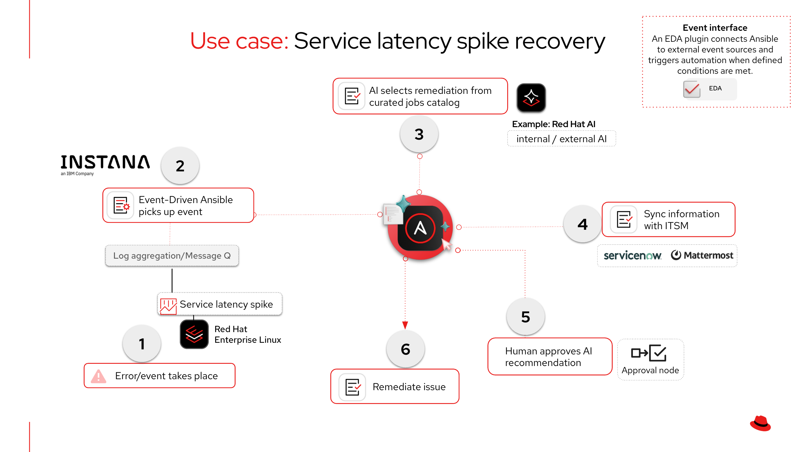
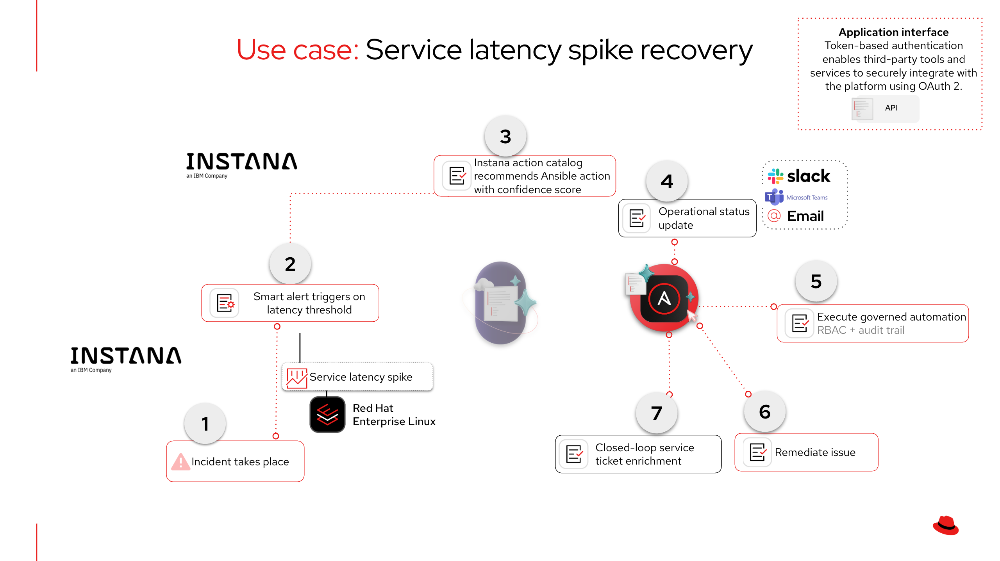


# Automated Incident Remediation with IBM Instana and Ansible Automation Platform - Solution Guide <!-- omit in toc -->

<style>
  div#toc {
    display: none;
  }
</style>


## Overview

Observability tools like IBM Instana detect thousands of infrastructure and application anomalies daily -- but detection alone does not fix the problem. Most organizations still route alerts to human on-call engineers for manual triage and remediation, creating alert fatigue, inconsistent responses, and mean time to resolution (MTTR) measured in hours instead of minutes.

Most organizations already have proven Ansible automation for service restarts, database maintenance, deployment rollbacks, and dozens of other operational runbooks -- built and refined by their own automation teams. Red Hat Ansible Automation Platform turns these existing, trusted playbooks into an **governed remediation layer** that observability tools can trigger directly. This guide demonstrates how to connect IBM Instana Observability to Ansible Automation Platform so that every high-signal Incident triggers the right remediation from your existing automation catalog -- automatically, with full RBAC control and audit trail.

**Business value:** Reduced MTTR from hours (manual triage and remediation) to minutes (automated response). Reduced alert fatigue through automated triage -- only novel or unresolvable Incidents escalate to humans. Compliance-ready audit trail for every remediation action: who triggered it, what changed, pass or fail. For mission-critical workloads -- payments, trading, customer-facing services -- automated remediation directly reduces downtime impact on revenue and SLA compliance.

**Technical value:** Governed remediation with RBAC-scoped job templates -- only authorized teams can trigger remediation within their scope. Credential isolation -- secrets stored in automation controller and injected at runtime, never exposed in playbooks or logs. Bidirectional observability-automation feedback loop via Host Agent REST API annotations, linking remediation actions to Incidents on the Instana timeline.

- [Background](#background)
- [Solution](#solution)
- [Prerequisites](#prerequisites)
- [Integration Architecture](#integration-architecture)
- [Solution Walkthrough](#solution-walkthrough)
  - [Part 1: Shared Setup](#part-1-shared-setup)
  - [Part 2: Path A -- Event-Driven Ansible Integration](#part-2-path-a--event-driven-ansible-integration)
  - [Part 3: Path B -- Instana Automation Framework](#part-3-path-b--instana-automation-framework)
  - [Part 4: Use Case Walkthroughs](#part-4-use-case-walkthroughs)
  - [Part 5: Optional AI-Assisted Routing](#part-5-optional-ai-assisted-routing)
- [Validation](#validation)
- [Maturity Path](#maturity-path)
- [Related Guides](#related-guides)
- [ROI Recap](#roi-recap)
  - [Measuring Success](#measuring-success)

---

## Background

### The AIOps Gap: Detection Without Remediation

Modern observability platforms excel at detecting anomalies, identifying root causes, and correlating events. But without an automation layer to act on those signals, organizations are left with dashboards and alert noise. The value of observability is only realized when it connects to remediation -- and that remediation must be governed, auditable, and consistent across teams and shifts.

### Ansible Automation Platform: Connecting Existing Automation to Observability

Most enterprises already invest heavily in Ansible automation -- service restart playbooks, database maintenance runbooks, deployment rollback procedures, compliance hardening, and more. These playbooks are written by teams who understand the infrastructure, tested in staging, reviewed through pull requests, and promoted through change management. They represent institutional knowledge codified as automation.

The challenge is not writing more playbooks. It is connecting the right playbook to the right signal at the right time -- without requiring a human to interpret the alert, find the runbook, and execute it manually.

Red Hat Ansible Automation Platform solves this by turning your existing automation library into a governed remediation catalog that observability tools can trigger directly:

- **Ansible Automation Platform** -- centralizes your existing job templates with full RBAC, so observability-triggered remediation runs with the same governance as operator-initiated automation
- **Event-Driven Ansible** -- the foundation of the AIOps pipeline. EDA matches observability events to the correct existing job template via rulebook conditions, replacing manual triage with deterministic routing. Organizations that have adopted EDA for change management, GitOps workflows, or ticket enrichment already have the foundation in place to extend into automated remediation
- **Audit trail** -- every execution is logged with who triggered it, what changed, and whether it succeeded -- the same audit trail whether a human or Instana initiated the job
- **Approval workflows** -- workflow job templates can include approval nodes so that high-impact remediations require human sign-off before execution, even when triggered automatically
- **Credential management** -- secrets are stored in automation controller and injected at runtime, never exposed in playbooks or logs
- **Execution environments** -- containerized, reproducible runtime environments ensure playbooks run identically whether triggered manually or by an observability event

### IBM Instana: The Detection Layer

[IBM Instana Observability](https://www.ibm.com/products/instana) is a full-stack observability platform that provides the intelligent detection feeding AAP's automation layer:

- **Zero-config auto-discovery** of [300+ technologies](https://www.ibm.com/products/instana/supported-technologies) -- application runtimes, databases, messaging systems, Kubernetes clusters, and infrastructure -- without manual agent configuration
- **[Probable Root Cause](https://www.ibm.com/blog/probable-root-cause-accelerating-incident-remediation-with-causal-ai/)** -- uses causal AI and differential observability to identify *why* something broke, not just *that* it broke, giving AAP the context needed to choose the right remediation
- **[Smart Alerts](https://www.ibm.com/docs/en/instana-observability/current?topic=applications-smart-alerts)** with [adaptive thresholds](https://www.ibm.com/docs/en/instana-observability/1.0.313?topic=instana-adaptive-thresholds-in-smart-alerts) -- learns daily and weekly seasonality patterns to reduce false positives without manual threshold tuning
- Three event types (**Change**, **Issue**, **Incident**) that map cleanly to EDA rulebook conditions

Beyond detection, Instana includes its own AI-powered capabilities that complement AAP's governed execution:

- **Action catalog with [confidence scoring](https://www.ibm.com/docs/en/instana-observability/current?topic=instana-managing-actions)** -- when an event fires, Instana uses text-similarity matching to recommend relevant actions from the catalog (including auto-imported AAP job templates) with a confidence score. Start with recommended actions for unknown issues, then codify validated responses as automation policies for auto-trigger.
- **[Intelligent Remediation](https://www.ibm.com/new/announcements/achieving-operational-efficiency-through-instanas-intelligent-remediation)** (GA) -- ships 90+ pre-built curated remediation actions for common technologies (containers, Elasticsearch, Host, JVM, Kafka, Kubernetes). Live AI generation of new actions via watsonx Granite LLM is [public preview](https://www.ibm.com/docs/en/instana-observability/current?topic=ma-intelligent-remediation-live-action-generation-watsonx-public-preview) -- generates manual steps and Bash/Ansible scripts that require human review before use.
- **[Intelligent Incident Investigation](https://www.ibm.com/new/announcements/use-agentic-ai-to-resolve-incidents-faster-with-ibm-instana-intelligent-incident-investigation)** (GA Dec 2025) -- agentic AI that performs full incident investigation across dependency graphs, producing root cause analysis with transparent reasoning. The "Actions to Scripts" feature converts recommendations to Bash or Ansible scripts exportable to GitHub for review and promotion into AAP.

Instana's native AI generates investigation guidance and suggested scripts. AAP provides the governed execution layer for trusted, existing automation. The two are complementary -- Instana identifies what to do, AAP ensures it is done safely and consistently.

IBM owns both Instana and Red Hat, which means tighter integration than third-party observability tools. The [`ibm.instana`](https://catalog.redhat.com/en/software/collection/ibm/instana) Ansible Content Collection is available on Red Hat automation hub, and Instana monitors Ansible natively via a [callback plugin](https://github.com/instana/instana-ansible) -- creating a bidirectional feedback loop where the automation layer is itself observed.

---

## Solution

### Components

**Ansible Automation Platform -- the automation layer:**

- **[Red Hat Ansible Automation Platform](https://www.redhat.com/en/technologies/management/ansible)** -- governed job template execution with RBAC, audit trail, approval workflows, and credential management via automation controller
- **[Event-Driven Ansible](https://www.redhat.com/en/technologies/management/ansible/event-driven-ansible)** -- real-time event processing: webhook listener, rulebook conditions, and automated job template triggering (Path A)
- **[`ibm.instana`](https://catalog.redhat.com/en/software/collection/ibm/instana) Ansible Content Collection** -- dedicated `instana_webhook` EDA source plugin for parsing Instana webhook payloads

**IBM Instana -- the detection layer:**

- **[IBM Instana Observability](https://www.ibm.com/products/instana)** -- auto-discovery, Smart Alerts with adaptive thresholds, Probable Root Cause (causal AI)
- **Instana automation framework** -- in-product action catalog with AI-powered action recommendations and auto-trigger via automation policies (Path B)

**Optional:**

- **AI inference endpoint** -- Red Hat AI or any OpenAI-compatible API for enriched remediation recommendations

### Who Benefits

| Persona | Challenge | What They Gain |
|---------|-----------|---------------|
| **IT Ops Engineer / SRE** | Alert fatigue from observability tools; manual triage even when the remediation playbook already exists and has been run dozens of times | Instana Incidents trigger the same tested playbooks they already trust -- no new automation to write, just a faster path to execution |
| **Automation Architect** | Existing automation library is disconnected from observability; teams have built reliable playbooks but still rely on manual triage to invoke them | Two production-ready integration patterns that connect existing job templates to Instana signals with proper RBAC, credential management, and approval workflows |
| **IT Manager / Director** | MTTR measured in hours despite having automation in place; no audit trail linking observability events to remediation actions; difficulty connecting automation outcomes to business impact | Existing automation investment delivers more value -- playbooks that were run manually now execute in minutes with the same governance and a complete audit trail. Automated remediation of mission-critical services produces measurable improvements in uptime and SLA compliance that map directly to business outcomes |

### Demos and Labs

- [Red Hat TV: From Observability to Action with Event-Driven Ansible and IBM Instana](https://tv.redhat.com/en/detail/6365958260112/from-observability-to-action-with-event-driven-ansible-and-ibm-instana)
- [IBM Developer: Automation-Powered AIOps using Instana and Red Hat Ansible](https://developer.ibm.com/articles/automation-powered-aiops/)

---

## Prerequisites

### Red Hat Ansible Automation Platform

**Ansible Automation Platform 2.5+** -- required for Event-Driven Ansible controller (GA) and the `ansible.eda` collection.

### Featured Ansible Content Collections

| Collection | Source | Purpose |
|-----------|--------|---------|
| [`ibm.instana`](https://catalog.redhat.com/en/software/collection/ibm/instana) | Red Hat automation hub / Ansible Galaxy | Dedicated `instana_webhook` EDA source plugin |
| [`ansible.eda`](https://console.redhat.com/ansible/automation-hub/repo/published/ansible/eda/) | Ansible Certified Content (bundled) | Fallback webhook source, event filters |
| [`community.mysql`](https://galaxy.ansible.com/ui/repo/published/community/mysql/) | Community | Database remediation tasks (Use Case 2) |
| [`kubernetes.core`](https://console.redhat.com/ansible/automation-hub/repo/published/kubernetes/core/) | Ansible Certified Content | Kubernetes rollback tasks (Use Case 3) |

### External Systems

| System | Required | Notes |
|--------|----------|-------|
| IBM Instana (SaaS or self-hosted) | Yes | API token with "Configuration of alert channels" permission |
| Ansible Automation Platform | Yes | Job template execute permissions for EDA service account |
| Event-Driven Ansible controller | Yes (Path A) | Must be reachable from Instana SaaS for webhook delivery |
| AI inference endpoint | Optional | For LLM enrichment step only |

### Technical Requirements

- Python >= 3.9
- Ansible Core >= 2.15.0
- aiohttp >= 3.8.4 (dependency for `ibm.instana` collection)

**Operational Impact:** Medium -- remediation playbooks modify production services. Validate all automation in a non-production environment before enabling auto-trigger.

### Cost and Resource Notes

- No GPU required unless using the optional AI inference endpoint
- **Instana licensing**: SaaS or self-hosted; automation framework capability requires Standard or Enterprise edition
- **Event-Driven Ansible controller**: included in AAP subscription, sized per standard [AAP planning guidance](https://docs.redhat.com/en/documentation/red_hat_ansible_automation_platform/2.5/html/planning_your_installation/)
- **AI inference endpoint** (optional): see [AI Infrastructure automation with Ansible](README-IA.md) for GPU and model serving requirements

---

## Integration Architecture

This guide covers two production-ready integration paths. Both are GA and can be used independently or together.

The end-to-end flow starts the same way in both paths: an Instana Smart Alert fires when a metric -- such as service response time or error rate -- crosses an adaptive threshold tuned to the workload's daily and weekly patterns.

**In Path A**, Instana delivers the alert as an HTTP POST to an Event-Driven Ansible webhook. An EDA rulebook evaluates the incoming payload -- matching on severity, entity type, and alert text -- and triggers the appropriate remediation job template on automation controller.

**In Path B**, the alert stays inside Instana. An automation policy evaluates the trigger conditions and selects an action from the action catalog. The Automation Action Ansible sensor on the Instana host agent forwards that action to automation controller for execution -- no Event-Driven Ansible infrastructure required.

From this point, both paths converge. Ansible Automation Platform executes the remediation playbook with full RBAC scoping and credential injection. The playbook performs the fix -- restart a service, recycle database connections, or roll back a deployment -- and posts an annotation back to Instana via the Host Agent REST API. Instana displays this annotation as a Change event on the Incident timeline, closing the feedback loop so operators can see exactly what automation did and when.

### Operational Impact per Stage

| Stage | Impact | Why |
|-------|--------|-----|
| **Shared setup** (API token, credential type) | None | Configuration only -- no changes to running systems |
| **Path A setup** (webhook channel, alert config, rulebook) | Low | Configures event routing -- no production changes |
| **Path B setup** (sensor config, automation policy) | Low | Configures event routing -- no production changes |
| **Use Case 1: Service restart** | Medium | Restarts a running service; validated by health check |
| **Use Case 2: DB connection recycle** | Medium | Kills idle database connections; validated by connection count |
| **Use Case 3: Deployment rollback** | High | Reverts production code; use approval gates until validated |
| **AI enrichment** (optional) | Low | Read-only API call to inference endpoint; no infrastructure changes |

### Path A: Event-Driven Ansible



```
Instana Smart Alert fires
  -> Instana webhook alert channel sends HTTP POST
  -> Event-Driven Ansible controller receives event via ibm.instana.instana_webhook source
  -> Rulebook condition matches on event.payload.issue.severity, .text, .type
  -> run_job_template action triggers AAP job template
  -> AAP executes remediation playbook (RBAC-scoped, credential-injected)
  -> Playbook posts annotation back to Instana via Host Agent REST API
  -> Instana timeline shows remediation Change event alongside the Incident
```

### Path B: Instana Automation Framework



```
Instana Smart Alert or event fires
  -> Instana automation policy evaluates trigger conditions
  -> Policy triggers action automatically (or operator triggers manually)
  -> Instana AI recommends best action from action catalog (confidence score)
  -> Automation Action Ansible sensor connects to AAP
  -> AAP executes remediation job template (same RBAC, same audit trail)
  -> Action output reported back to Instana Incident timeline
```

### When to Use Which Path

In both paths, Instana's built-in alert channels can simultaneously notify collaboration and ITSM platforms -- Slack, PagerDuty, ServiceNow, Microsoft Teams, OpsGenie, and more -- ensuring the right teams are informed the moment an incident is detected. Path A adds another layer: AAP can enrich those notifications with AI-driven remediation recommendations, so teams receive not just what happened but what to do about it and why.

| Event-Driven Automation (Path A) | Native Instana Integration (Path B) |
|----------------------------------|--------------------------------------|
| Alerts trigger automated workflows with intelligent remediation selection | Remediation actions available directly within the Instana console |
| Multi-step orchestration with approval gates and notifications | Streamlined, single-action execution for fast response |
| Coordinates across multiple teams, tools, and platforms | Empowers operators to remediate without leaving the observability view |
| Integrates into broader enterprise automation workflows | Leverages Instana's application intelligence for context-aware actions |
| Full audit trail across observability, automation, and collaboration systems | Unified detection and remediation with audit trail in both platforms |
| Instana notifies ITSM and collaboration tools with detection context, while AAP enriches notifications with AI-recommended remediation, confidence level, and reasoning | Instana notifies ITSM and collaboration tools with full detection context in parallel with remediation execution |
| **Best for:** Incidents requiring orchestration, coordination, or intelligent decision-making | **Best for:** Known remediations where speed and simplicity are priorities |

**Together:** Both paths share the same automation content -- build your remediation once, execute through either path based on operational needs.

> **Tip:** Both paths use automation controller for execution.
>
> The RBAC policies, credential types, audit trail, and approval workflows are identical regardless of which path triggers the job template.

---

## Solution Walkthrough

### Part 1: Shared Setup

#### Step 1: Create an Instana API Token

**Operational Impact:** None

1. In Instana, navigate to **Settings > Team Settings > API Tokens**
2. Create a new token with the permission **Configuration of alert channels** (required for webhook setup)
3. Store the token securely -- it will be needed for Path B (Automation Action Ansible sensor configuration)

#### Step 2 (Optional): Create a custom credential type in automation controller

**Operational Impact:** None

> **Tip:** This credential step is optional for the playbooks in this guide.
>
> Only needed if your playbooks call the Instana backend API (e.g., `POST /api/releases` for deployment markers). The remediation playbooks in this guide use the [Host Agent REST API](https://www.ibm.com/docs/en/instana-observability/current?topic=apis-host-agent-rest-api) on `localhost:42699`, which requires no authentication.

Input configuration:

```yaml
fields:
  - id: instana_api_token
    type: string
    label: Instana API Token
    secret: true
  - id: instana_base_url
    type: string
    label: Instana Base URL
required:
  - instana_api_token
  - instana_base_url
```

Injector configuration:

```yaml
extra_vars:
  instana_api_token: !unsafe "{{ instana_api_token }}"
  instana_base_url: !unsafe "{{ instana_base_url }}"
```

---

### Part 2: Path A -- Event-Driven Ansible Integration

#### Step 3: Configure an Instana webhook alert channel

**Operational Impact:** None

Navigate to **Settings > Events & Alerts > Alert Channels > Add Alert Channel > Generic Webhook** in Instana.

| Field | Value |
|-------|-------|
| **Name** | `EDA Webhook - Remediation` |
| **Webhook URL** | `https://eda.example.com:5000/instana` |
| **Custom HTTP Headers** | (optional: `X-EDA-Token: <bearer-token>` for auth) |

> **Note:** The Instana webhook payload is Instana-specific.
>
> Instana states "The Instana Webhook format is not compatible with third-party tools expecting Incoming Webhooks in their format." This is expected -- the `ibm.instana.instana_webhook` source plugin handles parsing.

Use the **Test Channel** button to verify delivery before proceeding.

#### Step 3b: Create an alert configuration in Instana

1. Navigate to **Settings > Events & Alerts > Alerts > New Alert**
2. Select **Alert on Event(s)**
3. Add events by filtering on entity type (e.g., Application, Service, Host)
4. Under **Alerting**, attach the `EDA Webhook - Remediation` alert channel
5. Set scope to the appropriate Application Perspective or infrastructure zone

When the alert fires, Instana sends an HTTP POST with the following default payload:

```json
{
  "issue": {
    "id": "abc123-def456",
    "type": "issue",
    "state": "OPEN",
    "start": 1709500000000,
    "severity": 10,
    "text": "Erroneous call rate is too high",
    "suggestion": "Check application logs for errors",
    "link": "https://instana.example.com/#/?snapshotId=abc123",
    "zone": "production",
    "fqdn": "app-server-01.example.com",
    "entity": "jvm",
    "entityLabel": "checkout-service",
    "container": "checkout-pod-7b8f9"
  }
}
```

Key fields for EDA rulebook conditions:

| Payload Field | EDA Accessor | Description |
|--------------|-------------|-------------|
| `issue.severity` | `event.payload.issue.severity` | `5` = Warning, `10` = Critical |
| `issue.text` | `event.payload.issue.text` | Alert title (used for pattern matching in rulebook conditions) |
| `issue.state` | `event.payload.issue.state` | `OPEN` or `CLOSED` |
| `issue.entity` | `event.payload.issue.entity` | Entity type (`jvm`, `Host`, `mysql`, etc.) |
| `issue.fqdn` | `event.payload.issue.fqdn` | Target host FQDN (passed as `limit` to the job template) |
| `issue.suggestion` | `event.payload.issue.suggestion` | Instana's remediation suggestion |
| `issue.link` | `event.payload.issue.link` | Direct link to the Incident in Instana UI |

#### Step 4: Create an EDA rulebook and rulebook activation

**Operational Impact:** Low

The following rulebook uses the dedicated `ibm.instana.instana_webhook` source plugin and handles all three use cases covered in this guide. Each rule matches on specific Instana event patterns and triggers the corresponding automation controller job template via the `run_job_template` action.

```yaml
---
- name: Instana Incident Remediation
  hosts: all
  sources:
    - ibm.instana.instana_webhook:
        host: 0.0.0.0
        port: 5000

  rules:
    - name: Service Latency - restart affected service
      condition: >
        event.payload.issue.severity == 10 and
        event.payload.issue.text is match(".*Slow.*|.*latency.*|.*response time.*", ignorecase=true) and
        event.payload.issue.state == "OPEN"
      action:
        run_job_template:
          name: "Instana - Service Latency Remediation"
          organization: "Default"
          job_args:
            extra_vars:
              target_host: "{{ event.payload.issue.fqdn }}"
              entity_label: "{{ event.payload.issue.entityLabel }}"
              instana_link: "{{ event.payload.issue.link }}"
              instana_suggestion: "{{ event.payload.issue.suggestion }}"

    - name: Database Performance - clear cache and recycle connections
      condition: >
        event.payload.issue.severity >= 5 and
        event.payload.issue.entity is match(".*sql.*|.*db.*|.*database.*|.*mysql.*|.*postgres.*", ignorecase=true) and
        event.payload.issue.state == "OPEN"
      action:
        run_job_template:
          name: "Instana - Database Performance Remediation"
          organization: "Default"
          job_args:
            extra_vars:
              target_host: "{{ event.payload.issue.fqdn }}"
              entity_label: "{{ event.payload.issue.entityLabel }}"

    - name: Deployment Error Spike - trigger rollback
      condition: >
        event.payload.issue.severity == 10 and
        event.payload.issue.text is match(".*error rate.*|.*erroneous call.*", ignorecase=true) and
        event.payload.issue.state == "OPEN"
      action:
        run_job_template:
          name: "Instana - Deployment Rollback"
          organization: "Default"
          job_args:
            extra_vars:
              target_host: "{{ event.payload.issue.fqdn }}"
              entity_label: "{{ event.payload.issue.entityLabel }}"
              instana_link: "{{ event.payload.issue.link }}"

    - name: Log all unmatched events for debugging
      condition: event.payload.issue is defined
      action:
        debug:
          msg: >
            Unmatched Instana event: {{ event.payload.issue.text }}
            (severity={{ event.payload.issue.severity }})
```

Create a rulebook activation in the Event-Driven Ansible controller:

| Field | Value |
|-------|-------|
| **Name** | `Instana Incident Remediation` |
| **Project** | `Instana AIOps` (Git repo containing rulebooks) |
| **Rulebook** | `instana_remediation.yml` |
| **Decision environment** | Custom image with `ibm.instana` and `aiohttp>=3.8.4` installed |
| **Credential** | AAP credential (for `run_job_template`) |
| **Restart policy** | `Always` |

---

### Part 3: Path B -- Instana Automation Framework

#### Step 5: Configure the Automation Action Ansible sensor

**Operational Impact:** Low

The [Automation Action Ansible sensor](https://www.ibm.com/docs/en/instana-observability/current?topic=technologies-automation-action-ansible) runs on the Instana host agent and connects to automation controller via the Ansible automation connector.

Add the following to the Instana agent configuration file:

```yaml
com.instana.plugin.action.ansible:
  enabled: true
  url: https://aap-controller.example.com
  token: <aap_api_token>
  apiPath: /api/v2          # optional, default
  maxConcurrentActions: 10  # optional, default
  defaultTimeout: 300       # optional, seconds
```

Key capabilities:
- **Auto-import**: Automatically imports all job templates and workflow job templates from automation controller into the Instana action catalog (since sensor 1.0.74, July 2025). No manual action creation required.
- **Concurrent execution**: Supports up to 10 concurrent actions (configurable).
- **No container runtime required**: Works without Docker or Podman (since sensor 1.0.58).
- **Workflow output**: Retrieves comprehensive workflow job template outputs (since sensor 1.0.78).

#### Step 6: Verify auto-imported job templates

**Operational Impact:** None

1. Navigate to **Automation > Action Catalog** in Instana
2. Verify that automation controller job templates appear as Ansible actions
3. Instana displays a **confidence score** for each action-event association based on text-similarity matching between the action metadata and event context

#### Step 7: Create an automation policy for auto-trigger

**Operational Impact:** Medium

1. Navigate to **Automation > Automation Policies > Create Policy** in Instana
2. Configure the trigger: event definition, Smart Alert, or schedule
3. Set execution mode: **automatic**, manual, or both
4. Associate with one or more actions from the action catalog
5. When the trigger fires, Instana automatically executes the associated Ansible action on automation controller -- the same RBAC, credential management, and audit trail apply as with Path A

> **Alternative: Route through Event-Driven Ansible**
>
> If you prefer EDA for complex multi-step orchestration, create a **Script** action in Instana that forwards event data to the EDA webhook:
>
> ```bash
> #!/bin/bash
> if [ -z "${INSTANA_EVENT}" ]; then
>   curl -s -H 'Content-Type: application/json' \
>     -d '{"message": "Test event from Instana automation framework"}' \
>     @@eda_server@@/instana
> else
>   curl -s -H 'Content-Type: application/json' \
>     -d "${INSTANA_EVENT}" \
>     @@eda_server@@/instana
> fi
> ```

---

### Part 4: Use Case Walkthroughs

#### Use Case 1: Service Latency Spike Recovery

**Operational Impact:** Medium

Instana detects response time exceeding the adaptive threshold on a microservice. A Smart Alert fires based on seasonality-adjusted latency thresholds. The EDA rulebook matches on `event.payload.issue.text` containing latency-related patterns and triggers the remediation job template on automation controller.

**Remediation playbook -- featured tasks:**

```yaml
- name: Gather service state before restart
  ansible.builtin.systemd:
    name: "{{ service_name }}"
  register: service_state

- name: Restart service to clear thread pool exhaustion
  ansible.builtin.systemd:
    name: "{{ service_name }}"
    state: restarted
  when: service_state.status.ActiveState == "active"

- name: Wait for service health check to pass
  ansible.builtin.uri:
    url: "http://{{ inventory_hostname }}:{{ service_port }}/health"
    status_code: 200
  retries: 10
  delay: 6
  register: health_check
  until: health_check.status == 200

- name: Post remediation annotation to Instana via Host Agent REST API
  ansible.builtin.uri:
    url: "http://localhost:42699/com.instana.plugin.generic.event"
    method: POST
    body_format: json
    body:
      title: "AAP Remediation: {{ service_name }} restarted"
      text: >
        Service {{ service_name }} restarted by automation controller
        due to latency spike. Health check passed.
      severity: -1
      duration: 30000
    status_code: [200, 201, 204]
```

**Job template configuration in automation controller:**

| Field | Value |
|-------|-------|
| **Name** | `Instana - Service Latency Remediation` |
| **Inventory** | `Application Servers` |
| **Project** | `Instana AIOps Playbooks` |
| **Playbook** | `remediate_service_latency.yml` |
| **Credentials** | Machine credential |
| **Extra variables** | `target_host` (prompt on launch), `service_name`, `service_port` |
| **Limit** | `{{ target_host }}` (dynamic, passed from Event-Driven Ansible) |

The Host Agent REST API annotation (severity `-1` = Change) creates a visible marker on the Instana timeline, linking the remediation action to the original Incident for post-incident review.

---

#### Use Case 2: Database Performance Degradation

**Operational Impact:** Medium

Instana detects slow query execution times or connection pool exhaustion on a monitored MySQL database. The `entity` field in the webhook payload matches database-related patterns. AAP runs a job template that identifies and kills idle connections.

**Remediation playbook -- featured tasks:**

```yaml
- name: Check current connection count
  community.mysql.mysql_query:
    login_host: "{{ db_host }}"
    login_user: "{{ db_admin_user }}"
    login_password: "{{ db_admin_password }}"
    query: "SHOW STATUS WHERE Variable_name = 'Threads_connected'"
  register: db_connections

- name: Kill idle connections exceeding threshold
  community.mysql.mysql_query:
    login_host: "{{ db_host }}"
    login_user: "{{ db_admin_user }}"
    login_password: "{{ db_admin_password }}"
    query: >
      SELECT CONCAT('KILL ', id, ';') FROM information_schema.processlist
      WHERE command = 'Sleep' AND time > 300
  register: idle_connections
  when: db_connections.query_result[0][0].Value | int > connection_threshold

- name: Post remediation annotation to Instana via Host Agent REST API
  ansible.builtin.uri:
    url: "http://localhost:42699/com.instana.plugin.generic.event"
    method: POST
    body_format: json
    body:
      title: "AAP Remediation: DB connections recycled on {{ db_host }}"
      text: >
        Idle connections killed. Previous count:
        {{ db_connections.query_result[0][0].Value }}
      severity: -1
      duration: 60000
    status_code: [200, 201, 204]
```

> **Tip:** Store database credentials in controller, not in playbooks.
>
> Store database credentials in an automation controller credential type -- never hardcode `db_admin_user` or `db_admin_password` in playbook variables. Use injectors to pass them as extra variables or environment variables at runtime.

---

#### Use Case 3: Bad Deployment Auto-Rollback

**Operational Impact:** High

Instana detects a spike in erroneous call rate correlated with a recent deployment Change event. Probable Root Cause identifies the deployment as the likely cause. AAP runs a job template that triggers a Kubernetes rollback.

> **Warning:** Rollbacks here affect production Kubernetes workloads.
>
> This use case has **high** operational impact -- a rollback reverts production code. Use automation controller approval workflow nodes (see [Maturity Path](#maturity-path)) until this pattern is validated in your environment.

**Remediation playbook -- featured tasks:**

```yaml
- name: Get deployment rollout history
  kubernetes.core.k8s_info:
    kind: Deployment
    name: "{{ app_name }}"
    namespace: "{{ app_namespace }}"
  register: current_deploy

- name: Roll back to previous revision
  ansible.builtin.command:
    cmd: >
      kubectl rollout undo deployment/{{ app_name }}
      -n {{ app_namespace }}
  register: rollback_result

- name: Wait for rollout to complete
  ansible.builtin.command:
    cmd: >
      kubectl rollout status deployment/{{ app_name }}
      -n {{ app_namespace }} --timeout=120s
  register: rollout_status

- name: Post rollback annotation to Instana via Host Agent REST API
  ansible.builtin.uri:
    url: "http://localhost:42699/com.instana.plugin.generic.event"
    method: POST
    body_format: json
    body:
      title: "AAP Remediation: {{ app_name }} rolled back"
      text: >
        Deployment rolled back due to error rate spike.
        {{ rollback_result.stdout }}
      severity: -1
      duration: 120000
    status_code: [200, 201, 204]
```

> **Tip:** Put `kubeconfig` in a Kubernetes API credential type.
>
> For Kubernetes remediation, store the `kubeconfig` in an automation controller credential of type "OpenShift or Kubernetes API Bearer Token" and ensure the execution environment includes the `kubernetes.core` Ansible Certified Content Collection.

---

### Part 5: Optional AI-Assisted Routing

The three use cases above use deterministic EDA rulebook conditions to select the right job template. For most well-understood failure modes, deterministic routing is the right approach because it is predictable, testable, and auditable.

For situations where the mapping is ambiguous -- a novel failure mode, an alert that could match multiple existing playbooks, or an entity type your rulebook does not yet cover -- you can add an AI inference step that dynamically selects from your existing job template catalog rather than generating new automation.

This uses a **workflow job template** pattern in automation controller: Event-Driven Ansible triggers a workflow that queries the available job templates, passes them with the event context to an AI inference endpoint, and conditionally runs the recommended template.

**Remediation playbook -- featured tasks:**

```yaml
- name: Get available job templates from automation controller
  ansible.builtin.uri:
    url: "https://{{ controller_host }}/api/controller/v2/job_templates/?page_size=100"
    method: GET
    headers:
      Authorization: "Bearer {{ controller_token }}"
    validate_certs: true
  register: job_templates_response

- name: Build job template catalog for AI context
  ansible.builtin.set_fact:
    job_template_catalog: >-
      {{ job_templates_response.json.results | map(attribute='name')
         | zip(job_templates_response.json.results | map(attribute='description'))
         | map('join', ': ')
         | join('\n') }}

- name: Ask AI to recommend a job template from existing catalog
  ansible.builtin.uri:
    url: "{{ ai_inference_url }}/v1/chat/completions"
    method: POST
    headers:
      Authorization: "Bearer {{ ai_api_token }}"
      Content-Type: "application/json"
    body_format: json
    body:
      model: "{{ ai_model }}"
      messages:
        - role: system
          content: >
            You are an SRE assistant. Given an Instana Incident and a catalog of
            available Ansible job templates, recommend the single best job template
            to remediate the issue. If no existing template is a good match, respond
            with NO_MATCH. Respond in JSON format:
            {"template": "<exact template name>", "confidence": "high|medium|low",
             "reasoning": "<one sentence>", "variables": {"key": "value"}}
        - role: user
          content: |
            INCIDENT:
            Text: {{ instana_issue_text }}
            Entity: {{ instana_entity_label }}
            Entity Type: {{ instana_entity_type }}
            Severity: {{ instana_severity }}
            FQDN: {{ instana_fqdn }}
            Suggestion: {{ instana_suggestion }}

            AVAILABLE JOB TEMPLATES:
            {{ job_template_catalog }}
  register: ai_response

- name: Parse AI recommendation
  ansible.builtin.set_fact:
    ai_recommendation: "{{ ai_response.json.choices[0].message.content }}"
```

As teams add new job templates to automation controller, the AI automatically considers them without requiring rulebook changes. The AI selects from existing templates -- it does not generate new playbooks.

**When to use AI-assisted routing vs. direct remediation:**

| Scenario | Approach |
|----------|----------|
| Well-understood, recurring failure with a single correct response | Direct remediation -- deterministic rulebook routing to an existing job template |
| Novel failure mode or alert that could match multiple existing playbooks | AI-assisted routing -- LLM selects the best existing job template from your catalog |
| Instana Probable Root Cause provides a clear suggestion | Direct remediation using the `suggestion` field to select the matching job template |

> **Tip:** AI output includes template, confidence, and variables.
>
> The AI recommendation includes the exact template name, confidence level, reasoning, and suggested variables -- enough detail for an operator to execute immediately or for a workflow to run conditionally based on confidence threshold.

> **Tip:** Deeper AI inference examples are in the main AIOps guide.
>
> The generic [AIOps automation with Ansible](README-AIOps.md) guide covers the AI inference pattern in depth, including how to use Red Hat AI, OpenAI, or any OpenAI-compatible endpoint.

---

## Validation

### Per-Stage Checklist

| Stage | What to Verify | Success Indicator |
|-------|---------------|-------------------|
| Instana API token | Token has correct permissions | Settings > API Tokens shows token with alert channel scope |
| Webhook alert channel | Channel is configured and reachable | **Test Channel** button returns success |
| Alert rule | Alert is bound to webhook alert channel | Settings > Alerts shows the channel under the rule |
| Rulebook activation | Activation is running | Event-Driven Ansible controller shows status **Running** |
| Webhook delivery | Instana event reaches Event-Driven Ansible | Rulebook activation log shows received event JSON |
| Condition match | Correct rule fires for test event | Activation log shows matched rule name |
| Job template launch | Job template triggered by Event-Driven Ansible | AAP job history shows new job |
| Remediation | Service/DB/deployment recovers | Target system returns to healthy state |
| Instana annotation | Remediation visible in Instana | Timeline shows Change event with AAP remediation details |

### Test

Send a synthetic Instana-format event to the Event-Driven Ansible controller to validate the end-to-end flow without waiting for a real Incident:

```bash
curl -X POST https://eda.example.com:5000/instana \
  -H "Content-Type: application/json" \
  -d '{
    "issue": {
      "id": "test-001",
      "type": "issue",
      "state": "OPEN",
      "start": 1709500000000,
      "severity": 10,
      "text": "Slow response time detected on checkout-service",
      "suggestion": "Check thread pool configuration",
      "link": "https://instana.example.com/#/?snapshotId=test",
      "fqdn": "app-server-01.example.com",
      "entity": "jvm",
      "entityLabel": "checkout-service",
      "zone": "production"
    }
  }'
```

### Expected Result

The automation controller job output should show:

```
PLAY [Remediate service latency] ************************************************

TASK [Gather service state before restart] **************************************
ok: [app-server-01.example.com]

TASK [Restart service to clear thread pool exhaustion] **************************
changed: [app-server-01.example.com]

TASK [Wait for service health check to pass] ************************************
ok: [app-server-01.example.com]

TASK [Post remediation annotation to Instana via Host Agent REST API] ***********
ok: [app-server-01.example.com]

PLAY RECAP *********************************************************************
app-server-01.example.com : ok=4    changed=1    unreachable=0    failed=0
```

### Troubleshooting

| Symptom | Likely Cause | Fix |
|---------|-------------|-----|
| Rulebook activation fails to start | `ibm.instana` collection not in decision environment | Build a custom decision environment image with `ibm.instana` and `aiohttp>=3.8.4` |
| Webhook events received but no rule fires | Condition field paths don't match payload | Add the catch-all debug rule (included in the rulebook) to log raw payload and verify field paths |
| Rule fires but job template fails to launch | Job template name mismatch or missing credential | Verify the exact job template name and organization in automation controller; check credential type is "Red Hat Ansible Automation Platform" |
| Instana Test Channel returns error | Event-Driven Ansible controller not reachable | Verify firewall rules allow inbound HTTPS from Instana SaaS IPs to the EDA port |
| Remediation runs but Instana still shows Incident | Instana auto-closes Issues based on metric recovery | Wait for Instana's evaluation cycle; verify the root metric recovered |
| Annotation POST returns connection refused | Instana host agent not running on target | Verify agent status: `systemctl status instana-agent` |
| Automation Action Ansible sensor can't reach automation controller | Ansible automation connector misconfigured | Verify the URL and API token in the Instana host agent configuration |

---

## Maturity Path

| Maturity | Description | What to Build |
|----------|-------------|---------------|
| **Crawl** | Instana alerts forwarded to Event-Driven Ansible, which enriches and routes notifications -- no remediation, human decides. Ticket enrichment is the essential starting point -- every organization should have this in place before progressing further | Instana webhook -> EDA rulebook -> `run_job_template` that sends a notification (Slack, email, or ITSM ticket) with Incident context, Instana link, and optionally an AI-recommended job template with suggested variables so the operator has a ready-to-execute recommendation. This stage alone reduces triage time by giving on-call engineers everything they need to act in a single notification instead of manually correlating alerts across tools. For full ITSM enrichment, see the [ServiceNow ITSM Ticket Enrichment](https://access.redhat.com/articles/7127603) guide. |
| **Walk** | Event-Driven Ansible triggers automation controller job templates with a human approval gate before execution | Enable `ask_variables_on_launch` on job templates; use automation controller approval workflow nodes; operator reviews before remediation runs |
| **Run** | Fully automated closed-loop: Instana detects -> Event-Driven Ansible triggers -> automation controller remediates -> Instana confirms resolution | Remove approval gates for well-understood failure patterns; add policy guardrails (e.g., max 3 auto-remediations per hour per service, business-hours-only for critical services) |

---

## Related Guides

- [AIOps automation with Ansible](README-AIOps.md) -- the tool-agnostic AIOps pattern that this guide builds on
- [AI Infrastructure automation with Ansible](README-IA.md) -- deploy the AI inference backend if using the optional LLM enrichment step
- [Get started with EDA](https://access.redhat.com/articles/7136720) -- Event-Driven Ansible fundamentals for teams new to event-driven automation

---

## ROI Recap

By connecting IBM Instana to Ansible Automation Platform, you have turned your existing automation library into a governed, event-driven remediation pipeline:

- **Automation reuse, not reinvention**: The playbooks that run are the same ones your teams have already built, tested, and promoted -- Instana provides the trigger, AAP provides the governance, and your existing automation does the work
- **MTTR reduction**: Automated response drops mean time to resolution from hours (manual triage, handoff, remediation) to minutes (detect, trigger, fix, verify)
- **Consistent remediation**: Every Incident triggers the same tested, RBAC-scoped job template -- regardless of which engineer is on call or what shift it is
- **Alert fatigue reduction**: Event-Driven Ansible filters and routes events so only truly novel or unresolvable Incidents escalate to human operators
- **Observability ROI**: Instana shifts from passive monitoring (dashboards and alerts) to an active remediation engine, with AAP providing the trusted execution layer
- **Compliance and audit**: Every remediation is logged in automation controller -- who triggered it, what changed, which hosts were affected, and whether it succeeded -- the same audit trail whether a human or an observability event initiated the job

### Measuring Success

Start capturing these metrics before enabling automated remediation -- having a baseline makes the impact measurable from day one.

| Metric | What to Capture | Where to Find It |
|--------|----------------|-----------------|
| **Mean time to resolution (MTTR)** | Time from Instana Incident open to close, before and after automation | Instana Incident timeline; automation controller job duration |
| **Mean time to remediate (MTTR-auto)** | Time from alert firing to successful remediation completion | EDA activation logs (event received timestamp) vs. automation controller job completion |
| **Alert-to-action ratio** | Percentage of alerts that trigger automated remediation vs. manual escalation | EDA activation logs (matched rules vs. unmatched debug events) |
| **Remediation success rate** | Percentage of automated remediations that resolve the Incident without human intervention | AAP job status (successful vs. failed); Instana Incident auto-close |
| **Change success rate** | Percentage of automated changes that complete without rollback | AAP job history; deployment revision history |
| **Repeat Incidents** | Number of recurring Incidents for the same service or failure pattern | Instana Incident history filtered by entity and alert type |
| **On-call escalation volume** | Number of Incidents that still require human triage after automation is enabled | PagerDuty/OpsGenie/Instana alert channel delivery counts |
| **SLA compliance** | Service uptime percentage for mission-critical applications | Instana Smart Alert history; service-level objectives dashboard |

> **Tip:** Define a small metric set before you scale automation.
>
> Identify 3-5 metrics most relevant to your environment and begin capturing baselines during the Crawl stage. Organizations that define success metrics before enabling automation can demonstrate measurable impact within the first quarter.

---

## Sources

- [Red Hat Ansible Automation Platform](https://www.redhat.com/en/technologies/management/ansible)
- [Red Hat -- Event-Driven Ansible](https://www.redhat.com/en/technologies/management/ansible/event-driven-ansible)
- [Red Hat Automation Hub -- ibm.instana](https://catalog.redhat.com/en/software/collection/ibm/instana)
- [IBM Instana Observability](https://www.ibm.com/products/instana)
- [IBM Docs -- Webhook Alert Channel](https://www.ibm.com/docs/en/instana-observability/current?topic=alerting-webhooks)
- [IBM Docs -- Smart Alerts](https://www.ibm.com/docs/en/instana-observability/current?topic=applications-smart-alerts)
- [IBM Docs -- Adaptive Thresholds](https://www.ibm.com/docs/en/instana-observability/1.0.313?topic=instana-adaptive-thresholds-in-smart-alerts)
- [IBM Docs -- Event Types](https://www.ibm.com/docs/en/instana-observability/current?topic=references-event-types)
- [IBM Docs -- Host Agent REST API](https://www.ibm.com/docs/en/instana-observability/current?topic=apis-host-agent-rest-api)
- [IBM Docs -- Automation Action Ansible Sensor](https://www.ibm.com/docs/en/instana-observability/current?topic=technologies-automation-action-ansible)
- [IBM Docs -- Managing Actions](https://www.ibm.com/docs/en/instana-observability/1.0.312?topic=instana-managing-actions)
- [IBM -- Probable Root Cause with Causal AI](https://www.ibm.com/blog/probable-root-cause-accelerating-incident-remediation-with-causal-ai/)
- [IBM -- Intelligent Remediation](https://www.ibm.com/new/announcements/achieving-operational-efficiency-through-instanas-intelligent-remediation)
- [IBM -- Intelligent Incident Investigation](https://www.ibm.com/new/announcements/use-agentic-ai-to-resolve-incidents-faster-with-ibm-instana-intelligent-incident-investigation)
- [GitHub -- ibm.instana EDA Collection](https://github.com/instana/ibm-instana-ansible)
- [GitHub -- Intelligent Remediation Playbooks](https://github.com/instana/intelligent-remediation-ansible)
- [GitHub -- Instana Ansible Callback Plugin](https://github.com/instana/instana-ansible)

