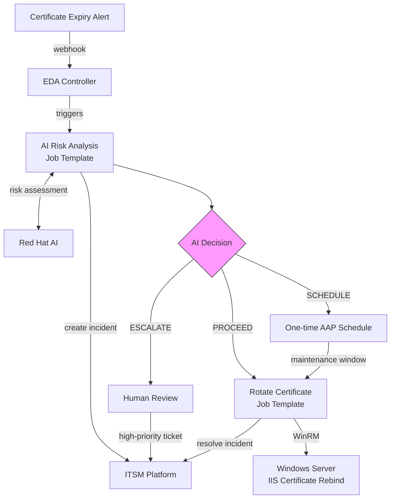
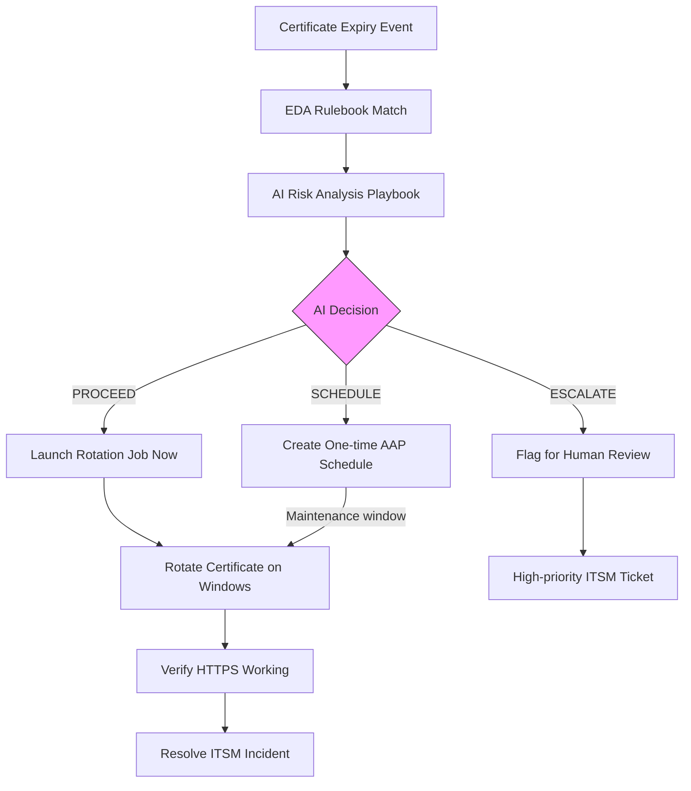
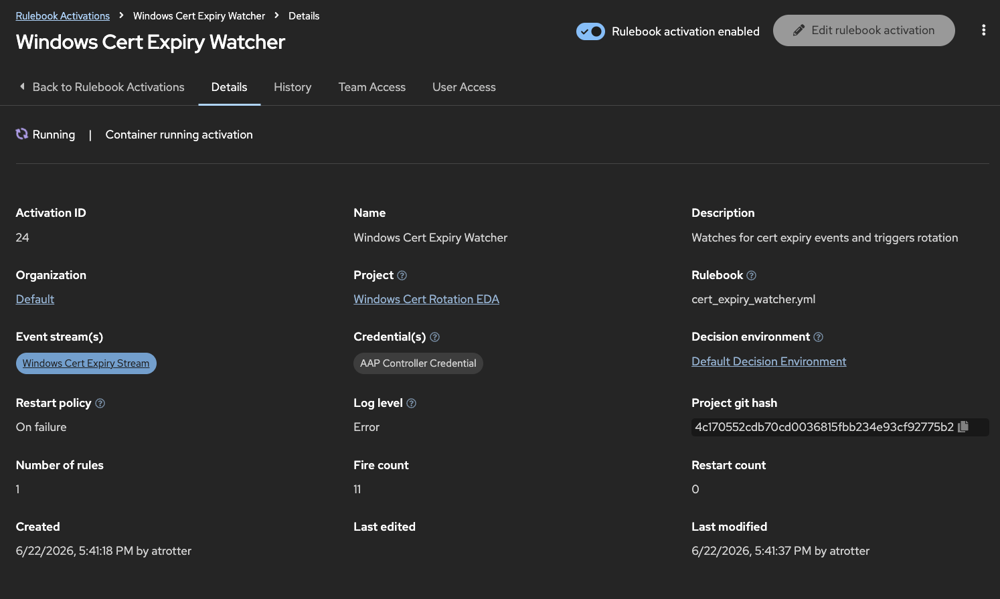
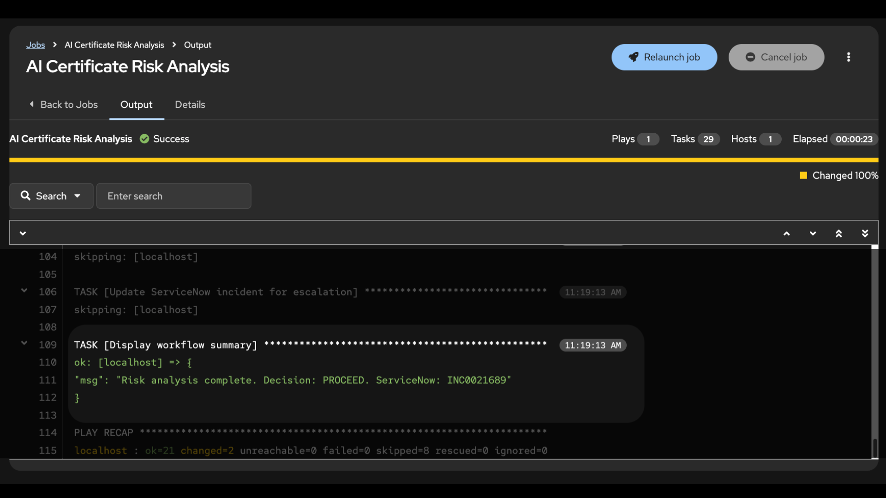
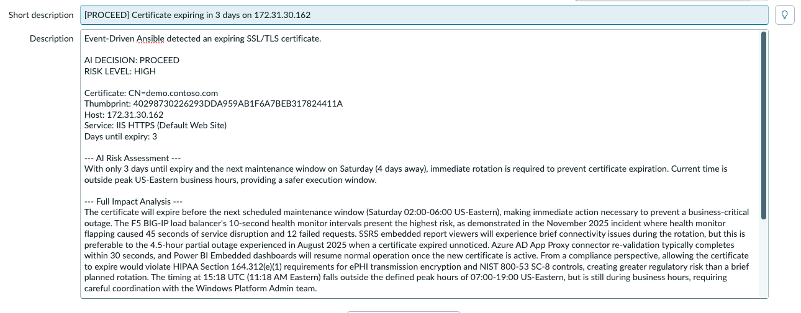
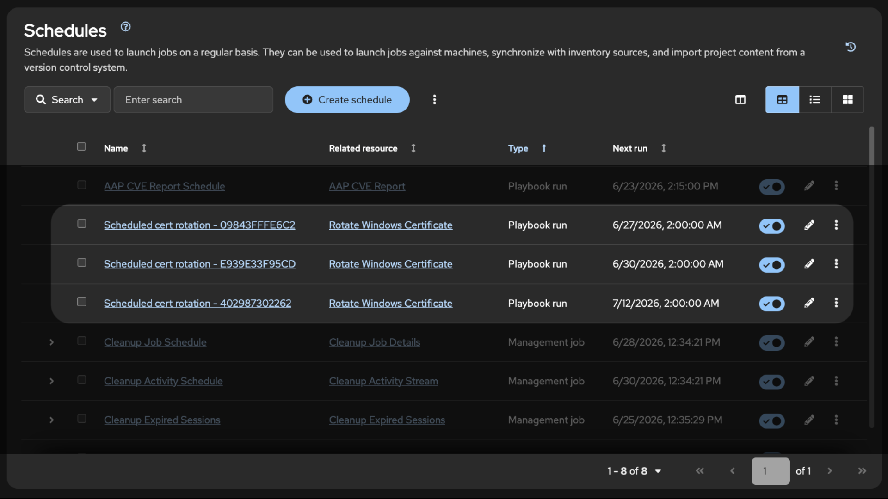
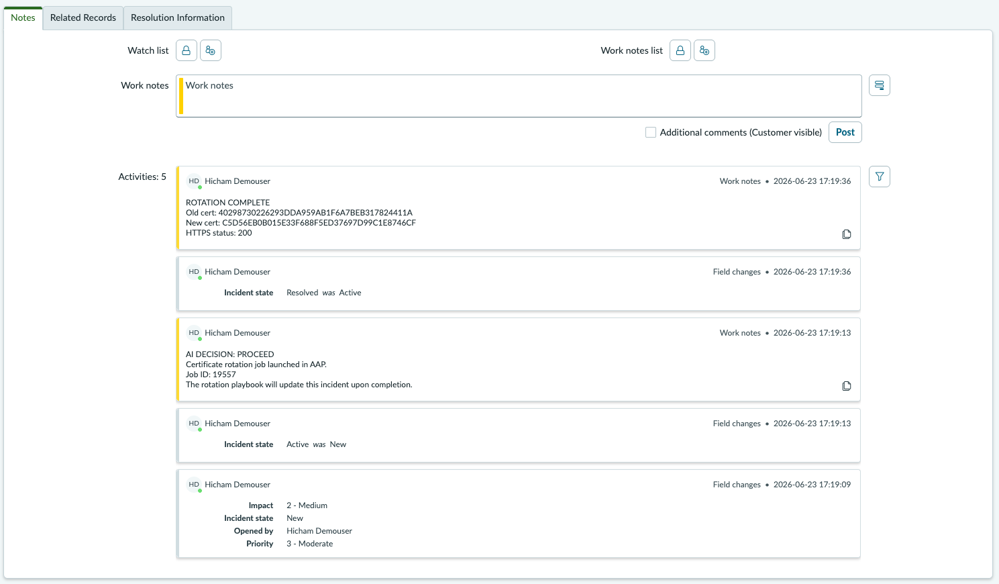

# Windows Certificate Rotation with AI Risk Analysis - Solution Guide <!-- omit in toc -->

<style>
  div#toc {
    display: none;
  }
</style>


## Overview

Certificate rotation on Windows servers is a manual, repetitive process: find the replacement cert in the store, rebind IIS, remove the old cert, verify HTTPS still works, update the ticket. When someone remembers to do it. When they don't, the certificate expires and HTTPS breaks. Even when rotation happens on time, it is rarely documented beyond "done" in a ticket, leaving compliance teams without the evidence they need for audits.

Automating the rotation mechanics solves the reliability problem, but it introduces a new one. Blind automation treats every rotation the same. In reality, rotating a certificate at 2 PM during month-end close on a portal that feeds downstream financial reporting is a different risk than rotating at 3 AM on a Saturday on a low-traffic internal site. A load balancer health check that flaps during rebind can mark the node as down and cascade into a P1 incident. A change freeze, a concurrent deployment, a compliance audit window: these all affect whether rotating right now is the right call.

This guide automates both the execution and the judgment. Event-Driven Ansible detects an expiring certificate. AI evaluates the risk, timing, dependencies, and service context to decide whether to rotate now, schedule for a maintenance window, or escalate for human review. Ansible performs the rotation and documents everything in your ITSM platform. The result is zero-touch rotation for routine cases, intelligent scheduling when conditions are not ideal, and human escalation for edge cases.

**Business value:** Reduced MTTR from hours (manual triage and rotation) to under 2 minutes (automated response). Eliminated certificate-related outages from missed or delayed renewals. Full audit trail in ITSM for every rotation, including AI risk assessment. Compliance-ready documentation for HIPAA, SOX, and NIST 800-53 encryption requirements.

**Technical value:** Event-driven detection eliminates the gap between "someone notices" and "someone acts." Automated rotation handles the mechanical steps (find cert, rebind IIS, remove old, verify HTTPS) consistently every time. AI risk assessment adds the judgment layer: evaluating timing, dependencies, compliance requirements, and change history to determine the right action. Separation of decision logic (risk analysis) from execution (cert rotation), so either playbook can run independently. If the AI service is unavailable, the workflow escalates for human review rather than making an uninformed decision.

- [Background](#background)
- [Solution](#solution)
- [Prerequisites](#prerequisites)
- [Certificate Rotation Workflow](#certificate-rotation-workflow)
- [Solution Walkthrough](#solution-walkthrough)
  - [Step 1: Set up the EDA rulebook](#step-1-set-up-the-eda-rulebook)
  - [Step 2: AI risk analysis and decision routing](#step-2-ai-risk-analysis-and-decision-routing)
  - [Step 3: Rotate the certificate (PROCEED path)](#step-3-rotate-the-certificate-proceed-path)
  - [Step 4: Schedule for maintenance window (SCHEDULE path)](#step-4-schedule-for-maintenance-window-schedule-path)
  - [Step 5: Resolve in ITSM](#step-5-resolve-in-itsm)
- [Validation](#validation)
- [Maturity Path](#maturity-path)
- [Related Guides](#related-guides)
- [ROI Recap](#roi-recap)
  - [Measuring Success](#measuring-success)

---

## Background

Windows Server environments rely on IIS for hosting internal portals, APIs, and web applications. These servers use TLS certificates to encrypt traffic, and those certificates expire. Active Directory Certificate Services (ADCS) handles auto-enrollment for some scenarios, but IIS certificates bound to specific sites often require manual renewal and rebinding, especially when using custom certificate templates or third-party CAs.

Automating the rotation itself is straightforward: find the replacement cert, rebind IIS, remove the old cert, verify HTTPS. Ansible handles this reliably. But blind automation creates its own risks. Rotating a certificate during peak trading hours on a financial portal, or while a dependent service is mid-deployment, or during a compliance audit freeze, can cause more disruption than the expiring cert itself. A load balancer health check that flaps during rebind can mark the node as down and redirect all traffic, turning a routine rotation into a P1 incident. Letting the cert sit too long without acting means the certificate expires and causes the very outage you were trying to prevent.

The challenge is the decision: should we rotate now, schedule it for the maintenance window, or flag it for human review? That decision depends on variables that change constantly: current time of day, service dependencies, change history, compliance requirements, concurrent incidents. This is where AI adds value. It evaluates the full risk picture for every expiry event and determines the optimal action, not a one-size-fits-all rule.

 <a target="_blank" href="https://www.redhat.com/en/technologies/management/ansible">Ansible Automation Platform - redhat.com</a>

 <a target="_blank" href="https://www.redhat.com/en/technologies/management/ansible/event-driven-ansible">Event-Driven Ansible - redhat.com</a>

---

## Solution

### Components

-  **[Event-Driven Ansible](https://www.redhat.com/en/technologies/management/ansible/event-driven-ansible)** to detect certificate expiry events via webhook in real time
-  **[Red Hat AI](https://www.redhat.com/en/technologies/linux-platforms/enterprise-linux/ai)** (or any LLM inference endpoint) to assess risk and determine whether to proceed, schedule, or escalate
-  **[Ansible Automation Platform](https://www.redhat.com/en/technologies/management/ansible)** to rotate certificates and orchestrate the workflow via automation controller
-  **ITSM platform** (this example uses [ServiceNow ITSM](https://console.redhat.com/ansible/automation-hub/repo/published/servicenow/itsm/)) to track every rotation with a full audit trail from detection through resolution

### Who Benefits

| Persona | Challenge | What They Gain |
|---------|-----------|---------------|
|  **Windows Admin** | Certificate rotation is manual, repetitive, and easy to get wrong: find the right replacement cert, rebind IIS, remove the old cert, verify HTTPS, update the ticket. Doing it at the wrong time is worse: load balancer health checks flap, downstream APIs reject connections, and a routine rotation becomes a P1 | Rotation mechanics are fully automated and consistent. AI evaluates timing, dependencies, and risk to determine when to rotate. Routine cases complete without human involvement. Edge cases surface as high-priority tickets with full context, not bare alerts |
|  **Security / Compliance** | Manual rotations are inconsistent and undocumented. Compliance frameworks (HIPAA, SOX, NIST 800-53) require evidence that certificate changes were risk-assessed before execution, but manual processes produce no audit trail of what was considered, why a rotation happened when it did, or what the impact assessment showed | Every rotation follows the same verified process and is documented in ITSM with AI risk assessment, decision rationale, old/new cert thumbprints, and HTTPS verification. Compliance evidence generated automatically |
|  **IT Manager** | Certificate outages are preventable but keep happening. Rotations depend on individual knowledge and availability, with no visibility into what was done, when, or why | Consistent, automated rotation eliminates single points of failure. Measurable MTTR reduction, proactive rotation with intelligent scheduling, human-in-the-loop escalation for edge cases. Dashboard-ready metrics from ITSM |

### Demos

- Source code: [amoyament/windows-cert-rotation-demo](https://github.com/amoyament/windows-cert-rotation-demo)
- Demo video: [Watch the full demo]() <!-- TODO: Add video URL -->

<!-- TODO: Replace with a thumbnail screenshot from the demo video. Clicking links to the full video -->
[]() <!-- TODO: Add video URL -->

---

## Prerequisites

### Red Hat Ansible Automation Platform

**Ansible Automation Platform 2.5+** with Event-Driven Ansible controller (GA). Required for webhook event sources and `run_job_template` actions in EDA rulebooks.

> **New to Ansible?**
>
> Start here: <a target="_blank" href="https://developers.redhat.com/learn/ansible/foundations-ansible">Foundations of Ansible</a>, <a target="_blank" href="https://developers.redhat.com/learn/ansible/get-started-ansible-playbooks">Get started with Ansible Playbooks</a>

### Featured Ansible Content Collections

| Collection | Type | Purpose |
|-----------|------|---------|
| <a target="_blank" href="https://console.redhat.com/ansible/automation-hub/repo/published/ansible/windows/">ansible.windows</a> | Certified | Certificate management (`win_certificate_info`, `win_certificate_store`), IIS configuration, WinRM connectivity |
| <a target="_blank" href="https://console.redhat.com/ansible/automation-hub/repo/published/ansible/eda/">ansible.eda</a> | Certified | EDA webhook event source for certificate expiry events |
| <a target="_blank" href="https://console.redhat.com/ansible/automation-hub/repo/published/servicenow/itsm/">servicenow.itsm</a> | Certified | Create, update, and resolve ServiceNow incidents with full field control |
| <a target="_blank" href="https://console.redhat.com/ansible/automation-hub/repo/published/community/windows/">community.windows</a> | Community | `win_scheduled_task` for certificate monitoring scheduled task |

### External Systems

| System | Required | Notes |
|--------|----------|-------|
| Windows Server 2019+ with IIS | Yes | Target for certificate rotation. WinRM must be configured (HTTP or HTTPS) |
| AI inference endpoint | Yes | Red Hat AI, or any LLM inference endpoint that returns structured JSON. The playbook uses a standard HTTP call, so it works with any provider |
| ITSM platform | Recommended | Incident tracking and audit trail. This example uses ServiceNow |

### Cost and Resource Notes

- AI API costs: one inference call per certificate expiry event (typically under $0.01/call)
- Event-Driven Ansible controller: included in AAP subscription, sized per standard <a target="_blank" href="https://docs.redhat.com/en/documentation/red_hat_ansible_automation_platform/2.5/html/planning_your_installation/">AAP planning guidance</a>

### Operational Impact per Stage

| Stage | Impact | Why |
|-------|--------|-----|
| **EDA rulebook activation** (Step 1) | None | Listens for webhook events, no system changes |
| **AI risk analysis** (Step 2) | None | API calls to AI and ITSM only, no infrastructure changes |
| **Certificate rotation** (Step 3) | Medium | Rebinds IIS HTTPS binding; causes brief HTTPS interruption (< 60s) |
| **Maintenance window scheduling** (Step 4) | None | Creates a one-time schedule in AAP, no immediate system changes |
| **ITSM resolution** (Step 5) | None | Updates incident record via API |

---

## Certificate Rotation Workflow

### System Architecture



### Decision Flow



> **Note:** If the AI service is unavailable, the playbook's rescue block automatically escalates for human review via a high-priority ITSM ticket. The rotation job template remains available for manual launch.

### Narrative Walkthrough

The workflow starts when your existing certificate monitoring detects a certificate expiring within the configured threshold and sends a webhook event to the EDA event stream with the certificate thumbprint, host, and days remaining.

EDA matches the event against a rulebook condition and triggers the "AI Certificate Risk Analysis" job template. This playbook runs on localhost, calls an AI inference endpoint with certificate details and service context (CMDB data, dependencies, compliance requirements, change history), and receives a PROCEED, SCHEDULE, or ESCALATE decision.

For PROCEED, the playbook launches the "Rotate Windows Certificate" job template immediately via the controller API. For SCHEDULE, it creates a one-time schedule on the same job template for the next maintenance window, so the rotation is guaranteed to happen at the optimal time rather than left unresolved. For ESCALATE, it updates the ITSM ticket to high priority and stops. Escalation is the right path when the risk picture is too complex for automated action: a wildcard cert affecting dozens of services, a compliance audit freeze, conflicting dependencies, or a host with a history of failed rotations.

The rotation playbook connects to the Windows host via WinRM, finds a valid replacement certificate, rebinds IIS, removes the old cert, verifies HTTPS, and resolves the ITSM incident with the full rotation details.

If the AI service is unavailable, the rescue block escalates for human review via a high-priority ITSM ticket. The rotation job template remains available for the on-call team to launch manually once they have reviewed the situation.

---

## Solution Walkthrough

### Step 1: Set up the EDA rulebook

**Operational Impact:** None

Your existing certificate monitoring sends webhook events to the EDA event stream when a certificate is expiring. The event payload should include:

| Field | Description | Example |
|-------|-------------|---------|
| `event_type` | Event classification | `cert_expiring` |
| `host` | Windows host private IP (for AAP inventory) | `172.31.30.162` |
| `thumbprint` | Certificate thumbprint to rotate | `92495AD495E5...` |
| `days_left` | Days until expiry | `5` |
| `subject` | Certificate subject name | `CN=demo.contoso.com` |

The rulebook listens for these events and triggers the AI risk analysis job template when a certificate is expiring within 7 days:

```yaml
---
- name: Windows Certificate Expiry Watcher
  hosts: all
  sources:
    - ansible.eda.webhook:
        host: 0.0.0.0
        port: 5000

  rules:
    - name: Certificate expiring within 7 days - trigger AI risk analysis
      condition: event.payload.days_left <= 7 and event.payload.event_type == "cert_expiring"
      action:
        run_job_template:
          name: "AI Certificate Risk Analysis"
          organization: "Default"
          job_args:
            extra_vars:
              target_host: "{{ event.payload.host }}"
              cert_thumbprint: "{{ event.payload.thumbprint }}"
              days_left: "{{ event.payload.days_left }}"
```

> **Tip:** Use tiered alert thresholds in production.
>
> This demo uses a single 7-day threshold for simplicity. In production, configure multiple EDA rules at different thresholds (90, 30, 7, and 1 day) with escalating responses: informational ticket at 90 days, scheduled rotation at 30, immediate rotation at 7, emergency bypass at 1. Each threshold can route to a different action or set different `additional_context` to influence the AI decision.

**Rulebook activation configuration in EDA controller:**

| Field | Value |
|-------|-------|
| **Name** | `Windows Cert Expiry Watcher` |
| **Project** | `Windows Cert Rotation` (Git repo) |
| **Rulebook** | `cert_expiry_watcher.yml` |
| **Decision environment** | Default (or custom with `ansible.eda`) |
| **Credential** | AAP credential (for `run_job_template`) |
| **Restart policy** | `Always` (ensures the activation restarts automatically if the EDA controller restarts or the process crashes) |

<!-- TODO: Screenshot of EDA rulebook activation running in the EDA controller UI -->


### Step 2: AI risk analysis and decision routing

**Operational Impact:** None (API calls only)

The risk analysis playbook runs on localhost. It combines the certificate details with service context from your CMDB and asks the AI to make a decision.

The AI doesn't just look at how many days are left. It considers:

- **Current timing**: Is it during peak business hours? Is the maintenance window coming up?
- **Dependencies**: Will the F5 load balancer health check flap? Will SSRS embedded reports break?
- **Change history**: Has this host had failed rotations before?
- **Compliance**: Are there HIPAA or SOX requirements for encryption continuity?
- **Operational context**: Is there a change freeze or concurrent incident?

**Featured task: AI inference call**

```yaml
- name: Call AI for risk assessment
  ansible.builtin.uri:
    url: "http://{{ rhelai_server }}:{{ rhelai_port }}/v1/chat/completions"
    method: POST
    headers:
      Content-Type: "application/json"
      Authorization: "Bearer {{ rhelai_token }}"
    body_format: json
    body:
      model: "{{ rhelai_model | default('granite-3-8b-instruct') }}"
      max_tokens: "{{ llm_max_tokens | default(2048) }}"
      temperature: 0
      messages:
        - role: user
          content: "{{ assessment_prompt }}"
    return_content: true
    status_code: 200
    timeout: 30
  register: ai_assessment_response

- name: Parse AI decision
  ansible.builtin.set_fact:
    ai_decision: "{{ ai_assessment_response.json.choices[0].message.content | from_json }}"
```

This example uses Red Hat AI with a Granite model served via vLLM, which exposes a standard `/v1/chat/completions` endpoint. The same playbook works with any LLM provider that supports this API format. Swap the URL and credentials to point at a different provider without changing the playbook logic.

The AI returns a structured JSON response:

| Field | Description |
|-------|-------------|
| `decision` | `proceed`, `schedule`, or `escalate` |
| `risk_level` | `CRITICAL`, `HIGH`, `MEDIUM`, or `LOW` |
| `rationale` | 2-3 sentence explanation of the decision |
| `impact_analysis` | Detailed analysis covering dependencies, compliance, timing, and history |
| `precautions` | List of specific precautions to take during rotation |
| `scheduled_window` | (SCHEDULE only) Recommended maintenance window |
| `escalation_contacts` | (ESCALATE only) Who should review and why |

After receiving the AI decision, the playbook creates an ITSM incident with the full risk assessment before acting on the decision:

```yaml
- name: Create ServiceNow incident
  servicenow.itsm.incident:
    instance:
      host: "https://{{ snow_instance }}"
      username: "{{ snow_username }}"
      password: "{{ snow_password }}"
    state: new
    short_description: >-
      [{{ ai_decision.decision | upper }}] Certificate expiring on {{ target_host }}
    description: |
      Event-Driven Ansible detected an expiring SSL/TLS certificate.

      AI DECISION: {{ ai_decision.decision | upper }}
      RISK LEVEL: {{ ai_decision.risk_level }}

      Certificate: CN={{ cert_dns_name }}
      Thumbprint: {{ cert_thumbprint }}
      Host: {{ target_host }}

      --- AI Risk Assessment ---
      {{ ai_decision.impact_analysis }}
    impact: "{{ 'high' if ai_decision.decision == 'escalate' else 'medium' }}"
    urgency: "{{ 'high' if ai_decision.decision == 'escalate' else 'medium' }}"
    other:
      category: "Software"
      subcategory: "Certificate Management"
  register: snow_incident
```

**Job template configuration in automation controller:**

| Field | Value |
|-------|-------|
| **Name** | `AI Certificate Risk Analysis` |
| **Inventory** | `Windows Demo Inventory` |
| **Project** | `Windows Cert Rotation` |
| **Playbook** | `playbooks/ai_risk_analysis.yml` |
| **Credentials** | Machine credential (Windows admin) |
| **Extra variables** | `cert_dns_name: demo.contoso.com` |
| **Prompt on launch** | Extra variables enabled (receives `target_host`, `cert_thumbprint`, `days_left` from EDA) |

> **Tip:** Store AI and ITSM credentials in automation controller.
>
> Use custom credential types to inject API tokens as environment variables at runtime. Never hardcode secrets in playbooks. See <a target="_blank" href="https://docs.redhat.com/en/documentation/red_hat_ansible_automation_platform/">Creating Custom Credential Types</a> in the AAP documentation.

<!-- TODO: Screenshot of AI risk analysis job output in AAP showing the AI decision and rationale -->


<!-- TODO: Screenshot of ITSM incident created with AI risk assessment in the description -->


### Step 3: Rotate the certificate (PROCEED path)

**Operational Impact:** Medium (brief HTTPS interruption, under 60 seconds)

When the AI decides PROCEED, the risk analysis playbook launches the "Rotate Windows Certificate" job template via the controller API. This job runs against the Windows host and performs four operations:

```yaml
- name: Find replacement certificate
  ansible.windows.win_shell: |
    $certs = Get-ChildItem Cert:\LocalMachine\My | Where-Object {
        $_.Subject -like "*{{ cert_dns_name }}*" -and
        $_.Thumbprint -ne "{{ cert_thumbprint }}" -and
        $_.NotAfter -gt (Get-Date)
    } | Sort-Object NotAfter -Descending
    if ($certs) {
        Write-Output $certs[0].Thumbprint
    } else {
        throw "No replacement certificate found for {{ cert_dns_name }}"
    }
  register: replacement_cert_result

- name: Rebind IIS HTTPS to replacement certificate
  ansible.windows.win_shell: |
    Import-Module WebAdministration
    $binding = Get-WebBinding -Name "{{ iis_site_name }}" -Protocol https
    $binding.AddSslCertificate("{{ new_cert_thumbprint }}", "My")

- name: Remove expired certificate from store
  ansible.windows.win_certificate_store:
    thumbprint: "{{ cert_thumbprint }}"
    state: absent
    store_location: LocalMachine
    store_name: My

- name: Verify HTTPS is still working
  ansible.windows.win_uri:
    url: "https://localhost"
    validate_certs: no
  register: verify_result

- name: Assert HTTPS is healthy
  ansible.builtin.assert:
    that: verify_result.status_code == 200
    success_msg: "IIS is serving HTTPS with the new certificate!"
    fail_msg: "IIS HTTPS check failed after certificate rotation"
```

The playbook expects a valid replacement certificate to already exist in the Windows certificate store. How that certificate gets there depends on your environment: ADCS auto-enrollment, a Venafi policy, HashiCorp Vault, or a manual renewal process. The rotation playbook handles the lifecycle from that point forward: find the replacement, rebind IIS, remove the old cert, verify HTTPS, and document everything in ITSM.

> **Warning:** Rotation causes a brief HTTPS interruption.
>
> The IIS HTTPS binding is unavailable for a few seconds during rebind. If an F5 or other load balancer health check fires during this window, it may temporarily mark the node as down. The change history in the demo shows this happened during a 2025-11 emergency rotation (45s of F5 health check flapping, 12 failed requests). Pre-draining the node from the load balancer before rotation eliminates this risk.

**Job template configuration in automation controller:**

| Field | Value |
|-------|-------|
| **Name** | `Rotate Windows Certificate` |
| **Inventory** | `Windows Demo Inventory` |
| **Project** | `Windows Cert Rotation` |
| **Playbook** | `playbooks/rotate_certificate.yml` |
| **Credentials** | Machine credential (Windows admin) |
| **Extra variables** | `cert_dns_name: demo.contoso.com` |
| **Prompt on launch** | Extra variables enabled (receives `cert_thumbprint`, `target_host`, `snow_incident_sys_id` from risk analysis) |

> **Tip:** RBAC for the rotation job template.
>
> Assign the `Execute` role to the EDA service account and the on-call Windows admin team. Limit the `Admin` role to the automation architect team to prevent accidental template modification. The same job template is callable by EDA (automated) and by operators (manual emergency rotation).

<!-- TODO: GIF of the rotation job running in AAP (cert found → IIS rebound → old cert removed → HTTPS verified) -->


<!-- TODO: Screenshot of HTTPS verification in browser showing the new certificate details -->


### Step 4: Schedule for maintenance window (SCHEDULE path)

**Operational Impact:** None (creates a schedule, no immediate system changes)

When the AI decides SCHEDULE, the risk analysis playbook creates a one-time schedule on the rotation job template using the AAP controller API. The rotation is guaranteed to run during the next maintenance window without human intervention.

The AI may choose SCHEDULE over PROCEED for several reasons: the current time falls within peak business hours and the cert has enough runway to wait, a change freeze is in effect (quarter-end close, compliance audit), a high-risk upstream dependency like an F5 or ARR reverse proxy would be impacted by a rebind during active traffic, or a dependent service is mid-deployment and needs to stabilize first.

```yaml
- name: Calculate next maintenance window start time
  ansible.builtin.shell:
    cmd: |
      python3 -c "
      from datetime import datetime, timedelta
      now = datetime.utcnow()
      days_until = ({{ maintenance_window_day }} - now.weekday()) % 7
      if days_until == 0 and now.hour >= {{ maintenance_window_hour_utc }}:
          days_until = 7
      target = now + timedelta(days=days_until)
      scheduled = target.replace(hour={{ maintenance_window_hour_utc }}, minute=0, second=0)
      print(scheduled.strftime('%Y%m%dT%H%M%SZ'))
      "
  register: scheduled_time_result

- name: Schedule rotation job for maintenance window
  ansible.builtin.uri:
    url: "https://{{ aap_hostname }}/api/controller/v2/job_templates/{{ rotation_jt_id }}/schedules/"
    method: POST
    user: "{{ aap_username }}"
    password: "{{ aap_password }}"
    force_basic_auth: yes
    validate_certs: false
    body_format: json
    body:
      name: "Scheduled cert rotation - {{ cert_thumbprint[:12] }}"
      rrule: "DTSTART:{{ scheduled_rotation_time }} RRULE:FREQ=MINUTELY;INTERVAL=1;COUNT=1"
      extra_data:
        cert_thumbprint: "{{ cert_thumbprint }}"
        target_host: "{{ target_host }}"
        snow_incident_sys_id: "{{ snow_incident_sys_id }}"
        snow_incident_number: "{{ snow_incident_number }}"
  register: schedule_result
```

> **Tip:** AAP rrule format for one-time schedules.
>
> AAP requires `DTSTART:YYYYMMDDTHHMMSSZ` (compact format, no dashes or colons). ISO 8601 format (`YYYY-MM-DDTHH:MM:SSZ`) will return a 400 error. The `RRULE:FREQ=MINUTELY;INTERVAL=1;COUNT=1` suffix makes it fire exactly once.

The playbook also updates the ITSM incident with the schedule details so the ticket shows when the rotation will happen and why it was scheduled for later.

<!-- TODO: Screenshot of the one-time schedule on the AAP Schedules page -->


### Step 5: Resolve in ITSM

**Operational Impact:** None (API call)

After the rotation playbook completes successfully, it resolves the ITSM incident with a factual record of what changed:

```yaml
- name: Resolve ServiceNow incident
  servicenow.itsm.incident:
    instance:
      host: "https://{{ snow_instance }}"
      username: "{{ snow_username }}"
      password: "{{ snow_password }}"
    sys_id: "{{ snow_incident_sys_id }}"
    state: resolved
    close_code: "Solved (Permanently)"
    close_notes: |
      Certificate rotation completed successfully by Event-Driven Ansible.

      Host: {{ inventory_hostname }}
      Service: IIS ({{ iis_site_name }}) HTTPS on port {{ iis_https_port }}
      Old certificate: {{ cert_thumbprint }} (removed)
      New certificate: {{ new_cert_thumbprint }} (now active)
      HTTPS verification: PASSED (status {{ verify_result.status_code }})
  delegate_to: localhost
  when: snow_incident_sys_id | default('') | length > 0
```

The ITSM incident now has the full story: the AI risk assessment from Step 2 (as the initial description and work notes), and the rotation results from Step 3 (as the close notes). This provides a complete audit trail from detection through resolution.

<!-- TODO: Screenshot of the resolved ITSM incident showing close notes with old/new thumbprints -->


---

## Validation

### Per-Stage Checklist

| Stage | What to Verify | Success Indicator |
|-------|---------------|-------------------|
| EDA activation | Rulebook activation is running | EDA controller shows activation as **Running** |
| Webhook delivery | Event reaches EDA | Rulebook activation log shows received event JSON |
| Condition match | Correct rule fires | Activation log shows "Certificate expiring within 7 days" rule matched |
| AI risk analysis | AI returns structured decision | Job output shows `DECISION: PROCEED/SCHEDULE/ESCALATE` with rationale |
| ITSM incident | Incident created with risk assessment | ITSM platform shows new incident with AI analysis in description |
| Rotation (PROCEED) | Certificate rotated and IIS rebound | Job output shows "IIS is serving HTTPS with the new certificate!" |
| Schedule (SCHEDULE) | One-time schedule created | AAP Schedules page shows "Scheduled cert rotation" entry |
| ITSM resolution | Incident resolved with rotation details | ITSM incident shows close notes with old/new thumbprints |
| Failsafe | AI unavailable, escalates for human review | High-priority ITSM incident created, noting AI service unavailable |

### Test: PROCEED Path

Send a test certificate expiry event to the EDA event stream:

```bash
source .env.demo
curl -X POST "${EDA_EVENT_STREAM_URL}" \
  -H "Content-Type: application/json" \
  -H "Authorization: Bearer ${EDA_TOKEN}" \
  -d '{
    "event_type": "cert_expiring",
    "host": "'"${WINDOWS_PRIVATE_IP}"'",
    "thumbprint": "'"$(grep old_cert vars/cert_thumbprints.yml | cut -d\" -f2)"'",
    "days_left": 5,
    "subject": "CN=demo.contoso.com"
  }'
```

Or use the included test script:

```bash
source .env.demo
bash scripts/send_test_event.sh
```

### Expected Result (PROCEED)

The AI Risk Analysis job output:

```
TASK [Display AI decision] *****************************************************
ok: [localhost] => {
    "msg": [
        "DECISION: PROCEED",
        "RISK LEVEL: HIGH",
        "RATIONALE: With only 3 days until expiry and the current time being after
         peak business hours, immediate rotation is necessary as waiting for the
         Saturday maintenance window would leave insufficient buffer time."
    ]
}

TASK [Display ServiceNow incident] *********************************************
ok: [localhost] => {
    "msg": "ServiceNow incident created: INC0021680 (PROCEED)"
}

TASK [Display launched job] ****************************************************
ok: [localhost] => {
    "msg": [
        "Rotation job launched successfully.",
        "AAP Job ID: 19511",
        "Job URL: https://aap-nostromo.demoredhat.com/#/jobs/19511/output"
    ]
}

PLAY RECAP *********************************************************************
localhost                  : ok=21   changed=2    unreachable=0    failed=0    skipped=8
```

The Rotate Windows Certificate job output:

```
TASK [Confirm replacement certificate found] ***********************************
ok: [172.31.30.162] => {
    "msg": "Found replacement certificate: A1FEA1A2A6F90F523925B1B3DBD2B3FD39C4916F"
}

TASK [Assert HTTPS is healthy] *************************************************
ok: [172.31.30.162] => {
    "msg": "IIS is serving HTTPS with the new certificate!"
}

TASK [Rotation complete] *******************************************************
ok: [172.31.30.162] => {
    "msg": "Certificate rotation complete. Old: 88898BD165E4307215BB51C50149B6A2D12CE40D
     -> New: A1FEA1A2A6F90F523925B1B3DBD2B3FD39C4916F. HTTPS verified.
     ServiceNow: INC0021680"
}

PLAY RECAP *********************************************************************
172.31.30.162              : ok=15   changed=4    unreachable=0    failed=0    skipped=0
```

### Test: SCHEDULE Path

To test the SCHEDULE path, pass `additional_context` with a change freeze or peak-hours constraint:

```bash
source .env.demo
curl -X POST "${EDA_EVENT_STREAM_URL}" \
  -H "Content-Type: application/json" \
  -H "Authorization: Bearer ${EDA_TOKEN}" \
  -d '{
    "event_type": "cert_expiring",
    "host": "'"${WINDOWS_PRIVATE_IP}"'",
    "thumbprint": "'"$(grep old_cert vars/cert_thumbprints.yml | cut -d\" -f2)"'",
    "days_left": 5,
    "subject": "CN=demo.contoso.com",
    "additional_context": "MANDATORY change freeze in effect until end of business Friday. No production changes permitted."
  }'
```

Expected output:

```
TASK [Display AI decision] *****************************************************
ok: [localhost] => {
    "msg": [
        "DECISION: SCHEDULE",
        "RISK LEVEL: HIGH",
        "RATIONALE: Certificate has 5 days remaining which provides sufficient buffer
         to wait for the scheduled maintenance window this Saturday. Currently during
         peak business hours with high transaction volume due to quarterly financial
         close, making immediate rotation too risky given F5 health monitor sensitivity."
    ]
}

TASK [Display scheduled rotation] **********************************************
ok: [localhost] => {
    "msg": [
        "Rotation scheduled in AAP for: 20260627T060000Z",
        "Schedule name: Scheduled cert rotation - 09843FFFE6C2",
        "The rotation job will execute automatically during the maintenance window."
    ]
}

PLAY RECAP *********************************************************************
localhost                  : ok=23   changed=2    unreachable=0    failed=0    skipped=6
```

### Troubleshooting

| Symptom | Likely Cause | Fix |
|---------|-------------|-----|
| `ntlm: auth method ntlm requires a password` | Machine credential not associated with job template | Associate the credential with the job template via AAP UI or API |
| WinRM connection timeout | Wrong port/scheme in inventory (5986/HTTPS vs 5985/HTTP) | Match the port and scheme to what's configured on the Windows host. Check with `winrm enumerate winrm/config/listener` |
| `No replacement certificate found` | No valid cert with matching subject in the store | Run the cert provisioning playbook first, or verify ADCS auto-enrollment. Check: `Get-ChildItem Cert:\LocalMachine\My` |
| AI returns `PROCEED` when you expect `SCHEDULE` | Current time is outside peak hours, so AI considers it safe | Pass `additional_context` with operational constraints (change freeze, concurrent incident) |
| Schedule creation returns 400 | DTSTART format wrong | AAP requires compact `YYYYMMDDTHHMMSSZ` format, not ISO 8601 with dashes and colons |
| `gcloud` not found in AAP execution environment | gcloud CLI not installed in the EE | Build a custom EE with gcloud, or switch to a different auth method for the AI endpoint (API key, service account JSON) |
| AI service returns 401/403 | Token expired or wrong project/region | Regenerate the access token. For Vertex AI: `gcloud auth print-access-token`. For API key auth: check the key is active |

---

## Maturity Path

| Maturity | Description | What to Build |
|----------|-------------|---------------|
|  **Crawl** | Run the rotation playbook manually from AAP when certs are reported as expiring. ITSM tickets created by hand. No EDA, no AI. | Job template for `rotate_certificate.yml` with manual launch. Machine credential for Windows host. |
|  **Walk** | EDA detects expiring certs and triggers rotation automatically. ITSM incidents created and resolved by the playbook. No AI gate, all rotations proceed immediately. Integrate CSR generation and CA submission (ADCS, Venafi, HashiCorp Vault) as a preceding play in the rotation workflow so certificates are requested on demand rather than pre-staged. | EDA rulebook activation with `run_job_template` action pointing directly to the rotation job template. ITSM incident tasks in the playbook. CA request playbook using `community.crypto` or your CA's API. |
|  **Run** | AI risk analysis evaluates every expiry event. PROCEED rotates immediately. SCHEDULE creates a one-time AAP schedule for the maintenance window. ESCALATE flags edge cases for human review. Full audit trail in ITSM from detection through resolution. If AI is unavailable, the workflow escalates for human review. | Two job templates (risk analysis + rotation). CMDB integration for service context. `additional_context` variable for operational overrides. Measurable MTTR reduction tracked via ITSM reporting. |

---

## Related Guides

-  **AIOps reference architecture:** [AIOps automation with Ansible](README-AIOps.md) covers the foundational patterns for AI-driven automation that this guide builds on
-  **ServiceNow integration:** [ServiceNow ITSM Ticket Enrichment](README-ServiceNow-ITSM.md) for deeper ITSM automation patterns, including AI-enriched ticket updates
-  **AI infrastructure:** [AI Infrastructure automation with Ansible](README-IA.md) for deploying your own AI inference endpoint instead of using a cloud API

---

## ROI Recap

By connecting certificate monitoring to Event-Driven Ansible with AI-informed decision making, you have turned a reactive, manual process into a governed, event-driven pipeline:

- **MTTR reduction**: Automated response drops mean time to resolution from hours (manual triage, rotation, verification) to under 2 minutes (detect, assess, rotate, verify)
- **Zero-touch routine rotations**: Certificates that the AI evaluates as safe to rotate are handled without human involvement, including ITSM documentation
- **Intelligent scheduling**: When conditions are not ideal (peak hours, change freezes, high-risk dependencies), the AI schedules rotation for the next maintenance window rather than taking unnecessary risk. The rotation is guaranteed to happen at the optimal time, not left unresolved
- **Compliance evidence**: Every rotation is documented in ITSM with the AI risk assessment, old and new certificate thumbprints, and HTTPS verification status. This satisfies audit requirements for HIPAA, SOX, and NIST 800-53
- **Failsafe design**: If the AI service is unavailable, the workflow escalates for human review via a high-priority ITSM ticket. The rotation job template remains available for manual launch, preserving human oversight when automated risk assessment is not possible
- **Automation reuse**: The rotation playbook can be called manually for emergencies, bypassing the AI gate entirely. One playbook, two entry points

### Measuring Success

Start capturing these metrics before enabling automated rotation so you have a baseline to measure improvement against.

| Metric | What to Capture | Where to Find It |
|--------|----------------|-----------------|
| **Mean time to resolution (MTTR)** | Time from cert expiry alert to rotation complete, before and after automation | ITSM incident open-to-resolved duration |
| **Certificate-related outages** | Count of outages caused by expired or misconfigured certs | ITSM incident count filtered by category "Certificate Management" |
| **Rotation success rate** | Percentage of automated rotations that complete without human intervention | AAP job status (successful vs. failed) |
| **AI decision distribution** | Breakdown of PROCEED / SCHEDULE / ESCALATE decisions | AAP job output; ITSM incident short descriptions (prefixed with decision) |
| **Scheduled rotation adherence** | Percentage of SCHEDULE decisions that execute successfully during the maintenance window | AAP schedule execution history |
| **Failsafe activations** | Count of escalations triggered by AI service unavailability (rescue block) | AAP job output containing "failsafe" in the output |

> **Tip:** Define a small metric set before you scale automation.
>
> Start with MTTR and rotation success rate. Organizations that define success metrics before enabling automation can demonstrate measurable impact within the first quarter.

---

## Sources

### Red Hat Ansible Automation Platform

| Resource | What you get |
|----------|-------------|
| <a target="_blank" href="https://www.redhat.com/en/technologies/management/ansible">Ansible Automation Platform</a> | Product overview, trial, and pricing |
| <a target="_blank" href="https://www.redhat.com/en/technologies/management/ansible/event-driven-ansible">Event-Driven Ansible</a> | Product overview for the real-time event processing layer |
| <a target="_blank" href="https://console.redhat.com/ansible/automation-hub/repo/published/ansible/windows/">ansible.windows on Automation Hub</a> | Collection details for Windows certificate and IIS management |
| <a target="_blank" href="https://console.redhat.com/ansible/automation-hub/repo/published/ansible/eda/">ansible.eda on Automation Hub</a> | Collection details for EDA webhook sources and event filters |
| <a target="_blank" href="https://console.redhat.com/ansible/automation-hub/repo/published/servicenow/itsm/">servicenow.itsm on Automation Hub</a> | Collection details for ServiceNow ITSM incident management |

### Source Code

| Resource | What you get |
|----------|-------------|
| <a target="_blank" href="https://github.com/amoyament/windows-cert-rotation-demo">windows-cert-rotation-demo</a> | Full source code: playbooks, EDA rulebooks, infrastructure provisioning, and AAP configuration |

---

## Next Steps

| | |
|---|---|
| <a target="_blank" href="https://www.redhat.com/en/technologies/management/ansible/trial"><strong>Try Ansible Automation Platform</strong></a> | Start a free 60-day trial and build your first automation workflows |
| <a target="_blank" href="https://www.redhat.com/en/services/consulting"><strong>Red Hat Consulting</strong></a> | Work with Red Hat experts to design and scale certificate lifecycle automation |
| <a target="_blank" href="https://www.redhat.com/en/services/training-and-certification"><strong>Training and Certification</strong></a> | Build team skills with hands-on courses and certifications |

---


